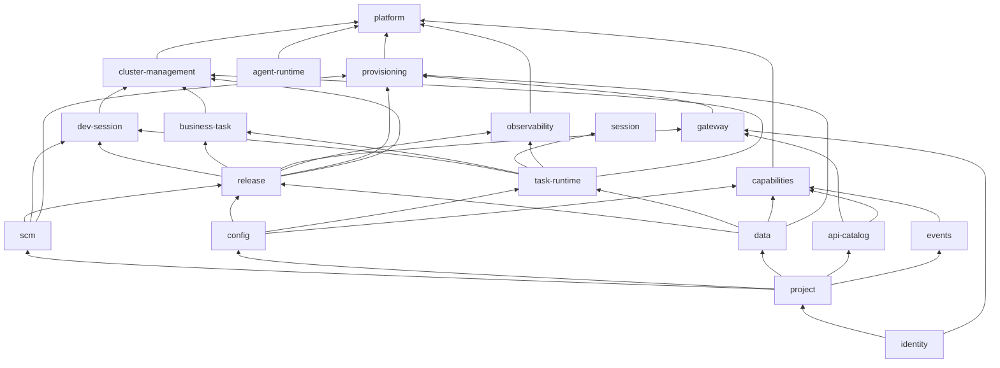

# 仓库结构、模块划分与依赖原则

> 状态：已确认（2026-09-11 作者裁定第 13 节四项），作为 Design §15.1 的展开并进入 Plan T0.2  
> 版本：0.5 · 日期：2026-09-22（0.5：按 ADR-0008 退役 `egress` 模块，模块数 20→19；0.4：按 ADR-0007 补用例落位与两条新规则、`tools/testguard`，§10 指向用例防护体系；0.3：根目录补 RFC／根级说明文件，模块清单补 ADR-0003 的两个模块，§11 指向开发规则）  
> 适用范围：CrewStation 代码仓（Bun workspaces monorepo）的全部代码，包括控制面、任务容器、工作台、CLI、部署与测试

## 目录

- [0. 为什么先定原则：agent-workflow 的堆叠证据](#0-为什么先定原则agent-workflow-的堆叠证据)
- [1. 根目录结构](#1-根目录结构)
- [2. 三类代码的判定规则](#2-三类代码的判定规则)
- [3. 模块内部的固定模板](#3-模块内部的固定模板)
- [4. 依赖原则](#4-依赖原则)
- [5. 模块清单与分层图](#5-模块清单与分层图)
- [6. 进程组合：哪个模块跑在哪个应用里](#6-进程组合哪个模块跑在哪个应用里)
- [7. 持久化归属](#7-持久化归属)
- [8. 工作台（前端）结构](#8-工作台前端结构)
- [9. 尺寸与命名硬规则](#9-尺寸与命名硬规则)
- [10. 机械化执行](#10-机械化执行)
- [11. 增长、拆分与例外](#11-增长拆分与例外)
- [12. 与 Design §15.1 的差异](#12-与-design-151-的差异)
- [13. 决策记录](#13-决策记录)

## 0. 为什么先定原则：agent-workflow 的堆叠证据

2026-09-11 对 `~/dev/proj/agent-workflow` 的统计（不含 node_modules 与测试文件）：

| 现象 | 数据 | 后果 |
|---|---|---|
| 单层平铺 | `backend/src/services/` 直接放 172 个 `.ts`，`frontend/src/components/` 380 个，`frontend/src/lib/` 128 个 | 找不到归属，新文件只能继续往里放 |
| 全局表定义 | `db/schema.ts` 8170 行，被 303 个文件直接 import | 任一模块都能读写任一张表，模块边界在数据层不存在 |
| 单文件子系统 | `services/task.ts` 7780 行，`server.ts` 3275 行，`cli/start.ts` 3310 行，`services/runner.ts` 2778 行 | 无法局部理解与测试，改动冲突集中 |
| 双轨并存 | 后期引入 `modules/<context>/{domain,application,infrastructure,composition}`（1187 个文件），但旧 `services/` 未迁完 | 同一概念两套实现，新人不知道该往哪一轨写 |
| 事后补规则 | `architecture/*.json` 多份“债务清单”（commons-debt、cross-context-imports、facades…）配合 RFC 测试 | 规则允许带着债务通过，边界只能缓慢收敛 |
| 单文件 i18n | `i18n/zh-CN.ts` 15239 行 | 任何页面改动都碰同一个文件 |

从中提炼出四个必须在第一行代码之前就定下的原则，本文其余部分是它们的展开：

1. **归属先于存在**：每个文件在创建时就必须能回答“属于哪个模块、模块里哪一层”，回答不出来的文件不允许创建。
2. **边界在三处同时成立**：目录、包（`package.json` 依赖与 `exports`）、数据库 schema。只在目录上分层而包和表不分，边界会在半年内消失。
3. **规则机械化、零债务**：所有规则由脚本在 CI 阻断，不设“基线清单”让存量违规通过；例外必须带过期日期的 ADR。
4. **尺寸是硬约束**：文件行数、目录文件数、函数行数设上限并阻断，超限只能拆，不能申请豁免。上限取值可以讨论，阻断方式不讨论。

## 1. 根目录结构

```text
crewstation/
├─ apps/                         # 可部署单元：一个进程一个目录，一个 Dockerfile；只做组合与启动，不含业务逻辑
│  ├─ cs-api/                    # 平台 API 进程
│  ├─ cs-auth/                   # 身份与网关决策进程
│  ├─ cs-controller/             # Kubernetes 协调器进程
│  ├─ cs-session/                # 会话流中枢进程
│  ├─ cs-events/                 # 事件中心进程
│  ├─ mcp-capabilities/          # 能力说明 MCP
│  ├─ mcp-operations/            # 操作 MCP
│  ├─ console/                   # 工作台 SPA（React）
│  └─ cli/                       # crewstation 命令行
├─ modules/                      # 领域模块：按限界上下文划分；不知道自己跑在哪个进程里
│  ├─ identity/  project/  scm/  config/  data/  api-catalog/  events/  agent-runtime/
│  ├─ release/  task-runtime/  dev-session/  business-task/  session/  gateway/
│  └─ observability/  cluster-management/  capabilities/  provisioning/  platform/
├─ packages/                     # 技术库：与领域无关，删掉所有业务概念后仍然成立
│  ├─ contracts/                 # Manifest、平台 API、事件、放行表、TaskRunner 协议的 zod Schema：唯一跨进程真相
│  ├─ kernel/                    # Result／错误类型、ID、时钟、日志接口、类型工具；零 IO
│  ├─ persistence/               # 数据库连接、事务、迁移运行器、outbox 基元；不含任何领域表
│  ├─ queue/                     # PostgreSQL 表队列：租约、fencing、重试
│  ├─ eventbus/                  # 进程内类型化事件总线 + outbox 发布
│  ├─ http/                      # Hono 服务骨架、错误映射、鉴权头解析中间件、OpenAPI 生成
│  ├─ ws/                        # WebSocket 帧、心跳、游标协议
│  ├─ k8s/                       # Kubernetes 客户端封装与对象构造器
│  ├─ gitlab-client/             # GitLab 兼容 HTTP 客户端（纯协议）
│  ├─ jwt/                       # jose 封装：签发、JWKS、轮换
│  ├─ agent-drivers/             # 自 agent-workflow 复制改造的 OpenCode／Claude Code 驱动；只供任务容器使用
│  ├─ api-client/                # 由 contracts 生成的平台 API 客户端；console、cli、mcp-* 共用
│  └─ testkit/                   # 测试夹具：临时数据库、假时钟、假 k8s、契约断言
├─ runtimes/
│  └─ task/                      # 任务容器镜像：Dockerfile、tini、TaskRunner 源码（只依赖 contracts、kernel、ws、agent-drivers）
├─ integrations/                 # 平台自带的接入容器项目（各自是独立业务项目形态）
│  ├─ gitlab-event-producer/
│  └─ reference-api-proxy/
├─ templates/
│  └─ minimal-sample/            # 业务项目模板
├─ deploy/                       # Kubernetes 清单、安装器、profiles、镜像清单
├─ tests/                        # 跨单元的用例层，一层一个目录：contracts、e2e、security、scale、upgrade、architecture（清单外的目录被规则阻断）
├─ tools/                        # 仓内工程脚本：arch 规则检查、testguard 用例门禁与报告、代码生成；不被任何应用 import
├─ docs/                         # 工程文档
│  ├─ engineering/               # 本文件、开发规则、用例防护体系、踩坑记录、实现期待决问题
│  └─ adr/                       # 架构决策记录：只记「结构规则本身」的决策
├─ proposal/                     # 产品与设计提案
│  ├─ proposal.md design.md plan.md tech-evaluation.md   # 基线三件套＋技术评估
│  ├─ reviews/                   # 设计门检视
│  └─ rfc/                       # 基线之后的变更：RFC-NNN-{slug}/ 各含三件套
├─ STATE.md                      # session 之间的接力状态
├─ AGENTS.md                     # 面向编码 Agent 的开工须知与提交署名
└─ CLAUDE.md                     # 仓库现状、命令、架构概览、术语
```

根目录只允许出现以上目录、上述根级说明文件与工作区配置文件。不设 `src/`、`lib/`、`common/`、`shared/` 这类根级目录。

模块清单以 §5 为准；上面 `modules/` 一行是示意，新增模块按 §11 走 ADR。

## 2. 三类代码的判定规则

| 类别 | 目录 | 判定问题 | 允许含有 | 禁止含有 |
|---|---|---|---|---|
| **应用** | `apps/*` | 它是一个独立进程或独立分发物吗？ | 配置读取、模块装配（调用各模块的 `create*Module`）、HTTP／WS 服务启动、健康检查、优雅退出 | 任何领域规则、任何 SQL、任何 Kubernetes 对象构造 |
| **模块** | `modules/*` | 它是 Design 里的一个领域概念簇吗（有自己的对象、状态机、不变量）？ | 领域、用例、端口、适配器、HTTP 路由、装配 | 进程拓扑知识（端口号、副本数、其他进程地址） |
| **包** | `packages/*` | 删掉“项目、发布、任务”等所有业务概念后它还成立吗？ | 协议、算法、客户端封装、基础设施基元 | 任何对 `modules/*` 的引用、任何业务表 |

两条补充判定：

- **contracts 的边界**：只放需要跨进程或跨镜像传递的数据形状（Manifest、API 请求响应、事件载荷、放行表、TaskRunner 协议帧）。模块内部的领域类型不进 contracts。判断标准：这个类型是否会被序列化后离开进程？
- **kernel 的边界**：新增文件必须已有三个以上模块需要，且不含业务含义；一个主题超过三个文件就升格为独立包（例如 `packages/jwt`），不许在 kernel 内长出子目录树。

## 3. 模块内部的固定模板

每个模块是一个工作区包 `@crewstation/module-<name>`，目录结构固定，只能少不能多：

```text
modules/<name>/
├─ package.json                  # name、layer、依赖的其他模块与包；exports 只暴露 "."
├─ index.ts                      # 唯一公开面：re-export api/ 与 create<Name>Module 工厂
├─ api/                          # 对外：命令与查询的输入输出类型、领域事件类型、模块工厂返回类型
├─ domain/                       # 纯领域：实体、值对象、状态机、不变量；零 IO、零框架
├─ application/                  # 用例：每个命令或查询一个文件；依赖 domain 与 ports
├─ ports/                        # 本模块需要外界提供的接口：Repository、Clock、K8sClient、其他模块的能力
├─ adapters/                     # ports 的实现，按技术分子目录
│  ├─ persistence/               # 本模块的 Drizzle schema、查询、迁移
│  ├─ k8s/  gitlab/  http-client/ …
├─ http/                         # Hono 路由：把 HTTP 翻译成 application 调用；一组资源一个文件
├─ workers/                      # 队列消费者与协调循环（reconciler）；一个职责一个文件
├─ wiring.ts                     # 装配：实例化 adapters → application → 返回 { api, http?, workers?, subscriptions? }
└─ tests/                        # 模块级集成测试（真实数据库）；单元测试就近放 *.test.ts；各类改动必带的用例见 testing.md §4
```

每层的职责与允许 import 的范围：

| 目录 | 职责 | 允许 import |
|---|---|---|
| `domain/` | 状态迁移、校验、不变量；函数尽量纯 | `packages/kernel`、`packages/contracts` 中的值类型、本目录 |
| `application/` | 编排一个用例：取仓储、调领域、写仓储、发事件 | `domain/`、`ports/`、`api/`、`contracts`、`kernel`、`eventbus` 类型 |
| `ports/` | 接口声明 | `domain/`、`contracts`、`kernel` |
| `adapters/*` | 实现端口 | `ports/`、`domain/`、`packages/*`、`contracts` |
| `http/` | 协议翻译、鉴权头读取、错误映射 | `application/`、`api/`、`contracts`、`packages/http` |
| `workers/` | 从队列或 k8s 事件驱动 application | `application/`、`ports/`、`packages/queue`、`packages/k8s` |
| `wiring.ts` | 唯一允许同时看见 adapters 与 application 的文件 | 模块内全部 + 其他模块的根 `index.ts` + `packages/*` |
| `index.ts` | 公开面 | `api/`、`wiring.ts` 的工厂 |

三条模板纪律：

- `application/` 与 `http/` 永远不 import `adapters/`。谁需要实现，谁通过 `wiring.ts` 注入。
- 模块间只能 import 对方的根 `index.ts`；`package.json` 的 `exports` 只声明 `"."`，深路径 import 在运行时就会失败，不依赖自觉。
- 模块不写 `index.ts` 以外的桶文件（barrel）。桶文件掩盖真实耦合，agent-workflow 的 `shared/index.ts` 就是这样长成 76 个平铺文件的。

## 4. 依赖原则

### 4.1 方向

只允许向下依赖：`apps → modules → packages → 运行时与 npm`。

- `packages/*` 永远不 import `modules/*` 或 `apps/*`。
- `modules/*` 永远不 import `apps/*`，也不知道端口号、副本数、其他进程地址。
- `runtimes/task` 只依赖 `contracts`、`kernel`、`ws`、`agent-drivers`；它进另一个镜像，绝不引入 `persistence`、`k8s`、任何模块。
- `apps/console` 与 `apps/cli` 只依赖 `contracts` 与 `api-client`；前端永远不 import 后端模块。
- `tools/*` 不被任何应用 import。

### 4.2 模块分层

每个模块在 `package.json` 里声明 `"crewstation": { "layer": N }`。规则：**模块只能依赖 layer 严格更小的模块**，同层之间不允许互相依赖。这条规则从 `package.json` 的依赖声明和源码 import 两处同时检查。

### 4.3 低层需要高层信息时的两种办法

1. **端口反转**：低层模块在 `ports/` 声明接口，由高层模块或 `apps/*` 的装配代码提供实现。例：`events` 推送时需要“订阅方当前 active 槽的地址”，它声明 `HandlerEndpointResolver` 端口，由 `cs-events` 应用用 `release` 模块的查询实现。
2. **事件订阅**：高层模块发布领域事件，低层模块订阅。**跨模块事件的载荷 Schema 与主题名放在 `packages/contracts/events`**，订阅方只依赖 contracts，不依赖发布方。例：`release` 发布 `release.registered`（含 Manifest 的 `exposes`、`subscriptions`、`produces`、`tasks` 段），`api-catalog`、`events`、`business-task` 各自订阅并落自己的表。

禁止第三种办法：为了拿数据直接 import 高层模块或读它的表。

### 4.4 同步调用与事件的选择

- 调用方“拥有”这条流程、需要立即得到结果或失败 → 同步调用对方公开 API。
- 只是通知“某事已发生”，对方怎么处理与本模块无关 → 事件（经 `eventbus` + outbox，同一事务内落库）。
- 一个用例里既改本模块状态又要求另一个模块必须成功 → 拆成“本模块落库 + 发事件 + 对方消费重试”，不做跨模块事务。

### 4.5 包之间

`packages/*` 之间允许依赖，但必须是无环 DAG，且 `contracts` 与 `kernel` 不依赖其他任何包。

## 5. 模块清单与分层图

| 层 | 模块 | 拥有的对象与职责 | 依赖的模块 |
|---|---|---|---|
| L1 | `identity` | User、登录适配器、用户令牌与 JWKS、服务身份解析（源 Pod IP → 身份）、来源令牌、上游凭据下发 | — |
| L2 | `project` | Project、Service、成员三级角色、preview 测试者、命名空间登记、TaskQuota、ServicePlan、TaskProfile（算力档位已按 ADR-0005 移出） | identity |
| L3 | `scm` | SourceRepositoryBinding、建仓、代推、标签与保护标签、会话级短期 Git 凭据 | project |
| L3 | `config` | ConfigItem、SecretValue、开发与生产两组值、版本快照、注入渲染 | project |
| L3 | `data` | DataResource、DataBinding、TaskDataBinding 三模式与审批、Provider 端口（postgres、s3、pvc） | project |
| L3 | `api-catalog` | APIProxy 登记、操作键（proxy＋method＋path）、开放策略、APIGrant、APIRequest、Swagger 裁剪 | project |
| L3 | `events` | EventProducer 登记、事件类型、inbox 去重、订阅、投递状态机、死信、推送 | project |
| L3 | `agent-runtime` | 算力档位（RFC-006）：协议、镜像、二进制、启动前步骤、凭据、修订、测试记录、默认与引用确认、平台仓库推送凭据；TaskProfile 目录、发布引用与测试执行经 ports 由 platform 回填（ADR-0004、ADR-0005） | —（不 import 其他模块） |
| L4 | `release` | Manifest 校验、Release、构建、迁移、DeploymentSlot、TrafficSwitch、发布并发控制；发布 `release.registered` | project、scm、config、data |
| L4 | `task-runtime` | TaskEnvironment 生命周期、Pod 与两种持久卷模式、配额原子准入、每个 Agent 一个执行环境（「＋ CLI」／headless／业务子任务）、档位测试执行、TaskRunner 归属与协议服务端语义 | project、config、data |
| L5 | `dev-session` | 一项目一会话、分支与落后提交数、空闲提醒、强制释放、发布入口 | task-runtime、release、scm |
| L5 | `business-task` | 业务任务、SubtaskRun 契约层、oneshot／interactive、attempt、契约校验、文件与结果读取 | task-runtime、release |
| L5 | `session` | TaskRunner 出向连接与浏览器流的中枢：租约、游标、重连、帧路由 | task-runtime |
| L5 | `gateway` | 用户域与服务域路由表、放行表、Pod 身份索引的生成、版本与下发 | identity、project、release、api-catalog |
| L6 | `cluster-management` | 受管 K8s 快照、归属/用途、管理员检查与持久运维操作（ADR-0006）；副本/任务期望值仍归原模块 | project、task-runtime、release、dev-session、business-task、agent-runtime（仅注入端口） |
| L6 | `observability` | 日志采集入口与查询、部署健康态与告警记录、execution_events、traceId 索引 | project、task-runtime、release（只读端口） |
| L6 | `capabilities` | 能力说明聚合：本服务授权、绑定、订阅、配额、套餐、约定表 | 多个模块的公开查询 |
| L6 | `provisioning` | 项目开通编排：命名空间→仓库→数据→路由→首个标签发布→active；失败留原因可重跑（ADR-0003） | project、scm、data、gateway、release |
| L7 | `platform` | 组合根：按端口装配全部模块，按进程角色挑选 http 路由、后台工作器与事件订阅（ADR-0003） | 全部模块 |



拆分依据：Design 里每一个有自己状态机的对象簇一个模块。围绕任务的能力刻意拆成四个模块（`task-runtime`、`dev-session`、`business-task`、`session`），因为 agent-workflow 的 `task.ts` 正是把这四件事写进了一个 7780 行的文件。管理员运行环境有自己的版本／检查／启用状态机，因此按 ADR-0004 单独成 `agent-runtime`，而不塞进已有 39／40 个源码文件的 `project` 或 `dev-session`；RFC-006 把运行环境并入算力档位后，档位整体移入 `agent-runtime`（ADR-0005）。

## 6. 进程组合：哪个模块跑在哪个应用里

模块的 `wiring.ts` 返回可选的入口：`http`（Hono 路由）、`workers`（队列消费者与 reconciler）、`subscriptions`（事件订阅）。应用只挑选并挂载需要的入口，模块本身不知道拓扑。

| 应用 | 挂载的模块入口 |
|---|---|
| `cs-api` | 全部模块的 `http`（identity 仅管理面）、`capabilities`、`observability`、`cluster-management` 查询与运维受理 |
| `cs-auth` | `identity` 运行面（登录、ForwardAuth 用户域与服务域、JWKS、凭据服务）、`gateway` 的查表评估 |
| `cs-controller` | `release`、`task-runtime`、`data`、`scm`、`gateway`、`project`（命名空间）、`provisioning`、`cluster-management` 的 `workers` 与启动任务 |
| `cs-session` | `session` 的 WS 入口与 `workers` |
| `cs-events` | `events` 的 ingress `http` 与投递 `workers` |
| `mcp-capabilities`、`mcp-operations` | 不挂模块，只经 `api-client` 调 `cs-api` |
| `console`、`cli` | 只经 `api-client` |

这样在本机可以把五个进程合并成一个进程启动（同一套 wiring 全部挂上）用于调试，而部署时按五个进程拆开，两者没有代码差异。

## 7. 持久化归属

- 一个平台数据库；**每个模块一个 PostgreSQL schema**，名字等于模块名（`release.releases`、`events.inbox`）。Drizzle 用 `pgSchema('<module>')` 声明，本模块代码只能引用本模块 schema。
- 迁移文件放在 `modules/<name>/adapters/persistence/migrations/NNNN_<name>.sql`，只允许操作本 schema；`packages/persistence` 的运行器按模块 layer 再按序号统一执行。迁移由安装器 Job 运行，不由服务进程启动时运行。
- 跨模块引用只存 ID（字符串），不建跨 schema 外键；引用完整性由 application 层在用例内校验。理由：外键会让模块无法独立迁移与独立测试，也让删除语义（R18、R37）被数据库隐式决定。
- 读取另一个模块的数据只能调它的公开查询，不能 join 它的表。需要聚合视图（工作台首页、能力页）时，聚合放在 L6 模块内做，或由发布方事件驱动维护一份本模块的只读副本。
- `packages/persistence` 只有连接、事务、outbox 表、迁移运行器；`packages/queue` 只有 `queue.jobs` 表。两者用自己的 schema（`platform_infra`）。

## 8. 工作台（前端）结构

```text
apps/console/src/
├─ app/                          # 路由树、Provider、布局、主题
├─ features/                     # 每个功能自足：页面、组件、hooks、状态、i18n、对 api-client 的调用封装
│  ├─ projects/  dev-session/  release/  config/  catalog/  events/  logs/  capabilities/  admin/
│  └─ <feature>/
│     ├─ pages/  components/  hooks/  model/  i18n/{zh-CN,en-US}.ts
│     └─ index.ts                # 只导出路由与被 app/ 使用的入口
├─ shared/
│  ├─ ui/                        # 无业务含义的基础组件
│  ├─ lib/                       # 无业务含义的工具，按主题分文件
│  └─ api/                       # 对 packages/api-client 的 Query hooks 封装、错误处理
└─ generated/                    # 由 contracts 生成，不手改
```

规则：`features/*` 之间不互相 import，只能经 `shared/`；不设根级 `components/`、`lib/`、`hooks/` 平铺目录；i18n 按 feature 分文件在构建时合并；`shared/ui` 与 `shared/lib` 同样受尺寸规则约束。

## 9. 尺寸与命名硬规则

| 规则 | 上限 | 处理 |
|---|---|---|
| 源码文件行数 | 600 行（测试文件 1000 行） | CI 失败；只能拆，不接受豁免 |
| 单个目录直接包含的源码文件数 | 20 个（不计测试与 `generated/`） | CI 失败；必须建子目录分组 |
| 函数行数 | 80 行 | lint 报错 |
| 文件名 | 一个文件一个概念，文件名即概念（`releaseStateMachine.ts`、`switchTraffic.ts`） | 评审 |
| 禁用文件名 | `utils.ts`、`helpers.ts`、`common.ts`、`misc.ts`、`shared.ts`、`types.ts`（仅 `api/` 内允许）、非模块根与包根的 `index.ts` | CI 失败 |
| 导出方式 | 只用命名导出，禁止 `export default`（React 组件与 `*.config.ts`／`*.config.js` 工具配置文件除外，见 ADR-0002） | lint + `tools/arch` |
| 生成代码 | 放 `generated/`，加头注释，不手改，不计入尺寸规则 | 检查头注释 |
| 依赖声明 | 只 import `package.json` 里声明的依赖；禁止 `tsconfig paths` 别名 | lint（`import/no-extraneous-dependencies`） |

命名约定：目录与包名 kebab-case（`modules/dev-session`、`@crewstation/module-dev-session`、`@crewstation/gitlab-client`）；TypeScript 文件 camelCase 且以概念命名（`switchTraffic.ts`）；React 组件文件 PascalCase（`SlotCard.tsx`）；测试 `*.test.ts` 就近；迁移 `NNNN_snake_case.sql`；PostgreSQL schema 与表 snake_case；环境变量 `CS_` 前缀。

## 10. 机械化执行

规则由 `tools/arch/check.ts`（Bun 脚本）和 ESLint 共同执行，作为 CI 的第一道门，任何一项失败即阻断合并；`bun run arch:check` 也可本地运行。

| 规则 | 执行处 |
|---|---|
| 依赖方向 apps → modules → packages；模块 layer 严格递减；包依赖无环 | `tools/arch`：解析所有 `package.json` 与 import |
| 模块间只 import 根 `index.ts` | `package.json` 的 `exports` + ESLint `no-restricted-imports` |
| `domain/` 零 IO：只 import kernel、contracts、本目录 | `tools/arch` |
| `application/`、`http/` 不 import `adapters/` | `tools/arch` |
| `runtimes/task`、`apps/console`、`apps/cli` 的依赖白名单 | `tools/arch` |
| 每模块只引用自己的 pgSchema；迁移 SQL 只操作本 schema | `tools/arch`：正则扫描 `pgSchema(` 与 `CREATE TABLE <schema>.` |
| 文件行数、目录文件数、函数行数、禁用文件名、默认导出 | ESLint `max-lines`、`max-lines-per-function` + `tools/arch` |
| 桶文件 | `tools/arch`：非根 `index.ts` 直接失败 |
| 无环 | ESLint `import/no-cycle` |
| 用例纪律：禁 `.only`、无条件 `.skip`、`.todo`、`.failing`、恒真 `skipIf`、用例重试；仓库根 `tests/` 只允许约定的用例层目录 | `tools/arch`（`test-discipline`，ADR-0007）：除工作区外还扫 `tests/`、`integrations/`、`templates/`、`deploy/` |
| 迁移只增不改：已入锁的不可修改、删除，新迁移不得插队且必须入锁 | `tools/arch`（`migration-lock`，ADR-0007）：比对 `tools/arch/migrations.lock.json` |
| 新增代码防护：本次推送改到的生产文件必须有用例加载，改动行的执行比例不低于下限 | `tools/testguard`，在 CI 的 `gate` 作业里阻断（ADR-0007） |

检查器自带负向夹具测试（`tools/arch/tests/`，夹具以 JSON 存放，避免源码中的 import 字样被当成真实依赖），每条规则至少一个故意违规样例；`bun test` 同时断言真实仓库零违规。规则清单只在 `tools/arch/ruleSet.ts` 一处登记。用例放在哪、必须写哪些、CI 怎么执行，见 `testing.md`。模块只能由 `bun run scaffold:module` 生成，模板文件在 `tools/scaffold/templates/*.tmpl`。

不设“基线清单”。规则从第一个提交生效，因此不存在存量违规；后续任何违规都是新引入的，直接修。

## 11. 增长、拆分与例外

- **模块超过 40 个源码文件或 6000 行** → 先写 ADR 提出拆分方案，再动手；不允许通过建更深的子目录规避。
- **一个文件接近 600 行** → 按概念拆（一个状态机、一个用例、一组路由），不按“part1／part2”拆。
- **新增模块** → 需要 ADR 说明：拥有哪些对象、layer、依赖哪些模块、为什么不能并入现有模块。
- **新增 kernel 文件** → 至少三个模块已有相同需求；否则放到需要它的模块里。
- **例外** → 只接受带过期日期的 ADR（`docs/adr/NNNN-*.md`），`tools/arch` 读取 ADR 中的例外条目并在过期后重新报错。
- **复制自 agent-workflow 的代码**（`packages/agent-drivers`）同样受全部规则约束；复制时按概念拆到规则允许的尺寸，并在 T0.2 登记源 commit 与逐文件对照表。

**本文管形状，不管流程。** 怎么改（主干开发、提交纪律、门禁、测试要求、RFC 流程）见 `development-rules.md`。
两者的分工：改产品行为立 RFC，改本文定的结构规则立 ADR，两样都改就两样都要。

## 12. 与 Design §15.1 的差异

| Design §15.1 | 本文 | 原因 |
|---|---|---|
| 只有 `apps/`、`packages/`，业务逻辑隐含在 `apps/*` 内 | 新增 `modules/`，`apps/*` 只装配 | 避免每个进程长成一个 `server.ts` |
| `packages/gateway-policy`、`packages/data-providers`、`packages/code-host` | 拆为模块 `gateway`、`data`、`scm` 与纯技术包 `gitlab-client`、`k8s` | 它们含领域规则，按第 2 节判定不属于包 |
| `packages/runtime-drivers` | 改名 `packages/agent-drivers`，并限定只供 `runtimes/task` 使用 | 名字对应对象；依赖白名单可机械检查 |
| 未提及模块内部结构、持久化归属与尺寸规则 | 第 3、7、9 节 | 这些正是 agent-workflow 缺失的部分 |
| 无 `docs/`、`tools/` | 新增 | 工程文档与检查脚本需要独立于提案与应用 |

作者确认后：Design §15.1 改为指向本文；Plan T0.2 增加“建立 `tools/arch` 检查并在首个提交生效”作为完成条件。

## 13. 决策记录

| 事项 | 裁定（2026-09-11） |
|---|---|
| 跨模块数据引用 | 只存 ID，不建跨模块外键；完整性由用例层校验 |
| 平台数据库隔离 | 每模块一个 PostgreSQL schema |
| 任务相关模块 | 拆为 `task-runtime`、`dev-session`、`business-task`、`session` 四个 |
| 尺寸硬上限 | 源码文件 600 行、目录 20 个文件、函数 80 行；超限 CI 阻断 |
| 工程文档位置 | `docs/engineering/` 与 `docs/adr/`，与 `proposal/` 分开（规划者选定，未提出异议） |
| 模块退役（2026-09-22，ADR-0008） | 删模块要同时删依赖边并重跑 `bun install` 提交锁文件、手工退出迁移锁条目并在提交说明写明原因、按 RFC 处理数据库 schema；模块数 20→19 |

后续对本文的修改走 ADR：新增模块、**删除模块**、调整 layer、调整尺寸上限、任何例外。
