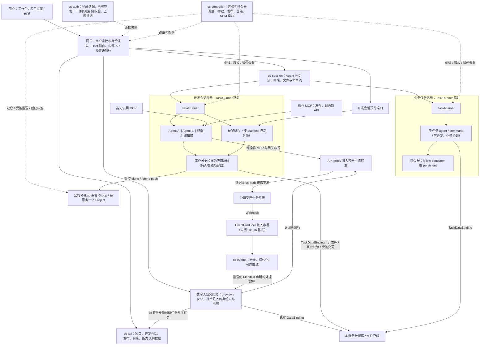

# Design｜CrewStation 数字人能力平台

> 状态：设计草案，待原型与评审验证  
> 版本：0.3.0 · 整理日期：2026-09-10  
> 修订日期：2026-09-11（v0.2.0：任务级执行环境、代码托管与持续意图修改）  
> 修订日期：2026-09-11（v0.3.0：与 Proposal v0.3.0 同步，平台职责收窄、标签发布、网关鉴权、接入容器与事件中心、规模目标；删除 ZIP 与知识飞轮）  
> 配套文档：[Proposal](./proposal.md) · [Plan](./plan.md)

## 目录

- [0. 阅读约定](#0-阅读约定)
- [1. 架构不变量与领域模型](#1-架构不变量与领域模型)
- [2. 部署实体与流量路径](#2-部署实体与流量路径)
- [3. 技术基线与可替换接口（待重评）](#3-技术基线与可替换接口待重评)
- [4. 项目协议、数据对象与接口](#4-项目协议数据对象与接口)
- [5. 开发会话：容器、Agent、工作台与预览](#5-开发会话容器agent工作台与预览)
- [6. 标签发布、构建、晋级与路由](#6-标签发布构建晋级与路由)
- [7. 用户身份、服务身份与平台角色](#7-用户身份服务身份与平台角色)
- [8. 内部 API 接入、开放策略、权限化 Swagger 与事件中心](#8-内部-api-接入开放策略权限化-swagger-与事件中心)
- [9. 有状态数字人的数据资源供给](#9-有状态数字人的数据资源供给)
- [10. 任务容器、TaskRunner 与业务子任务契约](#10-任务容器taskrunner-与业务子任务契约)
- [11. 空 Kubernetes 集群的一键安装](#11-空-kubernetes-集群的一键安装)
- [12. 升级、更新与回退](#12-升级更新与回退)
- [13. 安全边界与容量控制](#13-安全边界与容量控制)
- [14. 执行记录与追溯](#14-执行记录与追溯)
- [15. 仓库组织、决策记录与待决项](#15-仓库组织决策记录与待决项)
- [16. 设计完成的判断](#16-设计完成的判断)

## 0. 阅读约定

需求编号 R01–R49 以 Proposal v0.3.0 §6 为准；Proposal 章节号在 v0.3.0 顺延，本文引用它时使用新编号。本设计以公司 Kubernetes 集群为唯一部署目标，本机验证使用 kind 集群，不再有 Docker Compose 路径。

所有 `cs-*` 名称、平台 API、Manifest、状态机、数据对象和安装命令都是拟议协议，尚不是已存在的产品接口。第三方组件是讨论中的候选，v0.3.0 起全部标为待重评，结论见 `proposal/tech-evaluation.md`；本文不声称任何组件的版本、CRD 或兼容性已经确认。原稿与对话来源见 Proposal §0.1；本文的细化属于待验证的实现建议。

文档中区分：**要求**是不得违反的产品约束；**基线**是建议实现；**条件性选项**需要满足前置条件后才启用；**待决**事项必须在交付前关闭或明确限制。

### 0.1 v0.3.0 的替代范围

v0.2.0 把执行模型改为 TaskEnvironment → SubtaskRun → AgentRun／CommandRun，并纳入公司 GitLab 兼容托管与自动入库部署。v0.3.0 在此基础上按 Proposal §0.2 的 v0.3.0 替代表整体收窄平台在执行侧的职责：

- 删除主 Agent／coordinator 与主、分析、编码、审核角色维度；删除前台执行槽与单写入者规则。
- 意图开发改为“开发会话”：一个长驻开发容器内常驻 TaskRunner，开发者启动一个或多个意图创建与修改 Agent，平台不协调工作区；DevSession 对象并入开发会话；Checkpoint、SandboxLease（意图侧）删除。
- 业务执行保留子任务契约层，子任务可并发，由业务程序协调；持久卷两种模式，暂停恢复只在持久卷持久模式。
- 自动入库部署改为标签发布：平台创建 v 标签，构建部署到 preview，项目负责人晋级 prod。
- cs-connector 的 Broker 职责被“网关操作级放行 + 管理员开发的 API proxy 纯转发”替代，cs-connector 改为 cs-events 事件分发中心；GitLab 管理操作归 cs-controller；凭据服务归 cs-auth。
- 网关统一完成用户鉴权并向业务服务注入身份；服务身份用 Kubernetes 工作负载身份。
- 删除 ZIP 导入与知识飞轮，保留 taskId／traceId／sessionId 追溯。
- 明确设计目标：数百数字人服务并发、数百节点、首版单集群、控制面高可用首版必需。

既有 R／D／Q／T／AT 编号保留，受影响语义同步修订并在 §15 标注作废与替代。由于文档仍处于未实现草案阶段，新 API 是目标契约，不存在需要迁移的旧部署。

## 1. 架构不变量与领域模型

### 1.1 必须保持的不变量

1. **控制面不承载业务流量。** 页面、预览、业务 API、内部 API 调用与终端、Agent 流式会话都经网关转发到对应后端；cs-api 不代理业务请求，也不搬运仓库字节与对象文件。
2. **服务隔离与任务执行分开。** 一个服务运行单元承载一个业务服务；一项任务对应一个由平台调度的长驻容器，容器内常驻 TaskRunner。单个 Agent 进程结束不终结任务容器。
3. **平台不编排开发过程。** 开发会话内可以并行多个 Agent、终端与编辑器操作，工作区共享、分支与合并由使用者决定；平台只保证容器、配额、预览进程与发布前检查。
4. **业务执行经契约层。** 业务服务以自身身份创建任务，通过子任务契约提交 Agent 与命令，子任务可并发，由业务程序协调；平台校验契约、记录 attempt 与状态，不决定下一步。
5. **两类用途分开。** 意图创建与修改 Agent 面向应用自身源码，业务执行 Agent 面向业务任务对象；实例、会话、工作区绑定与权限不能混用。平台不定义 Agent 角色。
6. **网关统一鉴权。** 用户身份由网关认证后以可信身份头与平台签名令牌注入；业务服务不做登录鉴权，授权规则归业务。服务身份来自 Kubernetes 工作负载身份，不信任自报请求头。
7. **内部 API 只有一条放行路径。** 服务调用内部 API 必须经网关，网关按服务身份与开放策略做方法加路径级放行，再转给纯转发的 API proxy；网络层阻止绕过。资源级越权由上游或业务把关。
8. **公司事件先进入业务服务。** EventProducer 产生事件，cs-events 推送到业务服务声明的处理路径；Agent 不直接订阅公司 Webhook。
9. **权限由平台配置与审批决定，不由项目包决定。** Manifest、提示词、请求头、Agent 输出只能提出申请；默认开放的接口即可调，定向开放的接口需管理员审批。
10. **发布是平台创建标签的独立动作。** git push 不等于发布；只有平台创建的 `v大.小.patch` 标签触发构建与 preview 部署；晋级 prod 是负责人的另一个动作。已开始构建的发布不得漂移。
11. **数据资源独立于服务发布版本与任务。** 升级、释放任务、删除旧发布都不删除业务数据库或文件。
12. **存储随任务。** 意图任务的持久卷跟随容器，释放即回收；业务任务默认相同，可选持久卷持久、容器可重建。任务释放不删仓库与业务数据，未推送内容由使用者负责。
13. **一逻辑业务服务一个托管 Project。** 公司 Group 下自动建仓；preview／prod、运行副本和历次发布复用绑定。
14. **回退程序不恢复已撤销的权限，也不自动回退业务数据。**
15. **“已分配地址”不等于“服务已就绪”。** 建仓、容器、预览、数据绑定、授权接入分别显示状态。
16. **执行链路可追溯。** 一个 taskId 对应一条 traceId 链路，链上多个执行，Agent 执行以 sessionId 记录并可由 traceId 索引；知识提取留待未来，首版不做。
17. **控制面高可用与规模目标是首版约束。** cs-* 多副本、元数据库高可用、网关多副本；所有组件按数百数字人并发、数百节点评估。
18. **接入容器与业务服务同一套项目流程。** API proxy 与 EventProducer 由管理员以平台项目开发、标签发布，不新增常驻服务。

### 1.2 核心对象

| 对象 | 含义／关键关系 | 生命周期 |
|---|---|---|
| `Tenant` / `Team` | 用户、项目、授权和资源的组织范围 | 组织级 |
| `Project` | 开发与管理空间，首版承载一个业务服务；成员与角色（负责人、开发者）挂在项目上 | 项目级 |
| `DigitalWorkerService` | 可独立发布的业务定义，包含页面、API、事件逻辑；kind 可为 `DigitalWorker`、`APIProxy`、`EventProducer` | 服务级 |
| `SourceRepositoryBinding` | 服务的托管连接、Group、远端 Project ID、仓库地址与默认分支 | 服务级、长期 |
| `ServiceEnvironment` | preview／prod 两个稳定运行与授权绑定点 | 服务＋环境级 |
| `ServiceAccount` / `WorkloadIdentity` | 服务环境的稳定身份及其在 Kubernetes 中的工作负载身份 | 稳定主体 |
| `DevSession`（面向用户称“开发会话”） | 意图任务：一个项目同时至多一个；关联工作分支、开发容器、持久卷、预览进程、Agent 会话、数据绑定 | 运行／释放 |
| `TaskEnvironment` | 任务容器的逻辑对象：用途 intent 或 business、持久卷模式、配额占用、traceId | 任务级 |
| `TaskRunner` | 任务容器内常驻的平台进程，向控制面暴露启动 Agent、执行命令、读写文件、终端与预览守护接口 | 随容器 |
| `AgentSession` | 一次 Agent 进程会话：驱动、模型、原生会话 ID、状态；属于开发会话或某个业务子任务 | 可恢复 |
| `SubtaskRun` / `Attempt` | 业务任务内一次 `agent` 或 `command` 子任务及其尝试：agentProfile、输入输出契约、状态、退出信息 | 子任务级 |
| `CommandRun` | 命令子任务或开发会话内显式命令的 argv、cwd、退出状态与输出 | 执行级 |
| `TaskVolume` | 任务持久卷：模式 `follow-container` 或 `persistent`，与容器的绑定关系 | 随任务 |
| `TaskDataBinding` | 某任务访问现有 DataResource 的模式、范围、有效期、审批引用 | 限时、可撤销 |
| `DataResource` / `DataBinding` | 业务数据库、Bucket、卷与服务环境的稳定数据绑定 | 项目环境级 |
| `Release` | 一次标签发布：标签、最终提交 SHA、镜像摘要、配置、迁移与验证记录 | 不可变 |
| `Promotion` | 把某 Release 晋级到 prod 的动作：执行人、预期当前版本、结果 | 不可变记录 |
| `ServiceDeployment` | 某环境上某 Release 的运行副本和路由目标 | 可替换 |
| `APIOperation` / `OpenPolicy` / `APIGrant` / `APIRequest` | 接口目录中的操作、默认或定向开放策略、服务环境获得的授权、待审批申请 | 目录／策略级 |
| `UpstreamConnection` | API proxy 使用的公司上游系统连接与凭据引用，由 cs-auth 按需下发 | 管理级 |
| `EventType` / `EventSubscription` / `EventDelivery` | EventProducer 声明的事件类型、服务环境的订阅与处理路径、投递记录 | 服务环境级 |
| `TaskQuota` | 每数字人的并发任务配额 | 服务级 |
| `ExecutionEvent` | 任务、子任务、Agent 会话与命令的事实记录，带 traceId、taskId、sessionId | 按保留策略 |

**实例约定：** 数字人实例是独立逻辑业务服务；扩容 Pod 不新建仓库或扩大授权。TaskEnvironment 对应一个容器加一个持久卷，不是多容器集合。

**来源约定：** 公司托管仓库是正式源码历史；开发容器内未推送的内容不是平台保证的对象。Git 不保存数据库、秘密或执行日志。

**旧对象调整：** `RunWorkspaceBinding`、`TaskWorkspaceBinding`、`Checkpoint`、`SourceRevision`、`KnowledgeCandidate`、`KnowledgeVersion`、`RepositoryEnvironment` 在 v0.3.0 删除；`SandboxLease` 仅保留为业务任务持久卷持久模式下“容器可重建、任务不变”的语义；`AgentRun` 并入 `AgentSession` 与 `Attempt`。

### 1.3 两类用途与两种执行方式

| 维度 | 意图创建与修改 Agent | 业务执行 Agent |
|---|---|---|
| 谁发起 | 开发者在开发会话中手动启动，可多个并行 | 业务服务按业务规则经契约层提交 |
| 工作对象 | 当前数字人应用自身的源码与开发容器 | 业务任务授权的仓库、文档、问题单等 |
| 平台提供 | 启动 Agent、执行命令、读写文件、终端、预览守护、能力说明 MCP、操作 MCP | 子任务契约、attempt、状态机、产物读取 |
| 平台不做 | 不决定下一步，不协调多个 Agent 的工作区，不做检查点 | 不决定步骤顺序，不做业务结果判定 |
| 身份 | 开发会话绑定开发者；调用内部 API 用服务 preview 身份 | 绑定服务与当前任务 |
| 存储 | 持久卷跟随容器，无暂停 | 默认跟随容器；可选持久卷持久与暂停恢复 |

两类用途共用 RuntimeDriver、任务容器镜像、TaskRunner 与执行资源；`purpose` 字段取 `intent` 或 `business`。没有 `role` 字段；业务子任务用 `agentProfile` 选择驱动、模型与工具配置。

## 2. 部署实体与流量路径

### 2.1 常驻部署

| 实体 | 主要职责 | 关键边界 |
|---|---|---|
| 网关（候选 Traefik，待重评） | 统一入口；用户鉴权前置与身份注入；按 Host 与路径转发页面、业务、预览、平台、会话与终端流量；服务对内部 API 的方法加路径级放行与转发 | 不执行平台业务逻辑；多副本；放行规则由平台下发 |
| `cs-api` | 项目、服务、成员与角色、开发会话、发布与晋级请求、接口目录与开放策略、能力说明数据、控制台后端 | 不执行用户代码，不代理业务流量 |
| `cs-auth` | 企业登录适配与网关鉴权决策、身份头与签名令牌签发、工作负载身份校验、上游凭据服务（按需向 API proxy 下发） | 不向用户代码提供平台长期凭据；密钥轮换有重叠期 |
| `cs-controller` | 任务容器与持久卷调度、配额准入、构建、发布、晋级、路由、数据供给、GitLab 管理操作模块（建仓、受控推送、创建标签） | 受限集群权限；副作用持久化并在多副本间以租约协调 |
| `cs-session` | 开发会话与业务任务的 Agent 会话流、终端、文件与命令流的接入端，连接各任务容器内的 TaskRunner | 不把 TaskRunner 端口公开；多副本，会话可在副本间恢复 |
| `cs-events` | 事件分发中心：接收 EventProducer 事件，去重、持久化、按订阅推送到业务服务处理路径，重试与死信 | 不接收公司原始 Webhook；不直达 Agent |
| 能力说明 MCP | 向开发容器内的 Agent 提供平台能力目录与本服务现状的只读 resource | 与操作 MCP 分开部署 |
| 操作 MCP | 向 Agent 提供发布、调用内部 API 等 tools，按开发会话授权执行 | 每次调用经 cs-api 校验 |
| TaskRunner（任务容器内） | 常驻于每个任务容器：启动 Agent 子进程、执行命令、读写文件、PTY、按 Manifest 守护预览进程、回传事件 | 只接受 cs-session／cs-controller 经工作负载身份验证的连接 |
| PostgreSQL、对象存储、镜像仓库、CSI、备份设施 | 元数据、业务数据、产物和持久资源 | 元数据库高可用；独立升级与保留规则 |

五个 `cs-*` 是自研常驻服务，采用同仓库模块化实现；两个平台 MCP 是独立部署单元但不是新的业务后端。TaskRunner 是任务容器镜像的一部分。API proxy 与 EventProducer 不是常驻平台服务，而是管理员开发的平台项目。代码托管使用公司已提供的 GitLab 兼容服务，正式部署不自建。

### 2.2 动态部署

| 实体 | 建议映射 | 谁创建／释放 |
|---|---|---|
| 数字人正式业务服务 | Deployment＋Service＋HTTPRoute；本地状态用相应受控策略 | cs-controller 按 Release 与 Promotion 管理 |
| API proxy／EventProducer 接入容器 | 与业务服务相同的 Deployment 形态，kind 不同 | 管理员项目的标签发布；cs-controller 部署 |
| 托管 Project | 公司配置 Group 下的远端仓库资源 | cs-controller 的 SCM 模块创建；归档独立操作 |
| 开发会话容器 | 一个 Pod（任务容器镜像，内含 TaskRunner 与双驱动 CLI）＋跟随容器的持久卷＋预览端口路由 | cs-controller 在配额内创建；会话关闭即释放 |
| 业务任务容器 | 一个 Pod＋持久卷（`follow-container` 或 `persistent`） | cs-controller 经业务服务请求创建；关闭释放；持久模式可暂停后重建 Pod |
| Agent／命令子进程 | 任务容器内由 TaskRunner 启动的进程 | TaskRunner 执行与清理，结束不删除容器 |
| 构建／正式迁移／发布验证 | 固定标签 SHA 输入的独立 Job | cs-controller 管理；生产权限不进入任务容器 |
| 数据库、Bucket、PVC | DataResource／稳定 DataBinding；任务经 TaskDataBinding 访问 | DataProvider 供给；任务关闭只撤销绑定不删资源 |

Service、HTTPRoute、权限、仓库绑定和子任务记录不是各自一个服务进程。

### 2.3 部署关系图



图中的网关放行不等于 proxy 有不受限的公司账号：每次调用都以调用方工作负载身份查开放策略与授权；proxy 只转发，凭据由 cs-auth 在调用时下发。

### 2.4 控制面与数据面

| 流量 | 路径 |
|---|---|
| 平台管理与工作台 | 浏览器 → 网关（鉴权）→ cs-api |
| 正式业务页面／API | 浏览器 → 网关（鉴权，注入身份头与令牌）→ 数字人业务服务 |
| 开发预览／热更新 | 浏览器 → 网关（鉴权，项目成员校验）→ 开发会话容器预览端口；含 WebSocket |
| Agent 对话、终端、文件与命令 | 浏览器 → 网关 → cs-session → 任务容器内 TaskRunner |
| 内部 API 调用 | 业务服务或 Agent（经操作 MCP）→ 网关（工作负载身份＋操作级放行）→ API proxy → 公司系统 |
| 公司 Webhook | 公司系统 → EventProducer → cs-events → 推送 → 业务服务处理路径 |
| 业务服务调用平台 API | 业务服务 → 网关（工作负载身份）→ cs-api：创建任务、提交子任务、读取产物 |
| SQL | 业务服务或任务容器 → 业务数据库／连接池，不经过控制面 |
| 对象文件 | 业务服务或受限直传 → 对象存储，不经过 cs-api |
| 源码托管 | cs-controller SCM 模块完成管理操作；开发容器通过受控 Git 路径 clone／fetch／push |

路由与放行规则变化由 cs-controller 下发，网关执行；不为每个请求查询 cs-api。网关、cs-auth、cs-session 均多副本并分别测量容量；统一入口不等于只有一个网关 Pod。

## 3. 技术基线与可替换接口（待重评）

### 3.1 候选基线，全部待重评

v0.2.0 的候选保留在下表，但不再作为基线。v0.3.0 的约束是：数百数字人并发与数百节点（R38）、控制面高可用（R39）、双驱动复制改造自 agent-workflow（R42）、网关承担用户鉴权与操作级放行（R40、R45）、任务容器常驻 TaskRunner（R05）。逐项重评的结论写入 `proposal/tech-evaluation.md`，确认后回填本节与 Proposal §8。

| 部分 | v0.2.0 候选 | 重评约束 |
|---|---|---|
| 管理面语言与框架 | TypeScript、Node.js LTS、Fastify、TypeBox | 复制来源 agent-workflow 为 Bun 1.4 与 Hono；多副本无状态 |
| 控制台 | React、Vite、shadcn/ui | 多 Agent 面板、Web 终端、代码编辑器、预览 iframe、Swagger、能力页 |
| 元数据与后台任务 | PostgreSQL、Drizzle、pg-boss | 高可用；数百任务容器与事件吞吐；多副本租约与去重 |
| 网关 | Traefik、Gateway API | 鉴权前置、身份注入、工作负载身份识别、按服务的操作级放行、数百 Host 与 WebSocket |
| 任务容器底座 | OpenSandbox 候选 | 长驻 Pod、持久卷两种模式、容器内 PTY、按配额调度、多 Agent 进程 |
| Agent 驱动 | 复制自 agent-workflow 的 RuntimeDriver | OpenCode 与 Claude Code；依赖反转；容器内运行 |
| 源码托管 | 公司 GitLab 兼容服务＋SCM 模块 | 建仓、受控推送、创建与保护标签、标签事件 |
| 构建与数据 | BuildKit、CloudNativePG、S3；内置对象存储候选 SeaweedFS | 标签 SHA 固定构建；数据库高可用与单项目恢复 |
| 事件中心 | 未定 | 可靠投递、去重、死信、订阅版本 |
| 公司身份 | 现有体系适配；OIDC/SAML 优先 | 网关鉴权决策、令牌签发与轮换 |
| 观测与追溯 | OpenTelemetry；平台事件表 | taskId／traceId／sessionId 关联链 |

Knative、OPA、Temporal、Kafka、Redis、Istio、gVisor/Kata、Longhorn 仍是条件性选项，不进入首版强制清单。

### 3.2 适配边界

- `IdentityProvider`：用户登录、企业账号映射；为网关提供鉴权决策。
- `GatewayPolicy`：向网关下发用户鉴权前置配置、身份注入规则、按服务环境的内部 API 方法加路径放行表与 Host 路由。
- `WorkloadIdentityVerifier`：把 Pod 的工作负载身份映射为服务环境。
- `ServiceHost`：服务与接入容器的部署、就绪检查、路由后端和版本退役。
- `TaskContainerProvider`：任务容器与持久卷的创建、访问、暂停重建（持久模式）、释放、配额准入。
- `RuntimeDriver`：复制自 agent-workflow 的驱动接口，OpenCode 与 Claude Code 两个实现；事件解析、spawn 计划、会话恢复、取消。
- `TaskRunner API`：容器内进程对控制面暴露的启动 Agent、执行命令、文件、PTY、预览守护、事件流接口。
- `SourceControlProvider`：cs-controller 内的模块；建仓、初始化、受控推送、创建 v 标签、保护标签、确认远端 SHA。
- `CredentialProvider`：cs-auth 内的模块；按 UpstreamConnection 向 API proxy 按需下发短期上游凭据。
- `EventProducer 契约`：接入容器向 cs-events 投递归一化事件的协议；`EventDelivery` 是 cs-events 向业务服务推送的协议。
- `DataProvider`：数据库、Bucket、卷的申请、绑定、备份恢复和回收。
- `ArtifactStore` / `ImageRegistry`：不可变镜像产物。

接口先定义，每种首版只实现必要后端；不以“抽象扩展性”为理由提前实现多个未使用的 Provider。

## 4. 项目协议、数据对象与接口

### 4.1 Manifest

模板生成与标签发布统一使用版本化 Manifest。以下示例是拟议协议，构建 profile 与命令随 `tech-evaluation.md` 确定。

```yaml
apiVersion: crewstation/v1
kind: DigitalWorker
metadata:
  name: issue-worker
spec:
  build:
    profile: web-service-v1          # 待重评：首版构建 profile
    install: [<pkg>, install]
    command: [<pkg>, build]
  development:
    command: [<pkg>, dev]            # TaskRunner 在开发容器内自动启动并守护
    port: 3000
  service:
    command: [<runtime>, dist/server.js]
    port: 3000
    healthPath: /healthz
    releaseMode: rolling-compatible  # 使用单写卷时改为 maintenance
  apis:
    requested:                       # 只需为“定向开放”的接口申请；默认开放接口无需声明
      - operation: issues.v1.getIssue
      - operation: scm.v1.createMergeRequest
    exposes:                         # 可选：把本服务接口登记进目录供其他数字人调用
      openapi: ./openapi.yaml
  subscriptions:
    - eventType: gitlab.pipeline.finished
      handlerPath: /events/pipeline
  tasks:
    defaultVolumeMode: follow-container   # 业务任务可在创建时以高级参数覆盖为 persistent
  data:
    database: { type: postgresql, plan: shared-small, retention: retain }
    attachments: { type: object-storage, plan: standard, retention: retain }
  release:
    migrationCommand: [<pkg>, db:migrate]
```

```yaml
apiVersion: crewstation/v1
kind: APIProxy
metadata: { name: issues-proxy }
spec:
  service: { command: [<runtime>, dist/server.js], port: 8080, healthPath: /healthz }
  exposes: { openapi: ./openapi.yaml }     # 发布后登记为接口目录中的操作
  upstream: { connection: company-issues } # 管理员登记的上游连接；凭据由 cs-auth 按需下发
  openPolicy: { default: targeted }        # 每个操作可单独设为 open 或 targeted
```

```yaml
apiVersion: crewstation/v1
kind: EventProducer
metadata: { name: gitlab-events }
spec:
  service: { command: [<runtime>, dist/server.js], port: 8080 }
  ingress: { path: /webhooks/gitlab, verification: secret-token }
  produces: [gitlab.merge_request.updated, gitlab.pipeline.finished, gitlab.note.created]
```

约束：

- 不接收宿主机目录、Docker socket、任意 ServiceAccount、任意 K8s YAML、特权容器设置或原始公司凭据作为可直接生效配置。
- `apis.requested` 只申请定向开放接口，实际 `APIGrant` 由管理员审批产生；`exposes` 登记的操作默认为定向开放，由管理员决定是否改为默认开放。
- `tasks.defaultVolumeMode` 只影响业务任务；开发会话固定为 `follow-container`。配额不在 Manifest 申请，由平台按数字人分配。
- 没有角色、执行槽、检查点、基线策略、自动发布策略字段。
- `plan` 是管理员允许的套餐；超额度、缺 StorageClass 或不支持的访问模式应阻塞发布。
- 发布时解析到固定版本，记录镜像摘要、数据绑定引用和配置版本；敏感数据用引用。

### 4.2 主要持久化关系

| 数据集合 | 唯一性／关键字段 | 要防止的问题 |
|---|---|---|
| projects / services / environments | tenant、project、service、environment、kind | 跨租户误关联；接入容器与业务服务混淆 |
| project_members / platform_admins | project＋user 唯一；role ∈ {owner, developer} | 越权晋级、越权审批 |
| source_repository_bindings | service 唯一；connection、namespace_id、remote_project_id、default_branch、provisioning_step | 重试重复建仓、同名接管 |
| dev_sessions | project 上至多一条 active（部分唯一索引）；branch、opened_by、container_ref、volume_ref、deployed_sha_at_open | 同项目双会话、释放后残留 |
| task_environments | purpose、service、volume_mode、status、quota_slot、container_ref、volume_ref、trace_id | 超配额准入、持久卷误删、traceId 缺失 |
| agent_sessions | dev_session_id 或 subtask_id；driver、model、native_session_id、status、profile_digest | 混用上下文、凭据泄露 |
| subtasks / attempts | task_id＋request_key；kind、agent_profile、attempt、status、business_outcome、contract_ref | 重试混入旧结果、契约未校验 |
| command_runs | task_id、可选 subtask_id；argv、cwd、exit_code、输出引用 | 命令无退出记录 |
| releases / promotions / deployments | releases：service、tag 唯一、sha、image_digest、status；promotions：release_id、actor、expected_active_release；deployments：environment、release_id | 手工标签冒充发布、迟到晋级覆盖新版 |
| task_data_bindings | task、resource_ref、mode、scope、expires_at、approved_by、credential_ref | 预览继承生产写权、任务结束继续访问 |
| data_resources / data_bindings | owner_environment、provider_id、retention、credential_ref | 跟随 Release 或任务删除业务数据 |
| api_operations / open_policies / api_grants / api_requests | operation_key 唯一（来自 exposes）；policy ∈ {open, targeted}；grant：service_env＋operation；request：pending／approved／rejected | 目录新增自动授权；未审批即放行 |
| upstream_connections | name、owner、credential_ref、allowed_proxies | 凭据落入 proxy 配置 |
| event_types / subscriptions / event_inbox / deliveries | producer＋type；subscription：service_env＋type＋handler_path；inbox：origin＋event_id 唯一；delivery：attempt | 重复投递、订阅漂移 |
| task_quotas | service → max_concurrent_tasks | 一人耗尽集群 |
| execution_events | trace_id、task_id、subtask_id、session_id、sequence | 失去链路来源 |
| install_runs / migrations / audit | step、version、fencing_token、result | 并发安装、误删仓库与数据 |

业务数据库表由用户项目维护，不写入平台管理库。

### 4.3 平台 API 概览

| API（拟议） | 作用 |
|---|---|
| `POST /v1/projects` | 创建项目、服务、稳定地址、托管 Project 与最小样例初始化 |
| `GET /v1/projects/:id` | 仓库、地址、preview／prod 部署、开发会话与配额状态 |
| `POST /v1/projects/:id/dev-sessions` | 开启开发会话，指定工作分支；项目已有 active 会话时拒绝 |
| `GET /v1/dev-sessions/:id` | 容器、预览、数据绑定、分支、部署落后提交数 |
| `POST /v1/dev-sessions/:id/agents` / `POST …/agents/:agentId/messages` / `GET …/agents/:agentId/events` / `POST …/agents/:agentId/cancel` | 启动 Agent 会话（驱动、模型）、发消息、订阅事件流、取消 |
| `POST /v1/dev-sessions/:id/terminals` | 建立 PTY，经 WebSocket 接入 |
| `GET /v1/dev-sessions/:id/files` / `PUT …/files` | 文件树、读取、写入，供编辑器使用 |
| `POST /v1/dev-sessions/:id/commands` | 执行显式命令并回传输出 |
| `POST /v1/dev-sessions/:id/data-bindings` | 申请 development 之外的数据访问模式，交项目负责人审批 |
| `POST /v1/dev-sessions/:id/publish` | 发布：检查未提交、代为推送、创建 v 标签、构建、部署 preview |
| `DELETE /v1/dev-sessions/:id` | 释放会话，回收容器与持久卷 |
| `GET /v1/services/:id/releases` / `POST /v1/releases/:id/promote` / `POST /v1/services/:id/rollbacks` | 发布列表、负责人晋级 prod、回退 prod 到先前 Release |
| `POST /v1/task-environments` | 业务服务以工作负载身份创建业务任务，可带 volumeMode 高级参数 |
| `POST /v1/task-environments/:id/subtasks` / `GET …/subtasks/:subtaskId` / `POST …/subtasks/:subtaskId/cancel` | 提交、查看、取消子任务 |
| `GET /v1/task-environments/:id/files` / `GET …/events` | 读取任务容器内文件与事件流 |
| `POST /v1/task-environments/:id/pause` / `resume` | 仅持久卷持久模式 |
| `POST /v1/task-environments/:id/close` | 关闭并释放 |
| `GET /v1/services/:id/environments/:env/apis/openapi.json` | 按服务环境裁剪的可调用接口文档 |
| `POST /v1/services/:id/api-requests` | 申请定向开放接口，交管理员审批 |
| `POST /v1/admin/open-policies` / `POST /v1/admin/api-requests/:id/approve` / `POST /v1/admin/upstream-connections` | 管理员：设置默认或定向开放、审批申请、登记上游连接 |
| `POST /v1/events`（内部） | EventProducer 以自身工作负载身份投递归一化事件到 cs-events |
| `POST /v1/projects/:id/data-resources` / `restores` | 数据申请与受控恢复 |

能力说明数据由 cs-api 提供给工作台能力页，并由能力说明 MCP 以 resource 形式暴露给开发容器内的 Agent；不作为业务代码依赖的公开 HTTP 契约。异步操作返回 operation／task／subtask ID；创建、发布、晋级与资源申请使用幂等键；更新带预期版本。

### 4.4 请求示例

业务任务内的一个 Agent 子任务与一个命令子任务，二者可同时提交并并发执行：

```json
{
  "requestKey": "T123-analysis-1",
  "kind": "agent",
  "agentProfile": "analysis-v1",
  "input": {"instruction": "分析问题单 #4711 并在 reports/analysis.md 写出结论"},
  "outputContract": "analysis-report-v1"
}
```

```json
{
  "requestKey": "T123-test-1",
  "kind": "command",
  "argv": ["<pkg>", "test"],
  "workingDirectory": "backend",
  "outputContract": "test-result-v1"
}
```

开发会话内启动一个 Agent：

```json
{
  "driver": "claude-code",
  "model": "<provider>/<model>",
  "cwd": ".",
  "initialPrompt": "阅读 CONTRIBUTING.md，然后给列表页加上按状态筛选"
}
```

## 5. 开发会话：容器、Agent、工作台与预览

### 5.1 公司源码托管与自动建仓

**要求：每创建一个逻辑业务服务，平台就在配置的公司 GitLab 兼容 Group／Subgroup 下自动创建一个 Project 托管该应用代码。** preview／prod、副本、发布版本和开发会话都复用该仓库。接入容器同样如此。

平台管理员配置源码托管连接：公司服务地址、目标 Group ID、可使用的命名空间、管理凭据引用、可见性、分支策略、保护标签规则。仓库管理和 Git 读写分别经 SCM 模块验证；“GitLab 兼容”不等于完整管理 API 均可用。

自动建仓流程：

1. 事务性创建服务、地址和 provisioning 操作；生成稳定内部 ID 和经过校验的仓库路径。
2. SCM 模块使用平台受控身份在目标 Group 下创建 Project；不落到个人命名空间。
3. 保存远端 Project ID、namespace ID、路径和归属证据，建立 SourceRepositoryBinding。超时先核对远端结果，不盲目再建。
4. 提交并推送最小样例模板到默认分支，确认远端 SHA；配置保护标签规则，使 `v*` 标签只能由平台身份创建。
5. 作为建议方案，以初始提交创建首个 v 标签并部署到 preview；正式地址在负责人首次晋级后生效。
6. 仓库与部署分别显示 Ready／Failed／AwaitingAuthorization 等状态。

同名仓库只有经过归属核验并证明属于同一幂等创建操作才可复用；他人已有仓库需显式接入。建仓管理凭据留在 cs-controller 边界，不进入任务容器。开发容器以会话级 Git 凭据 clone／fetch／push，凭据不写入源码、镜像或日志。

### 5.2 开发会话建立链路

1. cs-api 校验用户是项目成员、项目当前无 active 会话、配额有余量；记录开发会话并立即返回准备状态。
2. 开发者在下拉框选择工作分支，默认为默认分支；cs-api 计算并返回 preview 与 prod 当前部署的 SHA、所选分支 HEAD 以及部署落后的提交数。
3. cs-controller 创建开发容器 Pod 与跟随容器的持久卷；容器镜像内含 TaskRunner、OpenCode 与 Claude Code CLI、模板语言工具链。
4. TaskRunner 以会话凭据检出所选分支到工作目录，按模板准备 preview 数据绑定（默认 development 模式），按 Manifest `development.command` 启动预览进程并守护，注册预览端口路由。
5. cs-session 与 TaskRunner 建立连接；工作台显示容器、预览、数据、Agent 四类就绪状态。
6. 开发者启动一个或多个 Agent、打开终端与编辑器；平台不限制其数量与顺序，只受容器资源与配额约束。
7. 发布与晋级见 §6；关闭会话见 5.8。

管理、预览和正式地址绑定项目／服务环境，不绑定容器 IP。预览地址只对项目成员开放，经网关鉴权。

### 5.3 已运行应用的再次开发

“再次开发”不是进入线上容器改文件。流程与 5.2 相同，差别只在提示信息：界面显示 prod 与 preview 各自部署的 Release 标签与 SHA、所选分支 HEAD、以及部署落后分支多少个提交；默认分支若领先线上，也在此提示。平台不预设“以部署 SHA 为基线”的策略，也不自动建立修改分支；从哪个分支开始、是否新建分支由开发者决定。

应用代码仓与业务任务涉及的产品代码仓是不同绑定，创建开发会话不会获得任意产品仓库的写权。

### 5.4 数据访问进入环境准备契约

TaskDataBinding 是开发会话就绪条件的一部分。三种模式：`development` 默认可用；`diagnostic-readonly` 与 `production-change` 由开发者在会话内申请，项目负责人审批后生效，细节见 §9.8。预览进程与 Agent 使用同一会话的数据主体。启动预览前关闭生产定时任务、真实消息消费、外发通知等副作用。

### 5.5 状态独立显示

| 对象 | 状态示例／应保存的信息 |
|---|---|
| 源码托管 | Pending、Creating、Initializing、Ready、AwaitingAuthorization、Conflict、Failed；远端 Project ID 与默认分支 SHA |
| 开发会话 | Requested、Provisioning、Ready、Releasing、Released、Failed；分支、容器、持久卷、开启人 |
| 预览 | Starting、Ready、BuildError、ProcessExited、Restarting；地址与进程状态 |
| Agent 会话 | Starting、Running、AwaitingInput、Exited、Cancelled、Failed；驱动、模型、原生会话 ID |
| 数据访问 | Requested、AwaitingApproval、Ready、Expired、Revoked、Failed；资源与模式 |
| 发布 | Checking、Pushing、Tagging、Building、DeployingPreview、PreviewActive、Failed；标签与 SHA |
| 晋级 | Requested、Promoting、ProdActive、Failed、Superseded |

一个 Pod 已运行不代表仓库、数据库、模型和预览均可用。

### 5.6 TaskRunner 接口面

TaskRunner 常驻任务容器，向 cs-session／cs-controller 暴露：

```text
runner.startAgent(driver, model, cwd, initialPrompt?, resumeSessionId?) -> agentSessionId
runner.sendMessage(agentSessionId, message)
runner.cancelAgent(agentSessionId)
runner.exec(argv, cwd, env?, timeout?) -> commandRunId
runner.openTerminal(cwd?) -> ptyId
runner.listFiles(path) / runner.readFile(path, range?) / runner.writeFile(path, content, expectedVersion?)
runner.previewStatus() / runner.restartPreview()
runner.events(cursor) -> 事件流：Agent 输出、命令输出、预览状态、文件变化摘要
```

TaskRunner 只接受经工作负载身份验证的控制面连接，校验路径不越出工作目录，不暴露平台凭据。Agent 子进程由 RuntimeDriver 的 spawn 计划启动，取消按进程树 SIGTERM 到 SIGKILL 升级。业务任务容器的 TaskRunner 另提供子任务契约校验与 attempt 记录，见 §10。

### 5.7 工作台

- **多 Agent 对话面板**：每个已启动的 Agent 一个会话视图，可并行；显示驱动、模型、状态与流式输出。
- **Web 终端**：进入开发容器 shell；可留在同一页签，也可独立页签实现多屏开发。
- **代码编辑器与文件树**：经 TaskRunner 文件接口读写；写入带预期版本，冲突时提示而不覆盖。
- **预览与发布控制**：右侧真实预览与预览进程状态；发布按钮执行 §6 流程并显示进度；负责人可见晋级按钮。
- **能力说明页**：本服务已获授权的接口、数据绑定、订阅、配额、环境地址；内容与能力说明 MCP 一致。
- **权限化 Swagger 调试页**：按服务 preview 授权裁剪，可直接试调。
- **项目信息**：仓库入口、所选分支、部署标签与 SHA、落后提交数。

预览与管理控制台不同来源，访问有真实鉴权；iframe、CSP、跨站 Cookie 需实测。原始浏览器消息、日志和仓库内容是输入材料，不能作为授权凭据。

### 5.8 重连与释放

消息和命令请求有幂等 ID，事件有序号；断线后补取，不重发同一指令；浏览器关闭不结束 Agent 进程。cs-session 副本切换时按 agentSessionId 重新连接 TaskRunner。

开发会话没有暂停：容器停止即释放，持久卷随之删除。释放前界面提示未推送的分支与提交；释放后再次开发从所选分支重新建立容器。平台不做检查点，不承诺恢复任何未推送内容。

### 5.9 平台 MCP 与 CLI

- **能力说明 MCP**：只读 resource，内容为平台能力目录、本服务现状、约定说明与接口示例；供开发容器内的 Agent 读取；模板 `CONTRIBUTING.md` 只指向它与工作台能力页。
- **操作 MCP**：tools 包括发布、查询可用内部 API、以服务 preview 身份调用内部 API、查看预览状态等；每次调用经 cs-api 校验开发会话授权。
- **CLI**：与工作台共用同一平台 API，用于创建项目、开启会话、发布、晋级。

两个 MCP 分开部署。Agent 的自然语言由 Agent 自己理解，副作用落成结构化请求，由平台依据当前授权执行。

## 6. 标签发布、构建、晋级与路由

### 6.1 一条固定的发布链

```text
开发会话工作区（所选分支）
   ↓ 发布动作：检查未提交 → 代为推送当前分支
平台创建 v大.小.patch 标签（保护标签，只有平台身份可创建）
   ↓
固定标签 SHA → 干净构建 → 镜像摘要 → 迁移检查 → 部署 preview 环境
   ↓ 项目负责人的独立动作
Promotion → 迁移 → 部署 prod → 路由切换
```

git push 不是发布。开发者或 Agent 的普通推送只更新仓库；平台不监听分支事件自动部署。手工推送的 `v*` 标签被保护标签规则拒绝，或即使存在也不触发发布，并在界面标为“非平台发布”。

### 6.2 发布前检查与代为推送

收到 `publish` 请求后，TaskRunner 在工作目录执行检查：

1. 有未提交修改，包括未跟踪文件：返回提示，列出文件，不打标签。发布方可选择在终端或编辑器中处理后重试。
2. 工作区干净但当前分支有未推送提交：平台以会话凭据推送当前分支到远端，失败则报告并停止。
3. 工作区干净且已推送：继续创建标签。

推送内容为分支上的提交，平台不代为 `git add` 任何文件，也不改写提交历史；禁止 force push。

### 6.3 标签创建与版本号

标签格式 `v<major>.<minor>.<patch>`。发布方给出版本号，或选择基于最近标签递增 patch／minor／major；同名标签存在时拒绝。标签由 SCM 模块以平台身份在远端创建，指向当前分支已推送的 HEAD，并在 releases 表登记标签、SHA、发布人与来源开发会话。

只有平台创建的标签进入发布链；无论标签来自工作台按钮还是 Agent 的操作 MCP 工具，都经 cs-api 校验发布人是项目成员、会话有效、目标提交已在远端。

### 6.4 构建与供应链

固定远端 Project ID、标签、SHA、构建 profile、依赖锁与镜像基础摘要。构建任务使用干净隔离环境，只取得所需源码、私有依赖和镜像写入权限；不复用开发容器中的产物或凭据。记录镜像摘要、确切源码提交、构建环境、依赖检查、测试和日志。秘密不进入镜像层、构建参数、源码或日志。非特权构建方式与缓存隔离按选定组件验证。

发布关联图必须可查询：`开发会话 → 分支 → 推送提交 → v 标签 → Build → 镜像摘要 → Release → preview ServiceDeployment → Promotion → prod ServiceDeployment`。

### 6.5 preview 部署与晋级 prod

标签构建成功后自动部署到 preview 环境：执行 preview 的数据库迁移、启动候选副本、健康检查、切换 preview 路由。preview 只有一个，后发布的标签替换先前的 preview 部署。

晋级由项目负责人发起，带 `expectedActiveRelease` 版本条件：核对 prod 当前 Release、执行 prod 迁移、启动候选、健康与必要业务检查、切换 prod 路由、记录 Promotion。失败保留旧版本并报告。回退是把 prod 切回先前 Release 的独立动作，不回退数据库、不恢复已撤销授权。

### 6.6 路由与运行

稳定地址由网关直接转发到业务服务或预览端口，cs-controller 只修改路由配置。用户不能配置指向平台内部或其他租户的后端。一个业务服务通常对外一个 HTTP 入口，同时提供页面与 API。网关、cs-auth、cs-session 可以分别扩容，入口鉴权不复制大请求体，长连接支持排空和恢复。

### 6.7 并发、幂等与版本切换

1. 同一服务同时只有一个开发会话，发布请求天然串行；多个标签按创建顺序进入构建队列。
2. preview 部署以标签创建顺序为准；晚创建的标签构建更快时仍以最新标签为最终 preview 状态，中间状态可见。
3. 晋级使用 `expectedActiveRelease`；迟到的晋级不能覆盖已上线的更新版本，除非显式回退。
4. Webhook 订阅与后台消费者的有效版本随 prod 路由一起切换，防止双版本重复消费。
5. 外部副作用结果未知时记录 `UnknownOutcome` 并核对，不靠无限重试掩盖。

### 6.8 失败结果与数据边界

| 阶段 | 失败处理 |
|---|---|
| 建仓／初始化 | 保存远端结果，核对后重试；不删除已使用仓库 |
| 发布前检查 | 有未提交内容只提示；推送失败报告并停止，不打标签 |
| 标签创建 | 同名或权限失败报告；不重试为新版本号 |
| 构建／候选启动 | 保留诊断信息与当前 preview 或 prod 版本 |
| 数据迁移 | 按迁移方案处理，不因切回镜像假设数据已回退 |
| 晋级／路由切换 | 核对实际生效版本再恢复，避免重复投递或错误回退 |

代码、配置、权限、数据库恢复分别管理。会话释放、发布失败、晋级失败都不删除托管源码或业务数据。

## 7. 用户身份、服务身份与平台角色

### 7.1 用户身份链

```text
公司身份体系（IdentityProvider 适配）
    ↓ 网关鉴权前置：未登录跳转登录，已登录取会话
cs-auth 签发身份断言
    ↓ 网关剥离外部同名头后注入
可信明文身份头（用户 ID、显示名、组等） ＋ 平台签名令牌
    ↓ 转发
业务服务 / 工作台 / 预览：直接读取，或验签令牌
```

业务服务不写登录代码。明文头只在网关到服务的内网路径可信，业务服务的网络策略只接受来自网关的流量；需要跨服务传递或二次校验时使用签名令牌。令牌格式、有效期、签名密钥轮换与验签方式为待决项 Q16。平台只保证身份可信，页面与数据的权限规则由业务实现。

### 7.2 服务身份

服务对内部 API 与平台 API 的调用以 Kubernetes 工作负载身份识别：网关侧依据 Pod 的 ServiceAccount 令牌或 mTLS 证书解析为服务环境，再查放行表。业务代码不管身份，不携带、也不能自报服务标识；自报头被剥离。开发会话容器以该服务的 preview 身份出现。

### 7.3 平台角色与授权表

| 角色 | 可执行的平台操作 |
|---|---|
| 管理员 | 登记上游连接；开发发布接入容器；设置接口默认或定向开放；审批定向 API 申请；分配配额与套餐；安装升级；查看全局审计 |
| 项目负责人 | 管理成员；开启开发会话与发布；晋级 prod；回退；审批本项目的只读诊断与生产变更数据访问；申请定向接口 |
| 开发者 | 开启开发会话；启动 Agent、终端、编辑器；发布到 preview；申请数据访问与定向接口 |
| 团队成员（使用者） | 经网关身份使用数字人应用；不接触平台管理界面 |

对象级校验：任何操作同时检查用户角色、目标项目归属与当前状态；不能靠项目 ID 猜测越权。

### 7.4 内部 API 的有效权限

一次调用放行需要同时满足：调用方工作负载身份解析为某服务环境；目标操作在目录中；该操作对该服务环境为默认开放，或存在已审批的 APIGrant；开放策略与目录版本未撤销。放行只到方法加路径级；资源范围由上游或业务把关。撤权后网关放行表在最大延迟内更新，见 §13.2。

## 8. 内部 API 接入、开放策略、权限化 Swagger 与事件中心

### 8.1 API proxy 接入容器

管理员为每个公司系统开发一个 `kind: APIProxy` 项目：声明暴露的 OpenAPI 与上游连接，走建仓、开发会话、标签发布的同一流程。proxy 内部是纯转发：接收网关放行后的请求，按上游协议转换并调用公司系统，返回结果；不解析身份、不查权限、不持长期凭据。调用上游所需凭据由 cs-auth 的凭据服务按 UpstreamConnection 在调用时短期下发，proxy 不把凭据写入配置、日志或响应。

proxy 发布后，其 `exposes` 的操作登记进接口目录，键为方法加路径；目录版本随发布递增。

### 8.2 接口目录与开放策略

| 策略 | 含义 | 业务如何获得 |
|---|---|---|
| 默认开放 | 所有业务服务可见即可调 | 无需申请 |
| 定向开放 | 只对管理员指定的业务可见可调 | 业务在 Manifest `apis.requested` 或控制台申请，管理员审批 |

管理员可对每个操作单独设置策略。数字人服务通过 `exposes` 把自己的接口登记进同一目录，默认为定向开放，由管理员决定是否改为默认开放；其他数字人按同样规则申请与调用。目录不接受未经 proxy 或服务发布登记的操作。

### 8.3 网关操作级放行

cs-controller 依据目录、开放策略与 APIGrant 生成每个服务环境的放行表，下发到网关：调用方工作负载身份 → 允许的方法加路径集合 → 目标 proxy。网关对不在表内的调用返回拒绝并记录；对在表内的调用剥离自报头、附加平台标识后转发到 proxy。放行表带版本，撤权与策略变化在最大延迟内生效；缓存键包含服务环境、目录版本与策略版本。开发会话容器与 preview 部署共用 preview 身份的放行表。

### 8.4 权限化 Swagger 与开发期调用

裁剪输入是服务环境身份、目录版本与策略版本；输出只含该服务当前可调的操作及其依赖的 Schema，`servers` 改写为平台网关地址，去除上游信息。裁剪后文档按服务环境与版本缓存，浏览器不得取得其他服务或全量文档。

工作台内嵌 Swagger 调试页，使用服务 preview 身份经网关试调，与部署后的 preview 权限一致；不发放长期凭据到浏览器。Agent 通过操作 MCP 的“调用内部 API”工具按同一放行表调用，用于开发中验证。看文档与试调是同一授权的两种用法，不再区分 `api-docs.read` 与 `api-debug.invoke`。

### 8.5 事件：EventProducer 与 cs-events

```text
公司系统 → EventProducer 接入容器（验签、归一化、以工作负载身份投递）
         → cs-events：去重（origin＋event_id）、持久化 → 按订阅投递
         → 业务服务 Manifest 声明的处理路径（推送、重试、死信）
         → 业务规则判断 → 创建业务任务 → 提交子任务
```

首版内置 GitLab 格式的 EventProducer 并默认部署，产出 MR、流水线、评论等事件类型；其他公司系统由管理员按项目流程开发新的 EventProducer。cs-events 至少支持投递重试、最大尝试后的死信、管理员核对与重放、订阅版本与消费者去重；重放保留来源与重放者审计。事件先到业务服务，不直达 Agent。

首版不支持业务服务向 cs-events 发布自定义事件，也不提供定时事件源；定时逻辑由业务在自己的服务内实现并自行处理多副本去重。

## 9. 有状态数字人的数据资源供给

### 9.1 三层独立生命周期

```text
Project / ServiceEnvironment
├─ DataResource：数据库、Bucket、持久卷
├─ DataBinding：以什么身份、什么权限连接哪个数据资源
└─ Release / ServiceDeployment：可替换的程序版本
```

DataResource 不由某个 Release、Pod 或任务级联拥有。preview 与 prod 分别分配数据，不通过把 preview 库直接复制覆盖 prod 来完成发布。

### 9.2 PostgreSQL 供给

- 平台管理数据库与业务 PostgreSQL 集群分开；用户账号不能访问平台表。
- 默认每项目环境独立数据库和账号，复用业务数据库池；需要更强隔离时申请独享集群。
- 资源管理身份、迁移身份、运行身份分开；显式限制默认连接、Schema、对象和默认权限。
- 向服务注入绑定引用或受控连接信息，约定为环境变量；浏览器和源码不保存凭据。
- 数据通路直接到数据库／连接池；连接配额、查询超时、池化按套餐实施。
- 共享池的独立库是逻辑隔离，不是故障域独占；容量若只是告警须明确。

CloudNativePG 作为候选待重评；应用表迁移由项目交付。

### 9.3 对象文件存储

附件、报告、上传文件和产物默认用 S3 接口存储。每个环境独立 Bucket 或经验证的受限对象空间，配置存储侧访问策略。支持业务服务直接访问与限时直传地址。内置对象存储候选待重评，企业模式优先适配已有对象存储；租户授权、跨桶拒绝、预签名、删除策略、备份、离线安装必须实测。

### 9.4 卷与部署类型

| 状态形式 | 运行基线 | 发布条件 |
|---|---|---|
| 外部 PostgreSQL／S3，服务副本可替换 | Deployment，可按条件弹性 | 数据兼容时滚动 |
| SQLite 或本地单写目录 | 单副本＋独占写入策略 | 停写、退出、重挂，维护窗口 |
| 多副本共享目录 | 支持相应访问模式的卷＋应用并发机制 | 存储可并挂不等于应用不会写冲突 |

任务持久卷另有两种模式：`follow-container` 随 Pod 创建与删除，开发会话固定此模式；`persistent` 独立于 Pod 存在，业务任务暂停时 Pod 删除、卷保留，恢复时新 Pod 重新挂载，关闭任务时删除。Kubernetes 访问模式与写入隔离不能混淆；每个存储套餐记录支持的模式。

### 9.5 资源申请与绑定事务

资源供给是异步且可恢复的 Saga：验证权限与额度并记录幂等键 → 逐项申请外部资源并保存 Provider 侧 ID → 创建最小权限凭据形成 Binding → 实际连接校验 → 失败重试复用已成功资源，只补偿明确新建且未使用的临时资源 → 数据已写入或保留策略为 retain 时不自动销毁。

### 9.6 数据库迁移与发布

迁移脚本来源于用户项目，使用独立 Job 与迁移身份，对目标环境加迁移锁和版本条件；preview 部署与 prod 晋级分别执行。发布计划声明迁移版本、兼容范围、是否破坏性、备份与回退方式；破坏性操作需负责人确认，Agent 不获得生产迁移身份。

### 9.7 删除、保留与恢复

| 操作 | 计算处理 | 数据处理 |
|---|---|---|
| 释放开发会话 | 删除 Pod 与跟随容器的持久卷 | 仓库、业务数据保留；未推送内容丢失并事先提示 |
| 关闭业务任务 | 删除 Pod 与任务持久卷 | 仓库、业务数据保留 |
| 暂停业务任务（persistent） | 删除 Pod，保留卷 | 恢复时重新挂载 |
| 删除旧 Release | 删除不再使用的运行资源 | 不删除项目 DataResource |
| 暂停项目 | 停止可停计算 | 保留数据库与文件 |
| 删除项目 | 停服务并进入删除流程 | 默认 retain 或受控保留期，单独销毁 |
| 卸载平台控制服务 | 删除平台进程 | 业务数据和备份不作为附件删除 |
| 销毁数据 | 已停用，核对绑定 | 明确授权、审计、最终删除确认 |

保留机制不能抵御集群管理员删除命名空间或底层存储；生产需要权限边界与独立备份共同保障。备份覆盖业务数据库、对象内容、平台元数据、必要密钥与资源映射；不覆盖任务持久卷。单项目时间点恢复：恢复到临时集群 → 提取目标项目 → 导入新数据库 → 验证 → 切换 DataBinding。

### 9.8 任务级数据访问 TaskDataBinding

**要求：开发会话与业务任务能够连接对应业务数据库并按需访问相关文件。**

| 模式 | 目标与用途 | 基线规则 | 审批 |
|---|---|---|---|
| `development` | 应用开发库、开发文件空间；调试、写入验证、迁移测试 | 默认可用，项目隔离；不能改连接参数切到生产 | 无需 |
| `diagnostic-readonly` | 已批准的真实业务库或只读副本；结构或问题诊断 | 限库、表、视图、数据范围与期限；只读由数据库执行 | 项目负责人 |
| `production-change` | 指定正式数据修正或迁移 | 专用身份、明确操作、审计；优先受控迁移任务 | 项目负责人 |

TaskDataBinding 记录任务、资源、主体、模式、范围、到期时间、审批人与凭据引用。任务启动时实际验证连接；缺授权或资源标为未就绪。暂停、关闭、撤销与到期都要处理已有连接，不只阻止发新凭据；撤权时效需实测。开发会话默认不订阅生产事件、不执行生产定时任务、不发送真实通知。

## 10. 任务容器、TaskRunner 与业务子任务契约

### 10.1 TaskEnvironment 与 TaskRunner

TaskEnvironment 是一项工作的逻辑对象，对应一个由平台调度的长驻容器和一个持久卷；容器内常驻 TaskRunner。开发会话与业务任务共用容器镜像、TaskRunner 与 RuntimeDriver，差别在用途、发起方与平台提供的接口面：开发会话只有 §5.6 的启动原语；业务任务在此之上有子任务契约层。

TaskRunner 是普通程序：启动 Agent 子进程、执行命令、读写文件、守护预览、回传事件，并在业务任务中校验契约与记录 attempt。它不决定下一步，不编排。

### 10.2 环境状态

开发会话：

```text
Requested → Provisioning → Ready → Releasing → Released
Provisioning / Ready → Failed（记录原因；容器与卷按释放处理）
```

业务任务：

```text
Requested → Admitted（配额）→ Provisioning → Ready
Ready ⇄ Active（有子任务运行）
Ready / Active → Closing → Closed
persistent 模式另有：Ready / Active → Pausing → Suspended → Restoring → Ready
Provisioning / Restoring / Active → Failed（记录是否可恢复）
```

Active 表示有子任务在跑，不等于业务成功。子任务 Succeeded 不自动关闭任务。Closing 需停止在途子任务、撤销临时授权、释放卷与配额。

### 10.3 业务子任务状态、尝试与契约

```text
Queued → Starting → Running → Verifying → Succeeded
Running → AwaitingInput → Running
Queued / Starting / Running / Verifying → Cancelled / Failed / TimedOut
有外部副作用且结果不明 → UnknownOutcome → 核对后确定
```

每次重试生成新 attempt，保留原输入、输出、日志；执行记录不覆盖。Agent 子任务有 agentProfile（驱动、模型、工具与权限配置）、输入、输出契约；命令子任务有 argv、cwd、退出码、输出与超时。Verifying 阶段由 TaskRunner 校验输出契约：缺少必要产物记 Failed 并说明；产物齐全但内容为“发现问题”记 `Succeeded, businessOutcome=findings`，不代表业务通过。

多个子任务可同时提交并并发执行，由业务程序协调；平台不排队、不串行、不判定顺序，只保证每个子任务的进程、契约与记录独立。默认每个 Agent 子任务新建模型会话，重试需恢复会话时显式指定 `resumeSessionId`。

### 10.4 进程、持久卷与配额

任务容器内可同时有多个 Agent 进程、命令进程、终端与预览进程；同一目录的并发写入由使用者或业务程序负责，平台不加锁。子任务或 Agent 结束时 TaskRunner 核对退出、清理其进程树与临时凭据；清理不确定时标记该子任务为 Failed 并保留容器供检查，不阻止其他子任务。

配额在 `Requested → Admitted` 判定：每数字人并发任务数上限包含开发会话与业务任务；超额请求返回明确状态并排队或拒绝，由业务选择。首版没有时长、模型用量等其他预算；任务只在使用者或业务程序关闭、或平台按空闲策略释放时结束，空闲策略为待决项 Q15。

### 10.5 文件与结果读取

任务目录保存业务程序需要的报告与产物；工作目录保存真实代码。开发者与业务程序通过 TaskRunner 文件接口读取目录、范围文件、diff 与日志，不依赖 Agent 自述。读取带来源与时间戳，不承诺任何快照一致性；需要稳定输入时业务自行提交或复制。共享现场不等于可信现场：仓库、日志和报告可能包含提示注入，仍按数据处理。

### 10.6 取消、释放、暂停与恢复

| 操作 | 环境和执行行为 | 保留／核对 |
|---|---|---|
| 取消子任务 | 停止该进程树，保留容器与其他子任务 | 现有文件、日志、不确定副作用 |
| 取消 Agent 会话（开发会话） | 停止该 Agent 进程，其他 Agent 与终端不受影响 | 工作目录原样 |
| 释放开发会话 | 删除 Pod 与卷 | 仓库与业务数据；未推送内容丢失并事先提示 |
| 关闭业务任务 | 终结子任务，删除 Pod 与卷，释放配额 | 仓库与业务数据 |
| 暂停业务任务（persistent） | 停止接新子任务，等待或取消在途子任务，删除 Pod 保留卷 | 卷内容；撤销短期访问 |
| 恢复业务任务 | 新 Pod 挂载同一卷，重新验证当前授权 | 不复活过期凭据 |
| 重试子任务 | 新 attempt，从当前卷内容继续 | 不覆盖失败证据；核对外部副作用 |

暂停不能回滚已发生的数据库写入或远端推送。

### 10.7 控制面高可用、队列与副作用

cs-* 服务均多副本无状态或以数据库为共享状态。cs-controller 的协调步骤由短任务驱动，持久期望状态、资源 ID、写入 epoch 和尝试记录支持任一副本续接；每个任务、发布、晋级只有当前租约持有者可更新，失联持有者不可重新取得写权。cs-session 的连接可在副本间迁移，事件游标保证不重发指令。元数据库高可用与故障切换进入首版验收。

建仓、推送、创建标签、部署和迁移不存在共同事务；每项副作用带稳定请求标识，结果不明时记录 UnknownOutcome 并核对，不能因重投重复建仓、重复打标签或重复部署。

### 10.8 容器镜像、驱动版本与配额

任务容器镜像内含 TaskRunner、OpenCode 与 Claude Code CLI 及模板语言工具链，版本一起锁定并记录；新镜像默认只用于新任务，已运行任务不替换。模型凭据按 agent-workflow 的方式配置在各 CLI 的配置目录中，由平台在容器启动时按环境注入引用；公有云与内部模型一致处理。配额按数字人配置；预热池是条件性选项，复用前必须清理跨任务数据。禁止任务容器访问宿主 Docker socket。

## 11. 空 Kubernetes 集群的一键安装

### 11.1 安装边界与模式

“空集群”指节点、网络、DNS 与容器运行条件可用但未安装 CrewStation。管理员还需提供公司源码托管地址、目标 Group 与建仓、推送、创建标签资格，以及身份体系与模型访问。安装器不能凭空创造这些授权、可路由 IP、磁盘或模型资格。

| 模式 | 用途 | 限制 |
|---|---|---|
| Kubernetes 快速体验（本机 kind） | 开发验证、安装验证；允许本地存储与演示身份；控制面副本数可为 1 但 HA 配置项必须存在 | 单节点不能验证真实故障切换，需在多节点测试集群补验 |
| Kubernetes 正式部署 | 接公司身份、网络、持久存储、备份、GitLab 与受控接口；控制面多副本 | 通过生产就绪门槛后使用 |

不再提供 Docker Compose 模式。已有 CSI、数据库、对象存储、镜像仓库优先接入；没有时提供验证过的内置选项。

### 11.2 发行包内容

```text
crewstation-release/
├─ release.lock.yaml       # 版本、镜像摘要、依赖兼容与最低条件
├─ charts/                 # 平台与所选依赖 Charts
├─ images/                 # 离线镜像或受控导入清单，含任务容器镜像与内置 GitLab EventProducer
├─ schemas/                # 安装配置与 Manifest Schema（DigitalWorker、APIProxy、EventProducer）
├─ templates/minimal-sample/   # 最小样例模板：显示当前身份、Agent 对话框、CONTRIBUTING.md
├─ profiles/               # 任务容器 profile、数据套餐、配额套餐
├─ migrations/             # 平台表结构与资源迁移说明
├─ checks/                 # 预检、安装验收、升级与恢复测试
└─ licenses-and-sbom/
```

锁文件不使用漂移 `latest`。离线模式先预载引导镜像。

### 11.3 安装入口与配置示例

```bash
crewstation install --config ./install.yaml --bundle ./crewstation-release
crewstation status --config ./install.yaml
crewstation verify --suite smoke --config ./install.yaml
```

```yaml
profile: production            # 或 kind-dev
namespace: cs-system
controlPlane:
  replicas: 3                  # kind-dev 可为 1
  metadataDatabase: { mode: bundled, highAvailability: true }
network:
  ingressMode: LoadBalancer
  consoleHost: studio.example.com
  appsDomain: apps.example.net
  previewDomain: preview.example.net
  tlsSecretRef: platform-ingress-tls
identity:
  mode: enterprise
  configurationSecretRef: company-identity
  tokenSigning: { rotationDays: 30 }
sourceControl:
  mode: external
  provider: gitlab-compatible
  baseUrl: https://git.example.com
  groupId: "1234"
  credentialsSecretRef: company-git-access
  defaultBranch: main
  protectedTagPattern: "v*"
eventProducers:
  gitlab: { enabled: true, webhookSecretRef: gitlab-webhook-secret }
storage: { mode: existing, blockStorageClass: company-block }
postgres: { mode: bundled, separatePlatformAndApplications: true }
objectStorage: { mode: bundled }
registry: { mode: external, endpoint: registry.example.com, credentialsSecretRef: registry-credentials }
runtime:
  taskContainerImage: <locked>
  modelCredentialsSecretRef: model-access
quotas: { defaultConcurrentTasksPerWorker: 3 }
backup: { configurationSecretRef: off-cluster-backup }
```

体验模式可使用演示身份和模拟连接，界面与验收报告必须标明。公司代码托管未配置时显示“平台已安装、自动建仓待接入”，闭环不能标为已通过。

### 11.4 安装阶段

1. **预检与计划**：权限、节点、资源余量、镜像来源、入口、DNS、证书、CSI、Secret 引用、模型与公司接入；源码托管另验建仓、推送、创建与保护标签。
2. **基础组件**：CRD 与 Controller 就绪。
3. **数据底座**：平台与业务 PostgreSQL（高可用）、对象存储、必要 registry；验证账号隔离。
4. **平台应用**：网关、五个自研服务多副本、两个 MCP、任务容器镜像；数据库迁移经带锁任务运行。
5. **初始化**：最小样例模板、任务容器 profile、数据与配额套餐、管理员、源码托管连接、内置 GitLab EventProducer 部署、上游连接与开放策略。
6. **真实验收**：建仓与样例部署、开发会话与并行多 Agent、终端与编辑器、标签发布到 preview、晋级 prod、GitLab 事件推送、会话释放后再开发、控制面副本故障切换。
7. **结果报告**：区分成功、受限、待配置、失败；输出版本与检查证据。

安装步骤持久记录，支持重试与恢复；仅创建缺失资源。

## 12. 升级、更新与回退

### 12.1 管理责任

| 更新对象 | 管理者 | 是否影响业务数据 |
|---|---|---|
| CrewStation 常驻服务与 MCP | 安装器／Helm／平台发布流程 | 仅受控元数据迁移 |
| 网关、任务容器底座、数据库 Operator、CRD | 独立依赖发布流程 | 需验证兼容和在途资源 |
| 数字人业务服务与接入容器 | 标签发布与晋级 | 使用稳定 DataBinding，迁移单独记录 |
| 应用代码与托管 Project | SCM 模块＋项目规则 | 平台升级不替换仓库绑定或覆盖代码；模板升级只影响新建 |
| 任务容器镜像（TaskRunner、双驱动） | 运行环境版本发布 | 新任务用新镜像，运行中任务不替换 |
| 开放策略、目录、上游连接 | 管理员流程 | 独立生效，不随代码回退 |

### 12.2 平台升级

`crewstation upgrade --bundle ./new-release --config ./install.yaml`。升级前检查路径、CRD 与依赖兼容、备份及恢复能力。先做新旧版本都能读取的扩展迁移，再滚动各服务副本；cs-session 排空时连接迁移到其他副本，不重发用户指令；cs-controller 通过租约交接。签名密钥轮换保留重叠期。回退只覆盖框架管理的资源，不撤销数据库迁移和外部副作用。

### 12.3 业务服务升级

即标签发布与晋级，见 §6；不改变稳定地址与服务身份。Webhook 订阅与后台消费者的活跃版本随 prod 路由切换。

### 12.4 任务容器镜像升级

新镜像验证后用于新建的开发会话与业务任务；运行中的容器不换镜像。开发会话很短，自然过渡；持久卷持久模式的业务任务在暂停后恢复时使用新镜像，需验证卷内容与新工具链兼容。

### 12.5 配置与策略更新

开放策略、目录与 APIGrant 变化生成新版本放行表下发网关，定义最大延迟与失联时策略。环境变量式配置改变需重建对应运行进程；配置版本可追溯，真实秘密不进入日志。

### 12.6 备份恢复与卸载

备份、恢复、卸载分别提供计划与确认。恢复先到新资源再切 DataBinding。普通卸载不删除业务数据；数据销毁必须独立授权。

## 13. 安全边界与容量控制

### 13.1 首版即需落实的隔离

| 风险源 | 必须控制 |
|---|---|
| 开发会话与业务任务中的 Agent 生成代码、命令 | 独立任务容器；CPU、内存、进程、文件大小与网络限制；不访问平台凭据与其他任务 |
| 同一容器内多个 Agent 与终端 | 平台不做写入协调；只保证容器边界、配额与发布前检查，冲突由使用者承担 |
| 数字人业务服务 | 不读取平台数据库与其他项目 Secret；不修改网关或集群管理资源；只接受来自网关的流量 |
| 内部 API 调用 | 网关按工作负载身份做操作级放行；网络层阻止绕过 proxy 直连公司系统；proxy 无长期凭据 |
| 源码托管 | 只在批准 Group 建仓；保护标签只允许平台身份；建仓凭据不进入任务容器 |
| 任务数据访问 | 三模式与负责人审批；撤权实测；日志与 Git 不泄露真实数据 |
| 事件 | EventProducer 验签；cs-events 去重；事件不直达 Agent |
| 浏览器 | 网关鉴权；预览独立来源；不把公司凭据注入用户页面 |
| 缓存、日志、备份 | 租户与环境范围、脱敏、保留与删除要求 |

namespace 只是隔离组织方式的一部分。必要 egress 包括模型、网关、批准的镜像与依赖源、绑定的数据存储；不为开发方便开放整个公司网段。

### 13.2 授权撤销与放行表缓存

放行表与身份断言分别有版本；缓存键包含服务环境、目录版本、策略版本。策略变化有通知与最大有效期；失联且无法确认时拒绝相应调用。服务停用、上游连接撤销、任务关闭分别处理各自的凭据范围。

### 13.3 容量与目标档位

设计目标为数百数字人服务并发、数百节点、单集群。按团队、服务和环境统计正式服务资源、任务容器数与时长、Agent 进程数、构建消耗、数据库连接、对象容量、事件吞吐、网关请求与长连接。配额只限并发任务数；其他资源以套餐与监控管理。网关、cs-auth、cs-session、cs-events、数据库分别在目标档位压测；未实测前不写具体数字。

## 14. 执行记录与追溯

### 14.1 关联链

```text
团队 / 数字人 / Release
→ 开发会话 或 业务任务（taskId ↔ traceId）
→ 执行：Agent 会话（sessionId）、子任务与 attempt、命令、发布与晋级动作
→ 工具调用 / 文件产物 / 命令输出 / 事件投递
```

一个 taskId 对应一条 traceId 链路；链上的每次 Agent 执行以驱动的原生会话 ID 记录为 sessionId，traceId 能索引到所有 sessionId、子任务、命令与产物引用。执行事实独立持久化到 execution_events；日志与产物按引用关联。

### 14.2 与 OpenTelemetry 的关系

OpenTelemetry 覆盖前台交互链路：浏览器、网关、cs-api、业务服务。当一次前台请求触发任务创建时，把当前 OTel trace_id 记入任务的 execution_events，两条链路由此关联；未由前台触发的任务（如事件驱动）不产生这种关联。默认不保留模型内部推理内容，只保存可观测的操作、输入输出摘要与来源。

### 14.3 知识提取留待未来

首版不做候选经验提取、验证发布与召回。上述关联链与访问控制是未来知识提取的前提，数据模型不得阻断按 traceId 回放一条任务链路的能力。

### 14.4 运维与用户可见状态

用户能看到：数字人地址、仓库与各环境部署标签及 SHA、开发会话状态、Agent 会话与终端、预览、数据访问模式、发布与晋级进度、可用接口与配额。管理员能看到：配额占用与排队、网关放行表版本与拒绝、事件投递与死信、构建部署失败、孤儿容器与卷、备份恢复、安装升级步骤与版本。

## 15. 仓库组织、决策记录与待决项

### 15.1 建议目录（随选型重评调整）

```text
crewstation/
├─ proposal/                    # proposal.md、design.md、plan.md、tech-evaluation.md 与原稿
├─ apps/
│  ├─ console/                  # 工作台与控制台
│  ├─ api/                      # cs-api
│  ├─ auth/                     # cs-auth（含凭据服务）
│  ├─ controller/               # cs-controller（含 SCM 模块）
│  ├─ session/                  # cs-session
│  └─ events/                   # cs-events
├─ mcp/
│  ├─ capabilities/             # 能力说明 MCP
│  └─ operations/               # 操作 MCP
├─ packages/
│  ├─ contracts/                # Manifest、API、事件契约
│  ├─ runtime-drivers/          # 复制改造自 agent-workflow 的 RuntimeDriver 与双驱动
│  ├─ code-host/                # GitLab 兼容客户端（建仓、推送、标签）
│  ├─ gateway-policy/           # 放行表与身份注入规则生成
│  └─ data-providers/
├─ runtimes/task/               # 任务容器镜像：TaskRunner、CLI、工具链
├─ integrations/
│  └─ gitlab-event-producer/    # 内置 GitLab 格式 EventProducer
├─ templates/minimal-sample/
├─ deploy/
│  ├─ helm/
│  ├─ installer/
│  └─ profiles/
└─ tests/
   ├─ contracts/
   ├─ security/
   ├─ e2e/
   ├─ scale/
   ├─ upgrade/
   └─ recovery/
```

包管理器与工作区工具随 `tech-evaluation.md` 确定；不是目录中每个包都必须有常驻进程。

### 15.2 设计决策记录

| 编号 | 决策 | 状态／取舍 |
|---|---|---|
| D01 | 以 Kubernetes 为目标 | v0.3.0 起仅 Kubernetes，本机 kind 验证；Docker 路径删除 |
| D02 | 独立网关入口，不使用 cs-api 全流量代理 | 基线；网关同时承担用户鉴权与操作级放行，产品待重评 |
| D03 | 五个自研常驻服务，内部模块化 | 基线；cs-connector 改为 cs-events；另有两个平台 MCP |
| D04 | 首版不强制 Istio／Kafka／全套 Knative | 范围决定 |
| D05 | 一任务一长驻容器，容器内常驻 TaskRunner | v0.3.0 修订；替代 v0.2.0 的多环境关联模型 |
| D06 | ZIP／意图修改先入托管仓库再由最终 SHA 发布 | 作废；由 D26 替代 |
| D07 | 每服务环境稳定身份 | 基线；服务身份用工作负载身份，见 D23 |
| D08 | OpenAPI 与运行授权共用规则来源 | 修订：开放策略同时驱动网关放行表与 Swagger 裁剪 |
| D09 | 事件先到业务服务，不直达 Agent | 用户明确要求 |
| D10 | 业务数据与 Release 分离、默认保留 | 用户要求 |
| D11 | PostgreSQL＋S3＋受限 PVC 为首版数据类型 | 建议；Provider 待重评 |
| D12 | 应用回退、撤权、数据库恢复分开 | 基线 |
| D13 | 安装器管理阶段，Helm 管组件，Controller 管用户资源 | 建议 |
| D14 | 知识飞轮 | 作废；由 D37 替代 |
| D15 | 平台升级与业务／环境升级分开 | 基线 |
| D16 | 任务内前台串行执行槽 | 作废；由 D27 替代 |
| D17 | 每逻辑业务服务自动创建独立托管 Project | 要求 |
| D18 | 修改默认从部署 SHA 建独立分支 | 作废；由 D36 替代 |
| D19 | TaskDataBinding 三模式 | 要求；审批主体为项目负责人 |
| D20 | 自动保存、合入、部署按策略推进 | 作废；由 D26 替代 |
| D21 | 取消、暂停、关闭分开；仓库与数据不级联清理 | 修订：开发会话无暂停；业务任务仅 persistent 模式可暂停 |
| D22 | 用途与角色正交 | 作废；由 D30 替代 |
| D23 | 网关统一鉴权，注入身份头与签名令牌；授权归业务；服务身份用工作负载身份 | 要求（S7） |
| D24 | 设计目标数百数字人并发、数百节点、首版单集群；控制面 HA 首版 | 要求（S7） |
| D25 | 仅 Kubernetes，kind 本地验证 | 要求（S7） |
| D26 | 发布为平台创建 v 标签的独立动作，先 preview，负责人晋级 prod；发布前检查并代为推送 | 要求（S7） |
| D27 | 意图开发只有启动原语；业务保留子任务契约层；子任务可并发由业务协调 | 要求（S7） |
| D28 | 持久卷两种模式；开发会话固定跟随容器且无暂停 | 要求（S7） |
| D29 | 复制改造 agent-workflow 的 RuntimeDriver 等，双驱动，不修改其仓库 | 要求（S7、S8） |
| D30 | 删除主 Agent 与角色维度 | 要求（S7） |
| D31 | 每数字人并发任务配额为首版唯一预算 | 要求（S7） |
| D32 | 接入容器 API proxy 与 EventProducer 走项目流程；proxy 纯转发；cs-events 事件中心；SCM 归 cs-controller；凭据服务归 cs-auth | 要求（S7） |
| D33 | 开放策略默认／定向；网关操作级放行；资源级由上游或业务 | 要求（S7） |
| D34 | 能力全景、纯约定接入、`CONTRIBUTING.md` 指向、能力说明 MCP 与操作 MCP 分开 | 要求（S7） |
| D35 | 平台角色三级；负责人晋级与数据审批；管理员审批定向 API | 要求（S7） |
| D36 | 一项目一开发会话；开发者下拉选分支并显示部署落后；预览由 TaskRunner 自动启动 | 要求（S7） |
| D37 | 执行链路 taskId／traceId／sessionId 追溯；知识提取留待未来 | 要求（S7） |

### 15.3 待决项与退出条件

| 编号 | 待确认事项 | 关闭方式／默认限制 |
|---|---|---|
| Q01 | 公司 SSO 与网关鉴权前置的接入模式 | 获得实际接入材料并跑通；否则仅演示身份 |
| Q02 | 各组件版本组合 | 随 `tech-evaluation.md` 冻结；不宣称兼容未测版本 |
| Q03 | 复制改造后的 RuntimeDriver 在容器内运行、依赖反转与双驱动会话恢复 | M0 原型：容器内同时运行两个驱动并恢复会话 |
| Q04 | 任务容器运行时隔离方式 | 安全验证与节点条件；未通过不开放不可信多租户 |
| Q05 | PostgreSQL 角色、S3 权限、任务持久卷两种模式的存储类 | 跨租户拒绝、暂停恢复、释放回收实测 |
| Q06 | 域名、证书、网络、存储、离线镜像条件 | 安装配置与预检 |
| Q07 | 晋级 prod 的检查项与破坏性迁移确认规则 | 产品与组织规则评审 |
| Q08 | 性能、撤权窗口、RPO／RTO | 目标档位压测与恢复演练后写入发行说明 |
| Q09 | 数据库与文件跨资源恢复一致性 | 选定恢复协议与演练 |
| Q10 | 许可证与依赖分发 | 依赖核验与仓库决策 |
| Q11 | 公司 GitLab 兼容范围：建仓、推送、创建与保护标签、标签事件 | 真实获批测试 Group 验证 |
| Q12 | 只读诊断与生产变更的审批界面、脱敏与连接撤销 | 每种模式实际连接与拒绝测试 |
| Q13 | 同容器多 Agent 进程与终端的资源与清理 | 原型与故障测试 |
| Q14 | 标签版本号策略、同名冲突、晋级条件、迟到版本 | 项目策略评审与并发测试 |
| Q15 | 开发会话与业务任务的空闲释放策略 | 无预算的前提下确定空闲判定与提醒 |
| Q16 | 身份令牌格式、有效期、签名轮换、业务服务验签方式 | 网关与 cs-auth 原型 |
| Q17 | TaskRunner 与 cs-session 的连接模型在数百容器规模下的可靠性 | 连接方向、心跳、副本迁移原型与压测 |
| Q18 | 网关放行表在数百服务规模下的下发与缓存失效 | 网关产品能力验证与撤权时延实测 |
| Q19 | kind 单节点无法验证真实故障切换 | 多节点测试集群补验 HA |

## 16. 设计完成的判断

不是所有方框能启动，而是：创建服务就在获准公司 Group 下生成代码仓并部署最小样例；开发者开启开发会话，选分支后得到一个常驻 TaskRunner 的容器，能并行启动 OpenCode 与 Claude Code Agent、用终端与编辑器工作、看到自动启动的预览与按 preview 授权裁剪的 Swagger；点发布后平台检查未提交、代为推送、创建标签、构建并部署到 preview，负责人独立晋级 prod；关闭会话即释放容器与卷，仓库与业务数据仍在。

业务服务不写登录代码即获得网关注入的用户身份；经网关按操作级放行调用管理员接入的 API proxy；收到内置 GitLab EventProducer 经 cs-events 推送的事件；以自身工作负载身份创建业务任务并经契约层并发提交子任务，读取真实产物。每条任务链路可由 traceId 追溯到 sessionId。

同时满足：控制面多副本与元数据库高可用、单集群数百服务的目标档位压测、按数字人的并发配额、仅 Kubernetes 的安装与分层升级、单项目恢复。所有具体验证见 [Plan](./plan.md)。
