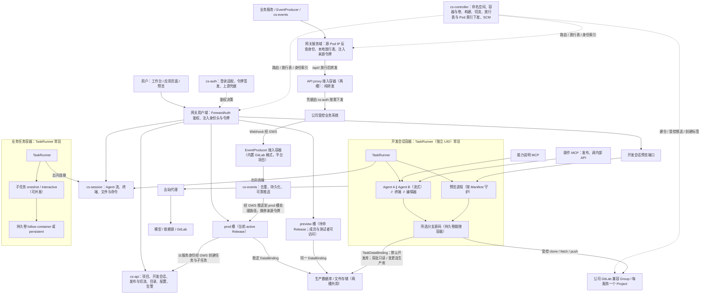

# Design｜CrewStation 数字人能力平台

> 状态：设计草案，待原型与评审验证  
> 版本：0.3.2 · 整理日期：2026-09-10  
> 修订日期：2026-09-11（v0.2.0：任务级执行环境、代码托管与持续意图修改）  
> 修订日期：2026-09-11（v0.3.0：与 Proposal v0.3.0 同步，平台职责收窄、标签发布、网关鉴权、接入容器与事件中心、规模目标；删除 ZIP 与知识飞轮）  
> 修订日期：2026-09-11（v0.3.1：选型按 tech-evaluation.md 确认并回填 §3）  
> 修订日期：2026-09-11（v0.3.2：设计门检视 25 项裁定落文：蓝绿部署槽、源 Pod IP 服务身份、用户域与服务域、网关本地放行表、契约随 Manifest 登记、子任务两种模式、配置与 Secret、日志与告警、每项目命名空间、TaskRunner 独立 UID）  
> 配套文档：[Proposal](./proposal.md) · [Plan](./plan.md) · [Tech Evaluation](./tech-evaluation.md) · [设计门检视](./reviews/design-gate-2026-09-11.md)

## 目录

- [0. 阅读约定](#0-阅读约定)
- [1. 架构不变量与领域模型](#1-架构不变量与领域模型)
- [2. 部署实体与流量路径](#2-部署实体与流量路径)
- [3. 技术基线与可替换接口](#3-技术基线与可替换接口)
- [4. 项目协议、数据对象与接口](#4-项目协议数据对象与接口)
- [5. 开发会话：容器、Agent、工作台与预览](#5-开发会话容器agent工作台与预览)
- [6. 标签发布、构建、蓝绿切流与路由](#6-标签发布构建蓝绿切流与路由)
- [7. 用户身份、服务身份与平台角色](#7-用户身份服务身份与平台角色)
- [8. 内部 API 接入、开放策略、权限化 Swagger 与事件中心](#8-内部-api-接入开放策略权限化-swagger-与事件中心)
- [9. 有状态数字人的数据资源供给](#9-有状态数字人的数据资源供给)
- [10. 任务容器、TaskRunner 与业务子任务契约](#10-任务容器taskrunner-与业务子任务契约)
- [11. 空 Kubernetes 集群的一键安装](#11-空-kubernetes-集群的一键安装)
- [12. 升级、更新与回退](#12-升级更新与回退)
- [13. 安全边界、残余风险与容量控制](#13-安全边界残余风险与容量控制)
- [14. 执行记录与追溯](#14-执行记录与追溯)
- [15. 仓库组织、决策记录与待决项](#15-仓库组织决策记录与待决项)
- [16. 设计完成的判断](#16-设计完成的判断)

## 0. 阅读约定

需求编号 R01–R53 以 Proposal v0.3.2 §6 为准。本设计以公司 Kubernetes 集群为唯一部署目标，本机验证使用 kind 集群，不再有 Docker Compose 路径。

所有 `cs-*` 名称、平台 API、Manifest、状态机、数据对象和安装命令都是拟议协议，尚不是已存在的产品接口。第三方组件选型已按 `proposal/tech-evaluation.md` 确认，但本文不声称任何组件的版本、CRD 或兼容性已经验证，版本在 Plan T0.2 锁定。原稿与对话来源见 Proposal §0.1；本文的细化属于待验证的实现建议。

文档中区分：**要求**是不得违反的产品约束；**基线**是建议实现；**条件性选项**需要满足前置条件后才启用；**待决**事项必须在交付前关闭或明确限制。

### 0.1 v0.3.x 的替代范围

v0.3.0 按 Proposal §0.2 收窄平台在执行侧的职责：删除主 Agent 与角色维度、执行槽与单写入者；意图开发改为开发会话；业务保留子任务契约层；自动入库改为标签发布；cs-connector 改为 cs-events；网关统一鉴权；删除 ZIP 与知识飞轮；明确规模与 HA 目标。

v0.3.2 依据设计门检视（`reviews/design-gate-2026-09-11.md`）的 25 项裁定 G1–G25 再修订：

- preview 与 prod 改为同一生产服务的蓝绿两个部署槽，共用生产数据与身份；晋级即网关切流，回退即切回；授权与订阅按服务；事件只投递到当前 prod 槽；隔离边界改为开发会话与生产之间。
- 服务身份由网关按源 Pod IP 反查，业务代码不携带任何凭据；用户鉴权走 ForwardAuth 到 cs-auth，服务放行表由网关本地执行；网关按 Host 分用户域与服务域，非用户流量全部经服务域并携带平台来源令牌。
- agentProfile 与 outputContract 在 Manifest 声明并随发布登记；开发会话走流式交互，业务子任务提供一次性与交互两种模式；Claude Code 自带沙箱关闭；复制单元重划。
- 新增配置与 Secret 对象、日志聚合与日志页、部署健康态与告警订阅、出站白名单管理、套餐与副本声明、每项目命名空间、TaskRunner 独立 UID、空闲提醒、管理员代建项目、preview 测试者、参考 APIProxy 与内置 EventProducer 走项目流程、CLI 入首版。

既有 R／D／Q／T／AT 编号保留，受影响语义同步修订并在 §15 标注作废与替代。

## 1. 架构不变量与领域模型

### 1.1 必须保持的不变量

1. **控制面不承载业务流量。** 页面、预览、业务 API、内部 API、事件推送、终端与 Agent 流都经网关转发到对应后端；cs-api 不代理业务请求，也不搬运仓库字节与对象文件。
2. **服务隔离与任务执行分开。** 一个服务运行单元承载一个业务服务的一个部署槽；一项任务对应一个由平台调度的长驻容器，容器内常驻 TaskRunner。单个 Agent 进程结束不终结任务容器。
3. **平台不编排开发过程。** 开发会话内可以并行多个 Agent、终端与编辑器操作，工作区共享、分支与合并由使用者决定；平台只保证容器、配额、预览进程与发布前检查。
4. **业务执行经契约层。** 业务服务以自身身份创建任务，通过 Manifest 登记的 agentProfile 与 outputContract 提交 Agent 与命令子任务，子任务可并发，由业务程序协调；平台校验契约、记录 attempt 与状态，不决定下一步。
5. **两类用途分开。** 意图创建与修改 Agent 面向应用自身源码，业务执行 Agent 面向业务任务对象；实例、会话、工作区绑定与权限不能混用。平台不定义 Agent 角色。
6. **网关统一鉴权，业务不带凭据。** 用户身份由网关认证后以可信身份头与绑定目标服务的签名令牌注入；业务服务不做登录鉴权，授权规则归业务。服务身份由网关按源 Pod IP 反查，业务代码不携带、不能自报任何身份。
7. **用户域与服务域分离。** 用户域承载页面与业务 API，做登录跳转并注入用户身份；服务域承载内部 API 调用、事件推送、数字人互调等非用户流量，不做登录跳转，网关注入平台签名的来源令牌。业务服务只接受来自网关的流量。
8. **内部 API 只有一条放行路径。** 服务调用内部 API 必须经网关 `/api/<proxy>/` 前缀，网关按源 Pod 身份与本地放行表做方法加路径级放行，再转给纯转发的 API proxy；用户鉴权决策经 ForwardAuth 交给 cs-auth，放行决策不经 cs-auth。资源级越权由上游或业务把关。
9. **公司事件先进入业务服务。** EventProducer 经服务域产生事件，cs-events 经服务域推送到业务服务当前 prod 槽声明的处理路径；Agent 不直接订阅公司 Webhook。
10. **权限由平台配置与审批决定，不由项目包决定。** Manifest、提示词、请求头、Agent 输出只能提出申请；默认开放的接口即可调，定向开放的接口需管理员审批。
11. **发布是平台创建标签的独立动作，晋级是网关切流。** git push 不等于发布；只有平台创建的 `v大.小.patch` 标签触发构建、兼容迁移与待命槽部署；负责人切流使待命槽成为 prod，原槽待命以备回退。已开始构建的发布不得漂移。
12. **preview 与 prod 是同一生产服务的两个部署槽。** 两槽共用生产数据库、文件、身份与授权，只是网关流量指向不同；不在两槽之间做数据隔离。隔离边界在开发会话与生产之间：开发会话默认连开发库。
13. **数据资源独立于服务发布版本与任务。** 升级、释放任务、删除旧发布都不删除业务数据库或文件。
14. **存储随任务。** 意图任务的持久卷跟随容器，释放即回收；业务任务默认相同，可选持久卷持久、容器可重建。任务释放不删仓库与业务数据，未推送内容由使用者负责。空闲只提醒，不自动释放。
15. **一逻辑业务服务一个托管 Project，一个项目一个命名空间。** 公司 Group 下自动建仓；两槽、运行副本、任务容器与 Secret 都在项目命名空间内。
16. **回退程序不恢复已撤销的权限，也不自动回退业务数据。**
17. **“已分配地址”不等于“服务已就绪”。** 建仓、容器、预览、数据绑定、授权接入、告警分别显示状态。
18. **执行链路可追溯。** 一个 taskId 对应一条 traceId 链路，traceId 在任务创建时由平台生成并随事件投递携带；Agent 执行以 sessionId 记录并可由 traceId 索引；知识提取留待未来。
19. **控制面高可用与规模目标是首版约束。** cs-* 多副本、元数据库高可用、网关多副本；所有组件按数百数字人并发、数百节点评估。
20. **接入容器与业务服务同一套项目流程。** API proxy 与 EventProducer 由管理员以平台项目开发、标签发布、蓝绿两槽，不新增常驻服务；内置 GitLab 格式 EventProducer 由安装器建为平台项目。
21. **运营元素是平台能力。** 配置与 Secret、日志聚合与日志页、部署健康态与告警订阅、出站白名单、套餐与副本由平台提供，不留给业务自行解决。
22. **TaskRunner 与 Agent 进程分权。** TaskRunner 以独立系统用户运行，凭据与契约文件只对它可读，文件接口以 realpath 校验边界。

### 1.2 核心对象

| 对象 | 含义／关键关系 | 生命周期 |
|---|---|---|
| `Tenant` / `Team` | 用户、项目、授权和资源的组织范围；首版无独立团队对象 | 组织级 |
| `Project` | 开发与管理空间，首版承载一个业务服务；由管理员创建并指定负责人；对应一个命名空间 | 项目级 |
| `DigitalWorkerService` | 可独立发布的业务定义，包含页面、API、事件逻辑；kind 可为 `DigitalWorker`、`APIProxy`、`EventProducer` | 服务级 |
| `SourceRepositoryBinding` | 服务的托管连接、Group、远端 Project ID、仓库地址与默认分支 | 服务级、长期 |
| `DeploymentSlot`（面向用户称环境） | preview 与 prod 两个部署槽：各自运行一个 Release 的副本，共用生产数据与身份；`active` 标记当前承接 prod 流量的槽 | 服务级、两条 |
| `ServiceIdentity` | 服务的稳定工作负载身份：命名空间加 ServiceAccount；网关按源 Pod IP 反查得到 | 稳定主体 |
| `DevSession`（面向用户称“开发会话”） | 意图任务：一个项目同时至多一个；引用其 `TaskEnvironment`，另有工作分支、预览进程、Agent 会话、数据绑定、空闲提醒状态 | 运行／释放 |
| `TaskEnvironment` | 任务容器的逻辑对象：用途 intent 或 business、持久卷模式、配额占用、traceId、容器与卷引用 | 任务级 |
| `TaskRunner` | 任务容器内以独立 UID 常驻的平台进程，向控制面暴露启动 Agent、执行命令、读写文件、终端与预览守护接口 | 随容器 |
| `AgentSession` | 一次 Agent 会话：驱动、模型、原生会话 ID、模式（流式交互或一次性）、状态；属于开发会话或某个业务子任务 | 可恢复 |
| `AgentProfile` / `OutputContract` | Manifest `tasks` 段声明、随发布登记的 Agent 配置与产物契约；子任务按名称引用 | 随 Release 版本化 |
| `SubtaskRun` / `Attempt` | 业务任务内一次 `agent` 或 `command` 子任务及其尝试：agentProfile、outputContract、模式 oneshot 或 interactive、状态、退出信息 | 子任务级 |
| `CommandRun` | 命令子任务或开发会话内显式命令的 argv、cwd、退出状态与输出 | 执行级 |
| `TaskVolume` | 任务持久卷：模式 `follow-container` 或 `persistent`，内嵌于 TaskEnvironment 记录 | 随任务 |
| `TaskDataBinding` | 某任务访问 DataResource 的模式、范围、有效期、审批引用 | 限时、可撤销 |
| `DataResource` / `DataBinding` | 每服务一份生产数据库、Bucket、卷与一份开发库，及其稳定绑定；两槽共用生产绑定 | 服务级 |
| `ConfigItem` / `SecretValue` | 服务的配置项与 Secret：键名来自 Manifest `env` 段，取值分开发与生产两组，生产值由负责人维护 | 服务级、版本化 |
| `Release` | 一次标签发布：标签、最终提交 SHA、镜像摘要、配置版本、迁移与验证记录、登记的 profile 与契约 | 不可变 |
| `TrafficSwitch` | 负责人把 prod 流量切到某槽的动作：方向、预期在线 Release、执行人、结果；回退也是一次切换 | 不可变记录 |
| `ServiceDeployment` | 某槽上某 Release 的运行副本 | 可替换 |
| `ServicePlan` / `TaskProfile` | 管理员定义的服务资源套餐与任务容器规格；Manifest 引用 | 管理级 |
| `APIOperation` / `OpenPolicy` / `APIGrant` / `APIRequest` | 目录中的操作（键为 proxy 名加方法加路径）、默认或定向开放策略、服务获得的授权、待审批申请 | 目录／策略级 |
| `UpstreamConnection` | API proxy 使用的公司上游连接与凭据引用，由 cs-auth 按需下发 | 管理级 |
| `EventType` / `EventSubscription` / `EventDelivery` | EventProducer 声明的事件类型、服务的订阅与处理路径、投递记录 | 服务级 |
| `EgressAllowlistEntry` | 全局出站白名单条目及按项目开放；被阻请求记录 | 管理级 |
| `AlertSubscription` | 项目级告警订阅：事件类型与接收人 | 项目级 |
| `PreviewTester` | 负责人为 preview 域指定的非成员访问者 | 服务级 |
| `TaskQuota` | 每数字人的并发任务配额 | 服务级 |
| `ExecutionEvent` | 任务、子任务、Agent 会话与命令的事实记录，带 traceId、taskId、sessionId，前台触发时含 OTel trace_id | 按保留策略 |

**实例约定：** 数字人实例是独立逻辑业务服务；扩容副本不新建仓库或扩大授权。TaskEnvironment 对应一个容器加一个持久卷。

**来源约定：** 公司托管仓库是正式源码历史；开发容器内未推送的内容不是平台保证的对象。Git 不保存数据库、秘密或执行日志。

**旧对象调整：** `ServiceEnvironment` 改为 `DeploymentSlot`；`Promotion` 改为 `TrafficSwitch`；`SandboxLease` 删除，业务任务持久模式下“容器可重建、任务不变”由 TaskEnvironment 与 TaskVolume 表达；`RunWorkspaceBinding`、`TaskWorkspaceBinding`、`Checkpoint`、`SourceRevision`、`KnowledgeCandidate`、`KnowledgeVersion`、`RepositoryEnvironment` 自 v0.3.0 起删除；`AgentRun` 并入 `AgentSession` 与 `Attempt`。

### 1.3 两类用途与两种执行方式

| 维度 | 意图创建与修改 Agent | 业务执行 Agent |
|---|---|---|
| 谁发起 | 开发者在开发会话中手动启动，可多个并行 | 业务服务按业务规则经契约层提交 |
| 工作对象 | 当前数字人应用自身的源码与开发容器 | 业务任务授权的仓库、文档、问题单等 |
| 交互 | 流式交互会话；这是对 agent-workflow 一次性进程的登记偏差 | 子任务模式 `oneshot`（一次性进程，无等待输入）或 `interactive`（可续消息，有 AwaitingInput） |
| 平台提供 | 启动 Agent、执行命令、读写文件、终端、预览守护、能力说明 MCP、操作 MCP、日志页 | Manifest 登记的契约、attempt、状态机、产物读取 |
| 平台不做 | 不决定下一步，不协调多个 Agent 的工作区 | 不决定步骤顺序，不做业务结果判定 |
| 身份 | 开发会话绑定开发者；调用内部 API 以本服务的身份经开发容器发出 | 绑定服务与当前任务 |
| 存储 | 持久卷跟随容器，无暂停 | 默认跟随容器；可选持久卷持久与暂停恢复 |

两类用途共用 RuntimeDriver、任务容器镜像、TaskRunner 与执行资源；`purpose` 字段取 `intent` 或 `business`。没有 `role` 字段；业务子任务用 `agentProfile` 选择驱动、模型与工具配置。

## 2. 部署实体与流量路径

### 2.1 常驻部署

| 实体 | 主要职责 | 关键边界 |
|---|---|---|
| 网关（Traefik） | 统一入口；按 Host 分用户域与服务域；用户域经 ForwardAuth 到 cs-auth 鉴权并注入身份头与令牌；服务域按源 Pod IP 反查调用方身份，注入平台来源令牌，并按本地放行表放行 `/api/<proxy>/` 调用；按 Host 与路径转发页面、业务、预览、平台、会话与终端流量 | 不执行平台业务逻辑；多副本；放行表与 Pod 身份索引由控制面下发 |
| `cs-api` | 项目、服务、成员与角色、开发会话、发布与切流请求、接口目录与开放策略、配置与 Secret、告警订阅、出站清单、能力说明数据、控制台后端 | 不执行用户代码，不代理业务流量 |
| `cs-auth` | 企业登录适配与用户鉴权决策、身份头与签名令牌签发、上游凭据服务（按需向 API proxy 下发）、Pod 身份索引的维护来源之一 | 不在服务调用的同步路径上；不向用户代码提供平台长期凭据；密钥轮换有重叠期 |
| `cs-controller` | 命名空间、任务容器与持久卷调度、配额准入、构建、发布到待命槽、切流、路由与放行表下发、Pod 身份索引下发、数据供给、GitLab 管理操作模块（建仓、受控推送、创建标签）、空闲提醒、健康态采集 | 受限集群权限；副作用持久化并在多副本间以租约协调 |
| `cs-session` | 开发会话与业务任务的 Agent 会话流、终端、文件与命令流的接入端；接受各任务容器内 TaskRunner 的出向连接并在副本间转发 | 不把 TaskRunner 端口公开；多副本，会话可在副本间恢复 |
| `cs-events` | 事件分发中心：接收 EventProducer 事件，去重、持久化、按订阅经网关服务域推送到当前 prod 槽的处理路径，重试与死信 | 不接收公司原始 Webhook；不直达 Agent |
| 能力说明 MCP | 向开发容器内的 Agent 提供平台能力目录与本服务现状的只读 resource | 与操作 MCP 分开部署 |
| 操作 MCP | 向 Agent 提供发布、调用内部 API 等 tools，按开发会话授权执行 | 每次调用经 cs-api 校验 |
| TaskRunner（任务容器内） | 以独立 UID 常驻于每个任务容器：启动 Agent 子进程、执行命令、读写文件、PTY、按 Manifest 守护预览、回传事件、契约校验 | 出向连接 cs-session；凭据与契约文件只对它可读 |
| 出站代理 | 按域名执行全局与项目级出站白名单，记录被阻请求 | 候选待定（tech-evaluation E23） |
| 日志采集与存储 | 采集业务服务、任务容器、构建与迁移 Job 的 stdout 日志，供工作台日志页查询 | 候选待定（tech-evaluation E24） |
| PostgreSQL、对象存储、镜像仓库、CSI、备份设施 | 元数据、业务数据、产物和持久资源 | 元数据库高可用；独立升级与保留规则 |

五个 `cs-*` 是自研常驻服务，采用同仓库模块化实现；两个平台 MCP 是独立部署单元。TaskRunner 是任务容器镜像的一部分。API proxy 与 EventProducer 是管理员开发的平台项目。代码托管使用公司已提供的 GitLab 兼容服务。

### 2.2 动态部署

| 实体 | 建议映射 | 谁创建／释放 |
|---|---|---|
| 项目命名空间 | 每项目一个 Namespace，含 ResourceQuota、默认 NetworkPolicy、项目 Secret | cs-controller 在管理员代建项目时创建 |
| 业务服务部署槽 | 每槽一个 Deployment＋Service；HTTPRoute 按 Host 指向当前 prod 槽与 preview 槽；共用 ServiceAccount 与数据绑定 | cs-controller 按 Release 与 TrafficSwitch 管理 |
| API proxy／EventProducer 接入容器 | 与业务服务相同的两槽形态，kind 不同 | 管理员项目的标签发布；cs-controller 部署 |
| 托管 Project | 公司配置 Group 下的远端仓库资源 | cs-controller 的 SCM 模块创建；归档独立操作 |
| 开发会话容器 | 项目命名空间内一个 Pod（任务容器镜像，内含 TaskRunner 与双驱动 CLI）＋跟随容器的持久卷＋预览端口路由 | cs-controller 在配额内创建；会话关闭即释放 |
| 业务任务容器 | 一个 Pod＋持久卷（`follow-container` 或 `persistent`） | cs-controller 经业务服务请求创建；关闭释放；持久模式可暂停后重建 Pod |
| Agent／命令子进程 | 任务容器内由 TaskRunner 以普通用户启动的进程 | TaskRunner 执行与清理，结束不删除容器 |
| 构建／迁移／发布验证 | 固定标签 SHA 输入的独立 Job | cs-controller 管理；生产权限不进入任务容器 |
| 数据库、Bucket、PVC | 每服务生产 DataResource 与开发库；任务经 TaskDataBinding 访问 | DataProvider 供给；任务关闭只撤销绑定不删资源 |

### 2.3 部署关系图



### 2.4 控制面与数据面

| 流量 | 路径 |
|---|---|
| 平台管理与工作台 | 浏览器 → 网关用户域（ForwardAuth）→ cs-api |
| 正式业务页面／API | 浏览器 → 网关用户域（鉴权，注入身份头与绑定目标服务的令牌）→ 当前 prod 槽 |
| preview 槽访问 | 浏览器 → 网关用户域（鉴权，项目成员或指定测试者）→ preview 槽 |
| 开发预览／热更新 | 浏览器 → 网关用户域（项目成员）→ 开发会话容器预览端口；含 WebSocket |
| Agent 对话、终端、文件与命令 | 浏览器 → 网关用户域 → cs-session ⇄（出向连接）任务容器内 TaskRunner |
| 内部 API 调用 | 业务服务或任务容器 → 网关服务域 `/api/<proxy>/…`（源 Pod IP 反查身份，本地放行表）→ API proxy → 公司系统 |
| 数字人互调 | 调用方 → 网关服务域（同上，被调方 `exposes` 登记的操作）→ 被调方 prod 槽 |
| 业务服务调用平台 API | 业务服务 → 网关服务域（源 Pod IP 反查身份）→ cs-api：创建任务、提交子任务、读取产物 |
| 公司 Webhook | 公司系统 → 网关服务域 → EventProducer → cs-events → 网关服务域（注入来源令牌）→ prod 槽处理路径 |
| SQL | 槽副本或任务容器 → 生产数据库或开发库／连接池，不经过控制面 |
| 对象文件 | 业务服务或受限直传 → 对象存储，不经过 cs-api |
| 源码托管 | cs-controller SCM 模块完成管理操作；开发容器通过受控 Git 路径 clone／fetch／push |
| 任务容器出站 | 任务容器 → 出站代理（域名白名单）→ 模型、依赖源、GitLab、平台 MCP |
| 日志 | 各 Pod stdout → 日志采集 → 日志存储 → cs-api 查询 → 工作台日志页 |

路由、放行表与 Pod 身份索引变化由 cs-controller 下发，网关执行；不为每个服务调用查询 cs-api 或 cs-auth。网关、cs-auth、cs-session 均多副本并分别测量容量。

## 3. 技术基线与可替换接口

### 3.1 已确认的技术基线

选型已按 `proposal/tech-evaluation.md` 逐项确认，此处为结论与核心验证；版本在 Plan T0.2 锁定，待验证项由 M0 原型核实。v0.3.2 依据设计门检视新增出站代理、日志聚合、告警通知三项待定候选，并修订身份与驱动两行。

| 部分 | 选型 | 核心验证 |
|---|---|---|
| 管理面语言与框架 | TypeScript on Bun；Bun workspaces；Hono；zod 契约并生成 OpenAPI | 长驻多副本稳定性；WebSocket 与流式 |
| 控制台与 CLI | React、Vite、TanStack Router 与 Query、CodeMirror、xterm.js、嵌入 Swagger UI；CLI 与工作台共用 API | 多 Agent 流式面板与终端并存的性能 |
| 元数据与队列 | PostgreSQL 高可用；Drizzle；PostgreSQL 表队列加租约与 fencing token | 吞吐与锁竞争；多副本续接；租约 TTL 与故障切换时序 |
| 网关 | Traefik；用户域经 ForwardAuth 到 cs-auth；服务域按源 Pod IP 反查身份并按本地放行表放行；Gateway API | WebSocket 升级；放行表与 Pod 索引下发及缓存失效；备选 Envoy Gateway |
| 用户与服务身份 | OIDC 对接公司 IdP；jose 签发绑定目标服务的 JWT 与 JWKS 轮换；服务身份由网关按源 Pod IP 反查，Pod 身份索引由控制面维护 | 公司 IdP 协议；令牌格式；所选 CNI 保留源 IP 与 NAT 场景（Q21） |
| 任务容器 | Kubernetes 原生 Pod、PVC、NetworkPolicy、ResourceQuota，cs-controller 直接管理；每项目一个命名空间；不引入任何额外沙箱层；tini 作 PID 1 | 供给时延；预热必要性 |
| TaskRunner | TypeScript；运行时优先 Bun，PTY 不可用则 Node；独立系统用户；文件接口 realpath 校验；出向 WebSocket 连接 cs-session；协议带版本字段 | PTY；连接迁移；多版本 TaskRunner 并存 |
| Agent 驱动 | 复制单元为 agent-workflow 的 runtime 驱动、execution/agentInjection、agentProcess 与 managedProcess、shared 的 Agent、Mcp、AgentPermission Schema；编排新写；双驱动；开发会话流式交互与关闭 Claude 自带沙箱为两处登记偏差 | 逐文件依赖清单与源 commit（T0.4）；两个 CLI 的流式交互能力（Q22）；会话恢复的并发保护 |
| 源码托管 | 公司 GitLab 兼容服务；复制 code-host 的 url 与 call 纪律及 gitlabAdapter，新写建仓、标签、保护标签与投递 | 公司兼容范围（Q11） |
| 构建 | BuildKit rootless 作 Kubernetes Job，全局与项目级并发上限入表队列 | rootless 允许方式（Q04） |
| 数据供给 | CloudNativePG；公司托管 PostgreSQL 优先；对象存储优先公司已有 S3 兼容存储；每服务一份生产库加一份开发库 | 高可用切换；单项目恢复；预签名与跨桶拒绝 |
| 事件中心 | PostgreSQL inbox 与 outbox 表加 SKIP LOCKED worker；经网关服务域 HTTP 推送，退避、并发上限、熔断、死信 | 目标档位吞吐 |
| 平台 MCP | 官方 MCP SDK；Streamable HTTP；两个独立服务，多副本无状态 | 容器内连接鉴权与凭据轮换 |
| 观测与追溯 | OpenTelemetry SDK 与 Collector；execution_events 表含 trace_id 与 otel_trace_id | OTel SDK 在 Bun 下的兼容 |
| 日志聚合 | 集群日志采集与存储，候选待定（E24） | 数百服务日志量；工作台查询时延 |
| 出站代理 | 按域名放行的出站代理，候选待定（E23） | 与 NetworkPolicy 配合；性能 |
| 告警通知 | 部署健康态与项目级告警订阅；通知渠道待定（Q20） | 公司 IM 或邮件接入 |
| 发行与安装 | Helm chart；Bun 单文件二进制安装器；本地仅 kind | 离线引导；HA 在多节点集群验证 |

Knative、OPA、Temporal、Buildpacks、Longhorn 保留为条件性选项；首版不引入 Kafka、Redis、Istio；gVisor、Kata 等额外沙箱不列为选项。

### 3.2 适配边界

- `IdentityProvider`：用户登录、企业账号映射；为网关用户域提供 ForwardAuth 决策。
- `GatewayPolicy`：向网关下发用户域与服务域的 Host 路由、身份注入规则、来源令牌注入、按服务的内部 API 方法加路径放行表、Pod 身份索引。
- `PodIdentityResolver`：控制面维护 Pod IP 到服务身份（命名空间、服务、槽或任务）的索引并下发网关；网关本地查询，带版本与失效。
- `ServiceHost`：部署槽、接入容器的部署、就绪检查、路由后端、切流与版本退役。
- `TaskContainerProvider`：任务容器与持久卷的创建、访问、暂停重建（持久模式）、释放、配额准入；首版实现为对 Kubernetes 原生对象的直接管理。
- `RuntimeDriver`：复制自 agent-workflow 的驱动接口，OpenCode 与 Claude Code 两个实现；事件解析、spawn 计划、会话恢复、取消；流式交互模式为新增能力。
- `TaskRunner API`：容器内进程对控制面暴露的启动 Agent、执行命令、文件、PTY、预览守护、契约校验、事件流接口，协议带版本。
- `SourceControlProvider`：cs-controller 内的模块；建仓、初始化、受控推送、创建 v 标签、保护标签、确认远端 SHA、会话级短期 Git 凭据。
- `CredentialProvider`：cs-auth 内的模块；按 UpstreamConnection 向 API proxy 按需下发短期上游凭据。
- `ConfigInjector`：把 ConfigItem 与 SecretValue 按取值组注入槽副本（生产组）与开发会话（开发组）的环境变量。
- `EgressPolicy`：全局与项目级出站白名单下发到出站代理；被阻请求回收到 cs-api。
- `LogPipeline`：日志采集、存储与按服务、槽、任务的查询接口。
- `AlertNotifier`：健康态与事件到告警订阅的投递，渠道待定。
- `EventProducer 契约`：接入容器经服务域向 cs-events 投递归一化事件的协议；`EventDelivery` 是 cs-events 经服务域向业务服务推送的协议。
- `DataProvider`：数据库、Bucket、卷的申请、绑定、备份恢复和回收。
- `ArtifactStore` / `ImageRegistry`：不可变镜像产物。

接口先定义，每种首版只实现必要后端。

## 4. 项目协议、数据对象与接口

### 4.1 Manifest

模板生成与标签发布统一使用版本化 Manifest。以下示例是拟议协议，构建 profile 与命令随最小样例模板语言确定。

```yaml
apiVersion: crewstation/v1
kind: DigitalWorker
metadata:
  name: issue-worker
spec:
  build:
    profile: web-service-v1          # 首版构建 profile 随最小样例模板语言在评审时确定
    install: [<pkg>, install]
    command: [<pkg>, build]
  development:
    command: [<pkg>, dev]            # TaskRunner 在开发容器内自动启动并守护
    port: 3000
  service:
    command: [<runtime>, dist/server.js]
    port: 3000
    healthPath: /healthz
    plan: standard-small             # 管理员定义的服务套餐
    replicas: 2                      # 每槽副本数，须在套餐允许范围内
    releaseMode: rolling-compatible  # 使用单写卷时改为 maintenance
  env:                               # 只声明键名与来源；取值在平台对象中分开发与生产两组
    - { name: ISSUE_API_BASE, from: config }
    - { name: NOTIFY_TOKEN, from: secret }
  apis:
    requested:                       # 只需为定向开放的接口申请；默认开放接口无需声明
      - { proxy: issues, method: GET, path: /v1/issues/{id} }
      - { proxy: scm, method: POST, path: /v1/merge-requests }
    exposes:                         # 可选：把本服务接口登记进目录供其他数字人调用
      openapi: ./openapi.yaml
  subscriptions:
    - { eventType: gitlab.pipeline.finished, handlerPath: /events/pipeline }
  tasks:
    profile: coding-medium           # 管理员定义的任务容器规格
    defaultVolumeMode: follow-container   # 业务任务可在创建时以高级参数覆盖为 persistent
    agentProfiles:                   # 随发布登记；子任务按名称引用
      - { name: analysis-v1, driver: claude-code, model: <provider>/<model>, permission: read-only }
      - { name: coding-v1, driver: opencode, model: <provider>/<model>, permission: edit }
    outputContracts:
      - { name: analysis-report-v1, required: [reports/analysis.md], schema: ./contracts/analysis-report.schema.json }
      - { name: test-result-v1, required: [reports/test-result.json] }
  data:
    database: { type: postgresql, plan: shared-small, retention: retain }
    attachments: { type: object-storage, plan: standard, retention: retain }
  release:
    migrationCommand: [<pkg>, db:migrate]
    migration:
      compatibility: expand-only     # 须与在线槽兼容；destructive 需维护窗口
      destructive: false
      rollback: switch-back
```

```yaml
apiVersion: crewstation/v1
kind: APIProxy
metadata: { name: issues }
spec:
  service: { command: [<runtime>, dist/server.js], port: 8080, healthPath: /healthz, plan: standard-small, replicas: 2 }
  exposes: { openapi: ./openapi.yaml }     # 发布后以 proxy 名加方法加路径登记进目录
  upstream: { connection: company-issues } # 管理员登记的上游连接；凭据由 cs-auth 按需下发
  openPolicy: { default: targeted }        # 建议值；正式策略由管理员在目录中设置
```

```yaml
apiVersion: crewstation/v1
kind: EventProducer
metadata: { name: gitlab-events }
spec:
  service: { command: [<runtime>, dist/server.js], port: 8080, plan: standard-small, replicas: 2 }
  ingress: { path: /webhooks/gitlab, verification: secret-token }   # 经网关服务域进入
  produces: [gitlab.merge_request.updated, gitlab.pipeline.finished, gitlab.note.created]
```

约束：

- 不接收宿主机目录、Docker socket、任意 ServiceAccount、任意 K8s YAML、特权容器设置或原始公司凭据作为可直接生效配置。
- `env` 只声明键名与来源，取值在平台 ConfigItem 与 SecretValue 中，分开发与生产两组；生产组由负责人维护。
- `apis.requested` 以 proxy 名加方法加路径申请定向开放接口，实际 `APIGrant` 由管理员审批产生；`exposes` 登记的操作默认为定向开放。`openPolicy` 只是接入容器作者的建议值。
- `tasks.agentProfiles` 与 `outputContracts` 随发布登记并版本化；子任务只能引用已登记名称。`tasks.profile` 与 `service.plan` 必须是管理员定义的套餐，`replicas` 在套餐范围内。
- `tasks.defaultVolumeMode` 只影响业务任务；开发会话固定为 `follow-container`。配额不在 Manifest 申请。
- `release.migration` 声明兼容性；`destructive: true` 的发布只能在维护窗口切流。
- 没有角色、执行槽、检查点、基线策略、自动发布策略字段。
- `plan` 是管理员允许的套餐；超额度、缺 StorageClass 或不支持的访问模式应阻塞发布。

### 4.2 主要持久化关系

| 数据集合 | 唯一性／关键字段 | 要防止的问题 |
|---|---|---|
| projects / services / deployment_slots | project（namespace）、service（kind）；slots：service＋slot ∈ {preview, prod}、release_id、active | 两槽同时 active；接入容器与业务服务混淆 |
| project_members / platform_admins / preview_testers | project＋user 唯一；role ∈ {owner, developer}；testers：service＋user | 越权切流、越权审批、非成员访问 preview |
| source_repository_bindings | service 唯一；connection、namespace_id、remote_project_id、default_branch、provisioning_step | 重试重复建仓、同名接管 |
| dev_sessions | project 上至多一条 active；task_environment_id、branch、opened_by、idle_since、reminder_sent_at | 同项目双会话、释放后残留、空闲无人知 |
| task_environments | purpose、service、volume_mode、status、quota_slot、container_ref、volume_ref、trace_id | 超配额准入、持久卷误删、traceId 缺失 |
| agent_sessions | dev_session_id 或 subtask_id；mode、driver、model、native_session_id、status | 混用上下文、并发恢复同一原生会话 |
| agent_profiles / output_contracts | service＋release_id＋name；definition、digest | 未登记契约、发布后漂移 |
| subtasks / attempts | task_id＋request_key；kind、mode、agent_profile、contract、attempt、status、business_outcome | 重试混入旧结果、契约未校验 |
| command_runs | task_id、可选 subtask_id；argv、cwd、exit_code、输出引用 | 命令无退出记录 |
| config_items / secret_values | service＋key＋value_set ∈ {development, production}；version、updated_by；Secret 值加密存储 | 明文落库、开发值进生产、无版本 |
| releases / traffic_switches / deployments | releases：service、tag 唯一、sha、image_digest、config_version、migration_decl、status；switches：service、from_slot、to_slot、expected_active_release、actor、result；deployments：slot、release_id | 手工标签冒充发布、迟到切流覆盖新版、两槽 active |
| task_data_bindings | task、resource_ref、mode、scope、expires_at、approved_by、credential_ref | 任务结束继续访问、未审批即绑定 |
| data_resources / data_bindings | service、value_set ∈ {production, development}、provider_id、retention、credential_ref | 跟随 Release 或任务删除业务数据 |
| api_operations / open_policies / api_grants / api_requests | operation：proxy＋method＋path 唯一；policy ∈ {open, targeted}；grant：service＋operation；request：status、reason | 目录键冲突；未审批即放行；拒绝无理由 |
| pod_identity_index | pod_ip＋valid_from；namespace、service、slot 或 task、valid_until | 源 IP 复用导致身份错配 |
| gateway_policy_versions | version、routes_digest、allowlist_digest、identity_index_digest | 网关与控制面版本不一致 |
| upstream_connections | name、owner、credential_ref、allowed_proxies | 凭据落入 proxy 配置 |
| event_types / subscriptions / event_inbox / deliveries | producer＋type；subscription：service＋type＋handler_path；inbox：origin＋event_id 唯一，trace_id；delivery：attempt、target_slot | 重复投递、投到非 active 槽 |
| egress_allowlist / egress_project_grants / egress_blocked | entry：domain、scope；grant：project＋entry；blocked：project、domain、count、last_seen | 无人知晓被阻；随意放开 |
| alert_subscriptions / alerts | project＋type＋receiver；alert：source、type、first_seen、resolved_at | 崩溃无人知 |
| service_plans / task_profiles / task_quotas | plan：name、limits；quota：service → max_concurrent_tasks | 超套餐；一人耗尽集群 |
| execution_events | trace_id、otel_trace_id、task_id、subtask_id、session_id、sequence | 失去链路来源 |
| install_runs / migrations / audit | step、version、fencing_token、result | 并发安装、误删仓库与数据 |

业务数据库表由用户项目维护，不写入平台管理库。

### 4.3 平台 API 概览

| API（拟议） | 作用 |
|---|---|
| `POST /v1/admin/projects` | 管理员代建项目：命名空间、服务、稳定地址、托管 Project、最小样例初始化、首个标签构建与部署到 preview 槽、指定负责人 |
| `GET /v1/projects/:id` | 仓库、地址、两槽部署、开发会话、配额、健康态 |
| `POST /v1/projects/:id/members` / `DELETE …` ；`POST /v1/services/:id/preview-testers` | 负责人管理成员与 preview 测试者 |
| `GET /v1/services/:id/branches` | 分支列表，各分支 HEAD 与两槽部署提交的落后数；供开启会话前的下拉框 |
| `POST /v1/projects/:id/dev-sessions` | 开启开发会话并指定工作分支；项目已有 active 会话时拒绝 |
| `GET /v1/dev-sessions/:id` | 容器、预览、数据绑定、分支、空闲状态 |
| `POST /v1/dev-sessions/:id/agents` / `POST …/agents/:agentId/messages` / `GET …/agents/:agentId/events` / `POST …/agents/:agentId/cancel` | 启动流式交互 Agent 会话、发消息、订阅事件流、取消 |
| `POST /v1/dev-sessions/:id/terminals` | 建立 PTY，经 WebSocket 接入 |
| `GET /v1/dev-sessions/:id/files` / `PUT …/files` | 文件树、读取、写入，供编辑器使用；realpath 校验 |
| `POST /v1/dev-sessions/:id/commands` | 执行显式命令并回传输出 |
| `POST /v1/dev-sessions/:id/data-bindings` ；`POST /v1/data-bindings/:id/approve` / `reject` | 申请 development 之外的数据访问模式；负责人批准或拒绝并给理由 |
| `POST /v1/dev-sessions/:id/publish` | 发布：检查未提交、代为推送、创建 v 标签、构建、兼容迁移、部署到待命槽 |
| `DELETE /v1/dev-sessions/:id` | 释放会话，回收容器与持久卷；负责人可强制 |
| `GET /v1/services/:id/config` / `PUT …/config/:key` ；`PUT /v1/services/:id/secrets/:key` | 配置与 Secret 的键值维护，分开发与生产两组；生产组仅负责人 |
| `GET /v1/services/:id/releases` ；`POST /v1/services/:id/traffic-switches` | 发布列表；负责人切流：目标槽与预期在线 Release；回退即再次切换 |
| `GET /v1/services/:id/logs` / `GET /v1/task-environments/:id/logs` / `GET /v1/releases/:id/build-logs` | 按槽、任务、构建与迁移 Job 查询日志 |
| `GET /v1/services/:id/health` ；`POST /v1/projects/:id/alert-subscriptions` | 部署健康态；项目级告警订阅 |
| `POST /v1/task-environments` | 业务服务以源 Pod 身份创建业务任务，可带 volumeMode 高级参数 |
| `POST /v1/task-environments/:id/subtasks` / `GET …/subtasks/:subtaskId` / `POST …/subtasks/:subtaskId/cancel` / `POST …/subtasks/:subtaskId/messages` | 提交、查看、取消子任务；interactive 模式下续消息 |
| `GET /v1/task-environments/:id/files` / `GET …/events` | 读取任务容器内文件与事件流 |
| `POST /v1/task-environments/:id/pause` / `resume` / `close` | 持久卷持久模式的暂停恢复；关闭并释放 |
| `GET /v1/services/:id/apis/openapi.json` | 按服务授权裁剪的可调用接口文档 |
| `POST /v1/services/:id/api-requests` ；`POST /v1/admin/api-requests/:id/approve` / `reject` | 申请定向开放接口；管理员批准或拒绝并给理由 |
| `POST /v1/admin/open-policies` / `POST /v1/admin/upstream-connections` / `POST /v1/admin/grants/:id/revoke` / `POST /v1/admin/upstream-connections/:id/disable` | 管理员：开放策略、上游连接登记、撤销授权、停用连接 |
| `GET /v1/projects/:id/egress` ；`POST /v1/projects/:id/egress-requests` ；`POST /v1/admin/egress-allowlist` | 项目查看被阻请求与申请追加；管理员维护全局清单与按项目开放 |
| `POST /v1/admin/plans` / `POST /v1/admin/quotas` | 管理员定义套餐与任务容器规格、调整配额 |
| `POST /v1/admin/projects/:id/pause` / `archive` / `delete` ；`GET /v1/admin/audit` | 项目暂停、归档、删除；审计查看 |
| `POST /v1/events`（内部，服务域） | EventProducer 以自身身份投递归一化事件到 cs-events |
| `POST /v1/projects/:id/data-resources` / `restores` | 数据申请与受控恢复 |

CLI 与工作台共用上述 API。能力说明数据由 cs-api 提供给工作台能力页，并由能力说明 MCP 以 resource 形式暴露给开发容器内的 Agent。异步操作返回 operation／task／subtask ID；创建、发布、切流与资源申请使用幂等键；更新带预期版本。

### 4.4 请求示例

业务任务内的一个 Agent 子任务与一个命令子任务，二者可同时提交并并发执行：

```json
{
  "requestKey": "T123-analysis-1",
  "kind": "agent",
  "mode": "oneshot",
  "agentProfile": "analysis-v1",
  "input": {"instruction": "分析问题单 #4711 并在 reports/analysis.md 写出结论"},
  "outputContract": "analysis-report-v1"
}
```

```json
{
  "requestKey": "T123-test-1",
  "kind": "command",
  "argv": ["<pkg>", "test"],
  "workingDirectory": "backend",
  "outputContract": "test-result-v1"
}
```

开发会话内启动一个流式交互 Agent：

```json
{
  "driver": "claude-code",
  "model": "<provider>/<model>",
  "cwd": ".",
  "initialPrompt": "阅读 CONTRIBUTING.md，然后给列表页加上按状态筛选"
}
```

## 5. 开发会话：容器、Agent、工作台与预览

### 5.1 管理员代建项目与自动建仓

**要求：项目由管理员创建并指定负责人；每创建一个逻辑业务服务，平台就在配置的公司 GitLab 兼容 Group／Subgroup 下自动创建一个 Project，并创建项目命名空间。** 两个部署槽、副本、发布版本和开发会话都复用该仓库。接入容器同样如此。

自动建仓与初始化流程：

1. 管理员提交项目名、模板、负责人；cs-api 事务性创建项目、服务、命名空间与地址记录。
2. cs-controller 创建命名空间、ResourceQuota、默认 NetworkPolicy、服务 ServiceAccount，并把身份写入 Pod 身份索引。
3. SCM 模块以平台受控身份在目标 Group 下创建 Project，保存远端 Project ID 与归属证据；超时先核对远端结果。
4. 提交并推送最小样例模板到默认分支，确认远端 SHA；配置保护标签规则，使 `v*` 标签只能由平台身份创建。
5. 以初始提交创建首个 v 标签、构建、部署到 preview 槽（M1 交付）；prod 槽在负责人首次切流后生效。
6. 仓库、命名空间、两槽分别显示 Ready／Failed／AwaitingAuthorization 等状态。

同名仓库只有经过归属核验并证明属于同一幂等创建操作才可复用。建仓管理凭据留在 cs-controller 边界。开发容器以会话级、单 Project、短期的 Git 凭据 clone／fetch／push，提交署名为开发者本人；凭据不写入源码、镜像或日志。

### 5.2 开发会话建立链路

1. 开发者在项目页调用分支列表接口，下拉框显示各分支 HEAD 以及两槽部署提交的落后数，默认选中默认分支。
2. cs-api 校验用户是项目成员、项目当前无 active 会话、配额有余量；记录开发会话并立即返回准备状态。
3. cs-controller 在项目命名空间创建开发容器 Pod 与跟随容器的持久卷；容器镜像内含 tini、TaskRunner、OpenCode 与 Claude Code CLI、模板语言工具链；TaskRunner 以独立系统用户启动。
4. TaskRunner 以会话凭据检出所选分支到工作目录，注入开发组配置与 Secret 环境变量，按模板准备开发库绑定（development 模式），按 Manifest `development.command` 启动预览进程并守护，注册预览端口路由。
5. TaskRunner 出向连接 cs-session；工作台显示容器、预览、数据、Agent 四类就绪状态。
6. 开发者启动一个或多个流式交互 Agent、打开终端与编辑器；平台不限制其数量与顺序，只受容器资源与配额约束。
7. 会话空闲超过管理员配置的时长时，平台提醒开发者与负责人，列出未推送分支与提交；不自动释放；负责人可强制释放。
8. 发布与切流见 §6；关闭会话见 5.8。

管理、预览和正式地址绑定项目与服务，不绑定容器 IP。开发预览地址只对项目成员开放，经网关用户域鉴权。

### 5.3 已运行应用的再次开发

“再次开发”不是进入线上容器改文件。流程与 5.2 相同，差别只在提示信息：界面显示两槽各自部署的 Release 标签与 SHA、所选分支 HEAD 与落后提交数；默认分支若领先线上，也在此提示。平台不预设“以部署 SHA 为基线”的策略，也不自动建立修改分支。

应用代码仓与业务任务涉及的产品代码仓是不同绑定，创建开发会话不会获得任意产品仓库的写权。

### 5.4 数据访问进入环境准备契约

TaskDataBinding 是开发会话就绪条件的一部分。三种模式：`development` 默认可用，连接该服务的开发库；`diagnostic-readonly` 与 `production-change` 连接生产库，由开发者在会话内申请、项目负责人批准或拒绝后生效。获批的绑定进入会话容器后，容器内的 Agent 与终端都可使用，这是接受并记录的残余风险（§13.4）。开发预览进程关闭生产定时任务、真实消息消费、外发通知等副作用，环境标识以约定环境变量提供。

### 5.5 状态独立显示

| 对象 | 状态示例／应保存的信息 |
|---|---|
| 源码托管 | Pending、Creating、Initializing、Ready、AwaitingAuthorization、Conflict、Failed；远端 Project ID 与默认分支 SHA |
| 命名空间与身份 | Creating、Ready、Failed；ServiceAccount 与 Pod 索引状态 |
| 开发会话 | Requested、Provisioning、Ready、Idle（已提醒）、Releasing、Released、Failed；分支、容器、持久卷、开启人 |
| 预览 | Starting、Ready、BuildError、ProcessExited、Restarting；地址与进程状态 |
| Agent 会话 | Starting、Running、AwaitingInput、Exited、Cancelled、Failed；驱动、模型、模式、原生会话 ID |
| 数据访问 | Requested、AwaitingApproval、Approved、Rejected、Ready、Expired、Revoked、Failed；资源与模式 |
| 发布 | Checking、Pushing、Tagging、Building、Migrating、DeployingStandby、Standby、Active、Superseded、Failed；标签与 SHA |
| 切流 | Requested、Switching、Done、Failed |
| 部署槽健康 | Healthy、Degraded、CrashLooping、Unhealthy；副本数与最近告警 |
| 出站 | 被阻请求计数与最近目标 |

一个 Pod 已运行不代表仓库、数据库、模型和预览均可用。

### 5.6 TaskRunner 接口面

TaskRunner 以独立系统用户常驻任务容器，向 cs-session 出向建立连接并暴露：

```text
runner.startAgent(driver, model, cwd, mode, initialPrompt?, resumeSessionId?) -> agentSessionId
runner.sendMessage(agentSessionId, message)          # 流式交互模式；oneshot 模式拒绝
runner.cancelAgent(agentSessionId)
runner.exec(argv, cwd, env?, timeout?) -> commandRunId
runner.openTerminal(cwd?) -> ptyId
runner.listFiles(path) / runner.readFile(path, range?) / runner.writeFile(path, content, expectedVersion?)
runner.previewStatus() / runner.restartPreview()
runner.verifyContract(subtaskId, contractName)       # 业务任务
runner.events(cursor) -> 事件流：Agent 输出、命令输出、预览状态、文件变化摘要
```

TaskRunner 只接受经 cs-session 转发、带任务归属校验的指令；文件接口以 realpath 解析后校验不越出工作目录，拒绝指向外部的符号链接；凭据文件与契约定义只对 TaskRunner 用户可读；Agent 与命令子进程以普通用户启动。Agent 子进程由 RuntimeDriver 的 spawn 计划启动，取消按进程树 SIGTERM 到 SIGKILL 升级；tini 作 PID 1 收割孤儿进程。流式交互模式是对 agent-workflow 一次性 spawn 的登记偏差，两个 CLI 的实现方式在 T0.4 验证；不可用时回退为“每条消息以 resume 起新进程”。同一原生会话同一时刻只允许一个进程恢复，由 TaskRunner 持会话租约。

### 5.7 工作台

- **多 Agent 对话面板**：每个已启动的 Agent 一个会话视图，可并行；显示驱动、模型、状态与流式输出。
- **Web 终端**：进入开发容器 shell；可留在同一页签，也可独立页签实现多屏开发。
- **代码编辑器与文件树**：经 TaskRunner 文件接口读写；写入带预期版本，冲突时提示而不覆盖。
- **预览与发布控制**：右侧真实预览与预览进程状态；发布按钮执行 §6 流程并显示进度；负责人可见切流与回退按钮。
- **日志页**：按槽、开发会话、业务任务、构建与迁移 Job 查看日志与基础指标。
- **健康与告警**：两槽健康态、最近告警、告警订阅设置（负责人）。
- **配置与 Secret**：开发组与生产组的键值维护，生产组仅负责人；Secret 只写不读。
- **能力说明页**：本服务已获授权的接口、数据绑定、订阅、配额、套餐、环境地址、出站白名单与被阻请求；内容与能力说明 MCP 一致。
- **权限化 Swagger 调试页**：按本服务授权裁剪，试调请求经开发容器发出，以本服务身份被网关识别。
- **项目信息**：仓库入口、所选分支、两槽部署标签与 SHA、落后提交数、测试者列表。

开发预览与管理控制台使用不同的注册域；会话 Cookie 按 Host 下发；网关对用户域的非安全方法校验请求来源；CSRF 防护在业务应用内实现并由样例示范。原始浏览器消息、日志和仓库内容是输入材料，不能作为授权凭据。

### 5.8 重连与释放

消息和命令请求有幂等 ID，事件有序号；断线后补取，不重发同一指令；浏览器关闭不结束 Agent 进程。cs-session 副本切换时，TaskRunner 的出向连接按退避重连到任一副本，副本归属记录在元数据库并有租约；浏览器请求到达其他副本时转发。

开发会话没有暂停：容器停止即释放，持久卷随之删除。释放前界面提示未推送的分支与提交；释放后再次开发从所选分支重新建立容器。平台不做检查点，不承诺恢复任何未推送内容。

### 5.9 平台 MCP 与 CLI

- **能力说明 MCP**：只读 resource，内容为平台能力目录、本服务现状、约定说明与接口示例；供开发容器内的 Agent 读取；模板 `CONTRIBUTING.md` 只指向它与工作台能力页。
- **操作 MCP**：tools 包括发布、查询可用内部 API、以本服务身份调用内部 API、查看预览与日志状态等；每次调用经 cs-api 校验开发会话授权，会话释放后拒绝。
- **CLI**：与工作台共用同一平台 API，供项目成员开启会话、发布、切流、查看日志与配置；创建项目为管理员命令。首版交付并有验收。

两个 MCP 分开部署，多副本无状态。两个 CLI 对远程 MCP 的连接配置由平台在容器启动时注入：OpenCode 以 remote 类型 MCP 配置，Claude Code 以 `--mcp-config` 文件；连接凭据为会话级短期令牌，随会话释放失效。

## 6. 标签发布、构建、蓝绿切流与路由

### 6.1 一条固定的发布链

```text
开发会话工作区（所选分支）
   ↓ 发布动作：检查未提交 → 代为推送当前分支
平台创建 v大.小.patch 标签（保护标签，只有平台身份可创建）
   ↓
固定标签 SHA → 干净构建 → 镜像摘要 → 对生产库执行兼容迁移 → 部署到待命槽（preview 域可访问）
   ↓ 项目负责人的独立动作
TrafficSwitch：prod 流量切到待命槽 → 原槽成为待命槽 → 回退即再次切换
```

git push 不是发布。平台不监听分支事件自动部署。手工推送的 `v*` 标签被保护标签规则拒绝；即使存在也不触发发布，并在界面标为“非平台发布”。

### 6.2 发布前检查与代为推送

收到 `publish` 请求后，TaskRunner 在工作目录执行检查：有未提交修改则返回提示并列出文件，不打标签；工作区干净但有未推送提交则以会话凭据推送当前分支，失败即停止；干净且已推送则继续创建标签。平台不代为 `git add` 任何文件，不改写提交历史，禁止 force push。

### 6.3 标签创建与版本号

标签格式 `v<major>.<minor>.<patch>`。发布方给出版本号，或基于最近标签递增；同名标签存在时拒绝。标签由 SCM 模块以平台身份在远端创建，指向当前分支已推送的 HEAD，并在 releases 表登记标签、SHA、发布人与来源开发会话。无论标签来自工作台按钮、CLI 还是 Agent 的操作 MCP 工具，都经 cs-api 校验发布人是项目成员、会话有效、目标提交已在远端。

### 6.4 构建与供应链

固定远端 Project ID、标签、SHA、构建 profile、依赖锁与镜像基础摘要。构建任务使用干净隔离环境，只取得所需源码、私有依赖和镜像写入权限；构建的出站同样受白名单约束。全局与项目级构建并发上限入表队列。记录镜像摘要、确切源码提交、构建环境、依赖检查、测试和日志；构建日志可在日志页查看。秘密不进入镜像层、构建参数、源码或日志。

发布关联图必须可查询：`开发会话 → 分支 → 推送提交 → v 标签 → Build → 镜像摘要 → 配置版本 → 迁移记录 → Release → 待命槽 ServiceDeployment → TrafficSwitch → prod 槽`。

### 6.5 待命槽部署与切流

构建成功后：解析生产组配置与 Secret 为配置版本；按 `release.migration` 声明对生产库执行迁移，迁移必须与在线槽正在运行的 Release 兼容（默认 expand-only），`destructive: true` 的发布只允许在维护窗口部署与切流；启动待命槽副本、健康检查；preview 域路由指向待命槽，项目成员与指定测试者可访问。待命槽与在线槽共用生产数据库、文件、身份与授权。后发布的标签替换待命槽上的 Release，前者标为 Superseded。

切流由项目负责人发起，带 `expectedActiveRelease`：核对在线槽 Release、待命槽健康、必要业务检查，然后网关把 prod 域路由切到待命槽；原在线槽保留运行成为待命槽，记录 TrafficSwitch。事件订阅、后台消费者的有效目标随切流一起改为新 prod 槽。回退是负责人再次切换回原槽的独立动作，不回退数据库、不恢复已撤销授权；若期间已执行不兼容迁移，回退被阻塞并说明。

### 6.6 路由与运行

用户域：prod 地址与 preview 地址由网关直接转发到对应槽，开发预览地址转发到开发容器端口；cs-controller 只修改路由配置。服务域：`/api/<proxy>/` 前缀按目录路由到 proxy 的 prod 槽，业务服务 `exposes` 的操作按同样规则路由到其 prod 槽，事件推送路由到订阅方 prod 槽的处理路径。用户不能配置指向平台内部或其他租户的后端。数百服务的 Host 路由与预览路由用通配 Host 加网关内映射，避免逐会话 HTTPRoute 高频变更。

### 6.7 并发、幂等与版本切换

1. 同一服务同时只有一个开发会话，发布请求天然串行；多个标签按创建顺序进入构建队列。
2. 待命槽以最新标签为最终状态，中间状态可见；被替换的 Release 标为 Superseded。
3. 切流使用 `expectedActiveRelease`；迟到的切流不能覆盖已上线的更新版本，除非显式回退。
4. 切流与订阅目标、消费者目标的切换在同一协调步骤内完成，防止双槽重复消费。
5. 外部副作用结果未知时记录 `UnknownOutcome` 并核对。

### 6.8 失败结果与数据边界

| 阶段 | 失败处理 |
|---|---|
| 建仓／初始化 | 保存远端结果，核对后重试；不删除已使用仓库 |
| 发布前检查 | 有未提交内容只提示；推送失败报告并停止，不打标签 |
| 标签创建 | 同名或权限失败报告；不重试为新版本号 |
| 构建 | 保留诊断与日志；在线槽与待命槽不变 |
| 迁移 | 迁移失败进入 Failed 并保留迁移日志与修复指引；不切流；修复以新标签或负责人审批的 production-change 进行 |
| 待命槽启动 | 保留诊断信息与在线槽 |
| 切流 | 核对实际生效槽再恢复，避免双槽承接或误回退 |

代码、配置、权限、数据库恢复分别管理。会话释放、发布失败、切流失败都不删除托管源码或业务数据。

## 7. 用户身份、服务身份与平台角色

### 7.1 用户身份链与两个域

```text
公司身份体系（IdentityProvider 适配）
    ↓ 网关用户域 ForwardAuth：未登录跳转登录，已登录取会话
cs-auth 签发身份断言（aud＝目标服务）
    ↓ 网关剥离外部同名头后注入
可信明文身份头（用户 ID、显示名、组等）＋ 平台签名令牌
    ↓ 转发
prod 槽 / preview 槽 / 工作台 / 开发预览：直接读取，或验签令牌
```

网关按 Host 分两个域。用户域承载工作台、业务页面与 API、preview 与开发预览，做登录跳转与身份注入；会话 Cookie 按 Host 下发，应用域与控制台使用不同的注册域，网关对非安全方法校验请求来源。服务域承载内部 API 调用、平台 API 调用、事件推送、EventProducer 入口与数字人互调，不做登录跳转；网关按源 Pod IP 反查调用方身份并注入平台签名的来源令牌，业务服务凭来源令牌区分平台推送与用户请求。业务服务的网络策略只接受来自网关的流量。令牌格式、有效期、签名密钥轮换与验签方式为待决项 Q16。平台只保证身份可信，页面与数据的权限规则由业务实现。

### 7.2 服务身份：源 Pod IP 反查

业务代码不携带、不能自报任何身份。cs-controller 维护 Pod 身份索引：每个业务槽副本、接入容器副本、任务容器的 Pod IP 映射到命名空间、服务与槽或任务，Pod 创建与删除时增量更新并带版本下发网关；网关服务域对每个请求以源 IP 本地查表得到调用方服务身份，再查该服务的放行表。前提是所选 CNI 在 Pod 到网关路径上保留源 IP；经过 SNAT 的路径不支持，安装预检必须验证（Q21）。Pod IP 复用的窗口以 valid_from／valid_until 与索引版本处理。开发会话容器以该服务的身份出现，因此开发期试调与部署后的授权一致。

### 7.3 平台角色与授权表

| 角色 | 可执行的平台操作 |
|---|---|
| 管理员 | 代建项目并指定负责人；登记上游连接；开发发布接入容器；设置接口默认或定向开放；审批定向 API 申请；定义套餐、任务容器规格与配额；维护全局出站白名单并按项目开放；项目暂停、归档、删除；安装升级；查看全局审计 |
| 项目负责人 | 管理成员与 preview 测试者；开启开发会话与发布；切流与回退；审批本项目的只读诊断与生产变更数据访问；维护生产组配置与 Secret；订阅告警；申请定向接口与出站追加；强制释放空闲会话 |
| 开发者 | 开启开发会话；启动 Agent、终端、编辑器；发布到待命槽；维护开发组配置；申请数据访问、定向接口与出站追加 |
| preview 测试者 | 访问 preview 域 |
| 团队成员（使用者） | 经网关身份使用数字人应用；不接触平台管理界面 |

对象级校验：任何操作同时检查用户角色、目标项目归属与当前状态；不能靠项目 ID 猜测越权。

### 7.4 内部 API 的有效权限

一次服务域调用放行需要同时满足：源 Pod IP 在身份索引中解析为某服务；目标操作在目录中；该操作对该服务为默认开放，或存在已审批的 APIGrant；放行表与目录版本未撤销。放行只到方法加路径级，由网关本地执行；资源范围由上游或业务把关。撤权后放行表在最大延迟内更新，见 §13.2。

## 8. 内部 API 接入、开放策略、权限化 Swagger 与事件中心

### 8.1 API proxy 接入容器

管理员为每个公司系统开发一个 `kind: APIProxy` 项目：声明暴露的 OpenAPI 与上游连接，走建仓、开发会话、标签发布与两槽切流的同一流程。proxy 内部是纯转发：接收网关放行后的请求，按上游协议转换并调用公司系统，返回结果；不解析身份、不查权限、不持长期凭据。上游凭据由 cs-auth 的凭据服务按 UpstreamConnection 在调用时短期下发，proxy 不把凭据写入配置、日志或响应。上游因此只看到平台连接这一主体，资源级越权由上游或业务把关，这是记录的设计选择（§13.4）。首版另交付一个对接本机测试 GitLab 的参考 APIProxy。

### 8.2 接口目录与开放策略

目录键为 proxy 名加方法加路径，网关服务域以 `/api/<proxy>/` 前缀路由到该 proxy 的 prod 槽，因此不同 proxy 的同路径不冲突。

| 策略 | 含义 | 业务如何获得 |
|---|---|---|
| 默认开放 | 所有业务服务可见即可调 | 无需申请 |
| 定向开放 | 只对管理员指定的业务可见可调 | 业务在 Manifest `apis.requested` 或控制台申请，管理员批准或拒绝并给理由 |

管理员可对每个操作单独设置策略；Manifest 的 `openPolicy` 只是接入容器作者的建议值。数字人服务通过 `exposes` 把自己的接口登记进同一目录，默认为定向开放；其他数字人按同样规则申请并经服务域调用其 prod 槽。目录不接受未经发布登记的操作。

### 8.3 网关本地放行表

cs-controller 依据目录、开放策略与 APIGrant 生成每个服务的放行表：调用方服务 → 允许的 proxy 加方法加路径集合，连同 Pod 身份索引与路由一起带版本下发网关。网关对不在表内的服务域调用返回拒绝并记录；对在表内的调用剥离自报头、注入来源令牌后转发。放行表版本变化在最大延迟内生效；缓存键包含服务、目录版本与策略版本。开发会话容器与两个槽共用该服务的放行表。用户鉴权决策仍经 ForwardAuth 交给 cs-auth，服务放行不经 cs-auth。

### 8.4 权限化 Swagger 与开发期调用

裁剪输入是服务、目录版本与策略版本；输出只含该服务当前可调的操作及其依赖的 Schema，`servers` 改写为网关服务域地址，去除上游信息。裁剪后文档按服务与版本缓存。

工作台内嵌 Swagger 调试页：试调请求由浏览器经 cs-session 交给开发容器内的 TaskRunner 发出，从而以本服务的源 Pod 身份被网关识别，与部署后的授权一致；不向浏览器发放任何服务凭据。Agent 通过操作 MCP 的“调用内部 API”工具按同一放行表调用，用于开发中验证。看文档与试调是同一授权的两种用法。

### 8.5 事件：EventProducer 与 cs-events

```text
公司系统 → 网关服务域 → EventProducer 接入容器（验签、归一化、以自身身份投递）
         → cs-events：去重（origin＋event_id）、持久化、生成或延续 trace_id
         → 网关服务域（注入平台来源令牌）→ 订阅方 prod 槽在 Manifest 声明的处理路径
         → 业务规则判断 → 创建业务任务（携带 trace_id）→ 提交子任务
```

首版内置 GitLab 格式的 EventProducer 由安装器自动建为平台项目、建仓并发布首个标签，兼作接入容器流程的验收样本；其他公司系统由管理员按项目流程开发新的 EventProducer。事件只投递到订阅方当前的 prod 槽；待命槽不接收事件。EventDelivery 请求带事件 ID、类型、trace_id、投递尝试序号与平台来源令牌，2xx 视为确认。cs-events 至少支持带抖动的退避重试、按订阅的并发上限与熔断、推送超时、最大尝试后的死信、管理员核对与重放（节流）、订阅版本与消费者去重；EventProducer 在 cs-events 不可用时以 5xx 回应公司系统，由其重试。事件先到业务服务，不直达 Agent。

首版不支持业务服务向 cs-events 发布自定义事件，也不提供定时事件源。

## 9. 有状态数字人的数据资源供给

### 9.1 每服务一份生产数据与一份开发库

```text
Project / DigitalWorkerService
├─ 生产 DataResource：数据库、Bucket、持久卷——两个部署槽共用
├─ 开发 DataResource：开发库与开发文件空间——开发会话默认使用
├─ DataBinding：以什么身份、什么权限连接哪个数据资源
└─ Release / ServiceDeployment：可替换的程序版本，分布在两个槽
```

DataResource 不由某个 Release、Pod 或任务级联拥有。preview 与 prod 是同一生产服务的两个槽，共用生产数据；隔离边界在开发会话与生产之间。

### 9.2 PostgreSQL 供给

- 平台管理数据库与业务 PostgreSQL 集群分开；用户账号不能访问平台表。
- 每服务一份生产数据库与账号，两槽共用；一份开发库与账号供开发会话；需要更强隔离时申请独享集群。
- 资源管理身份、迁移身份、运行身份分开；显式限制默认连接、Schema、对象和默认权限。
- 连接信息以约定环境变量注入槽副本（生产组）与开发容器（开发组）；浏览器和源码不保存凭据。
- 数据通路直接到数据库／连接池；连接配额、查询超时、池化按套餐实施。

CloudNativePG 为已确认的供给组件，公司已有托管 PostgreSQL 优先接入；应用表迁移由项目交付。

### 9.3 对象文件存储

附件、报告、上传文件和产物默认用 S3 接口存储。每服务一个生产 Bucket 或受限对象空间，两槽共用；开发会话使用开发文件空间。优先适配公司已有 S3 兼容存储，内置候选待核实许可证与维护状态后再定；租户授权、跨桶拒绝、预签名、删除策略、备份、离线安装必须实测。

### 9.4 卷与部署类型

| 状态形式 | 运行基线 | 发布条件 |
|---|---|---|
| 外部 PostgreSQL／S3，服务副本可替换 | 每槽 Deployment，副本数按套餐 | 迁移与在线槽兼容时可切流 |
| SQLite 或本地单写目录 | 单副本＋独占写入策略 | `releaseMode: maintenance`：停写、切流、重挂，维护窗口 |
| 多副本共享目录 | 支持相应访问模式的卷＋应用并发机制 | 存储可并挂不等于应用不会写冲突 |

任务持久卷另有两种模式：`follow-container` 随 Pod 创建与删除，开发会话固定此模式，Pod 被外部删除时由 cs-controller 回收孤儿卷；`persistent` 独立于 Pod 存在，业务任务暂停时 Pod 删除、卷保留，恢复时新 Pod 重新挂载，关闭任务时删除。节点维护走 cordon、提醒会话、等待释放的流程；开发会话不可重建，节点宕机即会话丢失并提醒。

### 9.5 资源申请与绑定事务

资源供给是异步且可恢复的 Saga：验证权限与额度并记录幂等键 → 逐项申请外部资源并保存 Provider 侧 ID → 创建最小权限凭据形成 Binding → 实际连接校验 → 失败重试复用已成功资源，只补偿明确新建且未使用的临时资源 → 数据已写入或保留策略为 retain 时不自动销毁。

### 9.6 数据库迁移与切流

迁移脚本来源于用户项目，使用独立 Job 与迁移身份，对生产库加迁移锁和版本条件；在标签部署到待命槽时执行，因此迁移期间在线槽仍在运行，迁移必须与在线槽的 Release 兼容：默认采用扩展、回填、切流、后续收缩的分阶段方式，`release.migration.compatibility` 声明兼容范围。`destructive: true` 的发布只能在维护窗口部署与切流，切流后不可回退到不兼容的旧槽，界面明示。迁移失败进入 Failed，保留日志与修复指引，不切流。Agent 不获得生产迁移身份；生产变更由负责人审批的 production-change 或新标签完成。

### 9.7 删除、保留与恢复

| 操作 | 计算处理 | 数据处理 |
|---|---|---|
| 释放开发会话 | 删除 Pod 与跟随容器的持久卷 | 仓库、生产与开发数据保留；未推送内容丢失并事先提示 |
| 关闭业务任务 | 删除 Pod 与任务持久卷 | 仓库、业务数据保留 |
| 暂停业务任务（persistent） | 删除 Pod，保留卷 | 恢复时重新挂载 |
| 切流与回退 | 改变网关路由指向 | 数据不变 |
| 删除旧 Release | 删除待命槽上被替换的运行资源 | 不删除 DataResource |
| 暂停项目 | 停止两槽与会话 | 保留数据库与文件 |
| 删除项目 | 管理员操作；停服务并进入删除流程 | 默认 retain 或受控保留期，单独销毁 |
| 卸载平台控制服务 | 删除平台进程 | 业务数据和备份不作为附件删除 |
| 销毁数据 | 已停用，核对绑定 | 明确授权、审计、最终删除确认 |

备份覆盖生产数据库、对象内容、平台元数据、配置与 Secret 密文、必要密钥与资源映射；不覆盖任务持久卷与开发库。单项目时间点恢复：恢复到临时集群 → 提取目标项目 → 导入新数据库 → 验证 → 切换 DataBinding。

### 9.8 任务级数据访问 TaskDataBinding

**要求：开发会话与业务任务能够连接对应业务数据库并按需访问相关文件。**

| 模式 | 目标与用途 | 基线规则 | 审批 |
|---|---|---|---|
| `development` | 该服务的开发库与开发文件空间；调试、写入验证、迁移测试 | 默认可用，服务隔离 | 无需 |
| `diagnostic-readonly` | 生产库或只读副本；结构或问题诊断 | 限库、表、视图、数据范围与期限；只读由数据库账号执行 | 项目负责人 |
| `production-change` | 指定生产数据修正或迁移 | 专用身份、明确操作、审计 | 项目负责人 |

TaskDataBinding 记录任务、资源、主体、模式、范围、到期时间、审批人与凭据引用。获批绑定进入任务容器后，容器内的 Agent 与终端都可使用，这是接受并记录的残余风险（§13.4）。任务启动时实际验证连接；缺授权或资源标为未就绪。暂停、关闭、撤销与到期都要处理已有连接，不只阻止发新凭据；撤权时效需实测。开发会话默认不订阅生产事件、不执行生产定时任务、不发送真实通知，环境标识以约定环境变量提供。

## 10. 任务容器、TaskRunner 与业务子任务契约

### 10.1 TaskEnvironment 与 TaskRunner

TaskEnvironment 是一项工作的逻辑对象，对应项目命名空间内一个由平台调度的长驻容器和一个持久卷；容器内以独立系统用户常驻 TaskRunner，tini 作 PID 1。开发会话与业务任务共用容器镜像、TaskRunner 与 RuntimeDriver，差别在用途、发起方与接口面：开发会话只有 §5.6 的启动原语与流式交互；业务任务在此之上有子任务契约层。

TaskRunner 是普通程序：启动 Agent 子进程、执行命令、读写文件、守护预览、回传事件，并在业务任务中校验 Manifest 登记的契约与记录 attempt。它不决定下一步，不编排。

### 10.2 环境状态

开发会话：

```text
Requested → Provisioning → Ready ⇄ Idle（空闲提醒已发，不自动释放）→ Releasing → Released
Provisioning / Ready → Failed（记录原因；容器与卷按释放处理）
```

业务任务：

```text
Requested → Admitted（配额，同事务行锁，超额直接拒绝）→ Provisioning → Ready
Ready ⇄ Active（有子任务运行）；Ready 长期空闲 → 提醒，不自动释放
Ready / Active → Closing → Closed
persistent 模式另有：Ready / Active → Pausing → Suspended → Restoring → Ready
Provisioning / Restoring / Active → Failed（记录是否可恢复）
```

Active 表示有子任务在跑，不等于业务成功。子任务 Succeeded 不自动关闭任务。Closing 需停止在途子任务、撤销临时授权、释放卷与配额。Pod Pending 超过配置时限、持久卷供给失败、镜像拉取超时都转 Failed 并释放配额。

### 10.3 业务子任务模式、状态、尝试与契约

子任务有两种模式：`oneshot` 以一次性进程运行 Manifest 登记的 agentProfile，不接受中途输入；`interactive` 允许业务程序经 messages 端点续消息，有 AwaitingInput 状态。业务服务在提交时选择。

```text
oneshot：     Queued → Starting → Running → Verifying → Succeeded
interactive： Queued → Starting → Running ⇄ AwaitingInput → Verifying → Succeeded
共同：        Queued / Starting / Running / Verifying → Cancelled / Failed / TimedOut
              有外部副作用且结果不明 → UnknownOutcome → 核对后确定
```

每次重试生成新 attempt，保留原输入、输出、日志；执行记录不覆盖。Agent 子任务引用已登记的 agentProfile（驱动、模型、工具与权限配置）与 outputContract；命令子任务有 argv、cwd、退出码、输出与超时。Verifying 阶段由 TaskRunner 按契约定义校验必需产物与 Schema：缺少必要产物记 Failed 并说明；产物齐全但内容为“发现问题”记 `Succeeded, businessOutcome=findings`，不代表业务通过。契约定义只对 TaskRunner 用户可读，Agent 进程不能篡改。

多个子任务可同时提交并并发执行，由业务程序协调；平台不排队、不串行、不判定顺序，只保证每个子任务的进程、契约与记录独立。默认每个 Agent 子任务新建模型会话；重试需恢复会话时显式指定 `resumeSessionId`，同一原生会话同一时刻只允许一个进程恢复。

### 10.4 进程、持久卷与配额

任务容器内可同时有多个 Agent 进程、命令进程、终端与预览进程；同一目录的并发写入由使用者或业务程序负责，平台不加锁。Agent 与命令进程以普通用户运行，TaskRunner 以独立用户运行，凭据文件、契约定义与 TaskRunner 状态只对后者可读。子任务或 Agent 结束时 TaskRunner 核对退出、清理其进程树与临时凭据；清理不确定时标记该子任务为 Failed 并保留容器供检查，不阻止其他子任务。

配额在 `Requested → Admitted` 以同一事务的行锁判定：每数字人并发任务数上限包含开发会话与业务任务；超额请求一律拒绝并返回明确状态，由业务自行重试。首版没有时长、模型用量等其他预算；任务只在使用者或业务程序关闭时结束，空闲只提醒。

### 10.5 文件与结果读取

任务目录保存业务程序需要的报告与产物；工作目录保存真实代码。开发者与业务程序通过 TaskRunner 文件接口读取目录、范围文件、diff 与日志；接口以 realpath 解析路径并拒绝越出工作目录或指向外部的符号链接。读取带来源与时间戳，不承诺快照一致性。共享现场不等于可信现场：仓库、日志和报告可能包含提示注入，仍按数据处理。

### 10.6 取消、释放、暂停与恢复

| 操作 | 环境和执行行为 | 保留／核对 |
|---|---|---|
| 取消子任务 | 停止该进程树，保留容器与其他子任务 | 现有文件、日志、不确定副作用 |
| 取消 Agent 会话（开发会话） | 停止该 Agent 进程，其他 Agent 与终端不受影响 | 工作目录原样 |
| 释放开发会话 | 删除 Pod 与卷 | 仓库与业务数据；未推送内容丢失并事先提示 |
| 强制释放（负责人） | 同上 | 记录执行人 |
| 关闭业务任务 | 终结子任务，删除 Pod 与卷，释放配额 | 仓库与业务数据 |
| 暂停业务任务（persistent） | 停止接新子任务，等待或取消在途子任务，删除 Pod 保留卷 | 卷内容；撤销短期访问 |
| 恢复业务任务 | 新 Pod 挂载同一卷，重新验证当前授权；CLI 会话目录在卷上，可尝试 resume | 不复活过期凭据 |
| 重试子任务 | 新 attempt，从当前卷内容继续 | 不覆盖失败证据；核对外部副作用 |

暂停不能回滚已发生的数据库写入或远端推送。

### 10.7 控制面高可用、连接与副作用

cs-* 服务均多副本无状态或以数据库为共享状态。cs-controller 的协调步骤由短任务驱动，持久期望状态、资源 ID、写入 epoch 和尝试记录支持任一副本续接；每个任务、发布、切流只有当前租约持有者可更新，租约 TTL 长于元数据库故障切换时长，失联持有者不可重新取得写权。

TaskRunner 出向连接 cs-session：携带绑定 cs-session audience 的投影令牌，心跳与失联时限、带抖动的重连退避、事件缓冲上限（容器内缓冲，容器亡即丢，业务需以 attempt 记录为准）在 T0.4 与 T6.10 中定值；副本归属记录在元数据库并有租约，cs-controller 对 TaskRunner 的指令经 cs-session 转发。TaskRunner 协议带版本字段，cs-session 至少兼容前一版本。

表队列与 inbox、outbox、deliveries、execution_events 共用元数据库：轮询节流、连接池上限、队列表分区与保留清理任务在 T0.2 定义并在 T5.7 压测。建仓、推送、创建标签、部署、切流和迁移不存在共同事务；每项副作用带稳定请求标识，结果不明时记录 UnknownOutcome 并核对。

### 10.8 容器镜像、驱动配置与凭据

任务容器镜像内含 tini、TaskRunner、OpenCode 与 Claude Code CLI 及模板语言工具链，版本一起锁定并记录；新镜像默认只用于新任务，运行中任务不替换。两个 CLI 的凭据与会话存储按 agent-workflow 的方式靠环境变量与目录约定：模型凭据以平台 Secret 经环境变量注入，容器内 Agent 可读取，这是接受并记录的残余风险；`HOME`、`XDG_DATA_HOME` 与 `CLAUDE_CONFIG_DIR` 指向任务持久卷，使持久模式恢复后会话目录仍在。远程 MCP 连接按 agent-workflow 的注入形状写入：OpenCode 的 remote 类型 MCP 配置，Claude Code 的 `--mcp-config` 文件；连接凭据为会话级短期令牌。agentProfile 的 `permission` 映射到两个 CLI 的权限参数，未映射的键拒绝。Claude Code 自带沙箱在容器内关闭。配额按数字人配置；预热池是条件性选项，复用前必须清理跨任务数据。禁止任务容器访问宿主 Docker socket；任务 Pod 不自动挂载默认 ServiceAccount 令牌，只投影所需 audience 的令牌。

## 11. 空 Kubernetes 集群的一键安装

### 11.1 安装边界与模式

“空集群”指节点、网络、DNS 与容器运行条件可用但未安装 CrewStation。管理员还需提供公司源码托管地址、目标 Group 与建仓、推送、创建标签资格，身份体系与模型访问，以及出站代理可达的依赖源。安装预检必须验证所选 CNI 在 Pod 到网关路径上保留源 IP。

| 模式 | 用途 | 限制 |
|---|---|---|
| Kubernetes 快速体验（本机 kind） | 开发验证、安装验证；允许本地存储与演示身份；控制面副本数可为 1 但 HA 配置项必须存在 | 单节点不能验证真实故障切换 |
| Kubernetes 正式部署 | 接公司身份、网络、持久存储、备份、GitLab 与受控接口；控制面多副本 | 通过生产就绪门槛后使用 |

### 11.2 发行包内容

```text
crewstation-release/
├─ release.lock.yaml       # 版本、镜像摘要、依赖兼容与最低条件
├─ charts/                 # 平台与所选依赖 Charts，含出站代理与日志采集
├─ images/                 # 离线镜像或受控导入清单，含任务容器镜像
├─ schemas/                # 安装配置与 Manifest Schema（DigitalWorker、APIProxy、EventProducer）
├─ templates/
│  ├─ minimal-sample/      # 最小样例模板：显示当前身份、Agent 对话框、一条 GitLab 事件订阅、CONTRIBUTING.md
│  ├─ gitlab-event-producer/   # 内置 GitLab 格式 EventProducer 的项目模板，安装器据此建项目并发布
│  └─ reference-api-proxy/     # 对接测试 GitLab 的参考 APIProxy 项目模板
├─ profiles/               # 服务套餐、任务容器规格、数据与配额套餐
├─ migrations/             # 平台表结构与资源迁移说明
├─ checks/                 # 预检、安装验收、升级与恢复测试
└─ licenses-and-sbom/
```

### 11.3 安装入口与配置示例

```bash
crewstation install --config ./install.yaml --bundle ./crewstation-release
crewstation status --config ./install.yaml
crewstation verify --suite smoke --config ./install.yaml
```

```yaml
profile: production            # 或 kind-dev
namespace: cs-system
controlPlane:
  replicas: 3
  metadataDatabase: { mode: bundled, highAvailability: true }
network:
  ingressMode: LoadBalancer
  consoleHost: studio.example.com          # 控制台注册域
  appsDomain: apps.example.net             # 用户域：prod 地址
  previewDomain: preview.example.net       # 用户域：preview 槽与开发预览
  serviceDomain: svc.crewstation.internal  # 服务域：内部 API、事件、互调
  tlsSecretRef: platform-ingress-tls
  sourceIpPreserved: true                  # 预检验证 CNI 保留源 IP
identity:
  mode: enterprise
  configurationSecretRef: company-identity
  tokenSigning: { rotationDays: 30 }
sourceControl:
  mode: external
  provider: gitlab-compatible
  baseUrl: https://git.example.com
  groupId: "1234"
  credentialsSecretRef: company-git-access
  defaultBranch: main
  protectedTagPattern: "v*"
integrations:
  gitlabEventProducer: { enabled: true, webhookSecretRef: gitlab-webhook-secret }
  referenceApiProxy: { enabled: true, upstreamConnection: test-gitlab }
egress:
  mode: proxy
  allowlist: [<model-endpoints>, git.example.com, registry.example.com, <dependency-mirrors>]
logging: { mode: bundled }
alerts: { channel: <tbd> }               # Q20
storage: { mode: existing, blockStorageClass: company-block }
postgres: { mode: bundled, separatePlatformAndApplications: true }
objectStorage: { mode: external, endpoint: s3.example.com, credentialsSecretRef: s3-credentials }
registry: { mode: external, endpoint: registry.example.com, credentialsSecretRef: registry-credentials }
runtime:
  taskContainerImage: <locked>
  modelCredentialsSecretRef: model-access
quotas: { defaultConcurrentTasksPerWorker: 3 }
idle: { reminderAfterHours: 24 }
backup: { configurationSecretRef: off-cluster-backup }
```

### 11.4 安装阶段

1. **预检与计划**：权限、节点、资源余量、镜像来源、入口、DNS、证书、CSI、Secret 引用、模型与公司接入、CNI 源 IP 保留、出站代理可达性；源码托管另验建仓、推送、创建与保护标签。
2. **基础组件**：CRD 与 Controller 就绪；出站代理与日志采集。
3. **数据底座**：平台与业务 PostgreSQL（高可用）、对象存储、必要 registry；验证账号隔离。
4. **平台应用**：网关（用户域与服务域）、五个自研服务多副本、两个 MCP、任务容器镜像；数据库迁移经带锁任务运行。
5. **初始化**：最小样例模板、任务容器与服务套餐、数据与配额套餐、管理员、源码托管连接、上游连接与开放策略、全局出站白名单；为内置 GitLab EventProducer 与参考 APIProxy 自动建平台项目、建仓并发布首个标签。
6. **真实验收**：管理员代建项目、建仓与样例到 preview 槽、开发会话与并行多 Agent、终端与编辑器、标签发布到待命槽、切流与回退、GitLab 事件经服务域到达样例、参考 APIProxy 经放行表可调、会话释放后再开发、控制面副本故障切换（多节点集群）。
7. **结果报告**：区分成功、受限、待配置、失败。

## 12. 升级、更新与回退

### 12.1 管理责任

| 更新对象 | 管理者 | 是否影响业务数据 |
|---|---|---|
| CrewStation 常驻服务、MCP、出站代理、日志采集 | 安装器／Helm／平台发布流程 | 仅受控元数据迁移 |
| 网关、数据库 Operator、CRD | 独立依赖发布流程 | 需验证兼容和在途资源 |
| 数字人业务服务与接入容器 | 标签发布与切流 | 使用稳定 DataBinding，迁移单独记录 |
| 应用代码与托管 Project | SCM 模块＋项目规则 | 平台升级不替换仓库绑定或覆盖代码 |
| 任务容器镜像（TaskRunner、双驱动） | 运行环境版本发布 | 新任务用新镜像，运行中任务不替换 |
| 开放策略、目录、上游连接、出站白名单、套餐 | 管理员流程 | 独立生效，不随代码回退 |

### 12.2 平台升级

`crewstation upgrade --bundle ./new-release --config ./install.yaml`。先做新旧版本都能读取的扩展迁移，再滚动各服务副本；cs-session 排空时 TaskRunner 连接重连到其他副本，不重发用户指令；cs-controller 通过租约交接；网关放行表与身份索引版本连续。签名密钥轮换保留重叠期。回退只覆盖框架管理的资源。

### 12.3 业务服务升级

即标签发布到待命槽与切流，见 §6；不改变稳定地址与服务身份。

### 12.4 任务容器镜像升级

新镜像验证后用于新建的开发会话与业务任务；运行中的容器不换镜像。持久模式的业务任务在暂停后恢复时使用新镜像，需验证卷内容与新工具链兼容；TaskRunner 协议版本按 N-1 兼容。

### 12.5 配置与策略更新

开放策略、目录、APIGrant、出站白名单变化生成新版本下发网关或出站代理，定义最大延迟与失联时策略。生产组配置与 Secret 变化生成新配置版本，需新标签或负责人触发的重启生效，界面明示。

### 12.6 备份恢复与卸载

备份、恢复、卸载分别提供计划与确认。恢复先到新资源再切 DataBinding。普通卸载不删除业务数据；数据销毁必须独立授权。

## 13. 安全边界、残余风险与容量控制

### 13.1 首版即需落实的隔离

| 风险源 | 必须控制 |
|---|---|
| 开发会话与业务任务中的 Agent 生成代码、命令 | 项目命名空间内独立任务容器；CPU、内存、进程、文件大小限制；出站只经代理白名单；Agent 以普通用户运行，TaskRunner 独立用户 |
| 同一容器内多个 Agent 与终端 | 平台不做写入协调；只保证容器边界、配额与发布前检查 |
| 数字人业务服务 | 命名空间隔离；不读取平台数据库与其他项目 Secret；只接受来自网关的流量；不能自报身份 |
| 内部 API 调用 | 网关按源 Pod IP 反查身份与本地放行表；proxy 无长期凭据；网络策略阻止绕过 proxy 直连公司系统 |
| 用户域与服务域 | 服务域不做登录跳转但注入来源令牌；用户令牌绑定目标服务；会话 Cookie 按 Host；控制台与应用域分注册域 |
| 源码托管 | 只在批准 Group 建仓；保护标签只允许平台身份；会话级单 Project 短期 Git 凭据 |
| 任务数据访问 | 三模式与负责人审批；撤权实测；日志与 Git 不泄露真实数据 |
| 配置与 Secret | Secret 加密存储、只写不读；生产组仅负责人；注入为环境变量，不进镜像与日志 |
| 事件 | EventProducer 验签；cs-events 去重；推送带来源令牌；事件不直达 Agent |
| 浏览器 | 网关鉴权；预览独立来源；不把公司凭据注入用户页面 |
| 任务 Pod 身份 | 不自动挂载默认 ServiceAccount 令牌；只投影 cs-session audience |
| 缓存、日志、备份 | 租户与环境范围、脱敏、保留与删除要求 |

### 13.2 授权撤销与放行表缓存

放行表、Pod 身份索引与身份断言分别有版本；缓存键包含服务、目录版本、策略版本。策略变化有通知与最大有效期；网关与控制面失联时按最后一版放行表继续服务，超过最大有效期后拒绝服务域调用。服务停用、上游连接撤销、任务关闭分别处理各自的凭据范围。

### 13.3 容量与目标档位

设计目标为数百数字人服务并发、数百节点、单集群。按项目、服务和槽统计正式服务资源、任务容器数与时长、Agent 进程数、构建消耗、数据库连接、对象容量、事件吞吐、网关请求与长连接、出站代理流量、日志量。配额只限并发任务数；其他资源以套餐与监控管理。目标档位的负载参数在 T5.7 定义，网关、cs-auth、cs-session、cs-events、数据库、出站代理分别在该档位压测；未实测前不写具体数字。

### 13.4 接受并记录的残余风险

| 风险 | 裁定 | 兜制 |
|---|---|---|
| 模型凭据以环境变量进入任务容器，Agent 可读取 | 接受（G13） | 出站白名单限制目标；审计；用量按容器统计 |
| 获批的只读诊断与生产变更绑定进入会话容器，容器内所有进程可用 | 接受（G14） | 负责人审批；期限与范围；审计 |
| 上游只见平台连接主体，资源级越权由上游或业务把关 | 设计选择（G17） | 目录登记时标注资源语义；操作级放行 |
| preview 槽与 prod 槽共用生产数据，preview 验证即操作生产数据 | 设计选择（G15） | 环境标识约定；测试者范围；业务自控副作用 |
| 源 Pod IP 反查依赖 CNI 保留源 IP | 设计选择（G1） | 安装预检；NAT 场景不支持；索引版本与失效 |
| 开发会话流式交互偏离 agent-workflow 一次性进程 | 登记偏差（G5） | T0.4 验证；不可用时回退 resume 模式 |
| 规模与 HA 到 M6 才首次验证 | 接受（G10） | 负载参数提前定义；副本故障用例入 T6.10 |

## 14. 执行记录与追溯

### 14.1 关联链

```text
项目 / 数字人 / Release / 槽
→ 开发会话 或 业务任务（taskId ↔ traceId，任务创建时由平台生成）
→ 执行：Agent 会话（sessionId）、子任务与 attempt、命令、发布与切流动作
→ 工具调用 / 文件产物 / 命令输出 / 事件投递（EventDelivery 携带 trace_id）
```

一个 taskId 对应一条 traceId 链路；由事件触发创建的任务延续该事件的 trace_id，链路从事件进入平台开始。链上的每次 Agent 执行以驱动的原生会话 ID 记录为 sessionId，traceId 能索引到所有 sessionId、子任务、命令、产物引用与相关日志。执行事实独立持久化到 execution_events。

### 14.2 与 OpenTelemetry 的关系

OpenTelemetry 覆盖前台交互链路：浏览器、网关、cs-api、业务服务。当一次前台请求触发任务创建时，把当前 OTel trace_id 记入 execution_events 的 `otel_trace_id`，两条链路由此关联；未由前台触发的任务不产生这种关联。默认不保留模型内部推理内容。

### 14.3 知识提取留待未来

首版不做候选经验提取、验证发布与召回。关联链与访问控制是未来知识提取的前提，数据模型不得阻断按 traceId 回放一条任务链路的能力。

### 14.4 运维与用户可见状态

用户能看到：数字人地址、仓库与两槽部署标签及 SHA、开发会话状态与空闲提醒、Agent 会话与终端、预览、数据访问模式、发布与切流进度、可用接口与配额、配置与 Secret 键、日志、健康态与告警、被阻出站请求。管理员能看到：配额占用与拒绝、放行表与身份索引版本、事件投递与死信、构建部署失败、孤儿容器与卷、备份恢复、安装升级步骤与版本、审计。

## 15. 仓库组织、决策记录与待决项

### 15.1 建议目录

```text
crewstation/
├─ proposal/                    # proposal.md、design.md、plan.md、tech-evaluation.md、reviews/、原稿
├─ apps/
│  ├─ console/                  # 工作台与控制台
│  ├─ cli/                      # 项目成员与管理员 CLI
│  ├─ api/                      # cs-api
│  ├─ auth/                     # cs-auth（含凭据服务）
│  ├─ controller/               # cs-controller（含 SCM 模块、放行表与身份索引生成）
│  ├─ session/                  # cs-session
│  └─ events/                   # cs-events
├─ mcp/
│  ├─ capabilities/             # 能力说明 MCP
│  └─ operations/               # 操作 MCP
├─ packages/
│  ├─ contracts/                # Manifest、API、事件、放行表契约
│  ├─ runtime-drivers/          # 复制改造：驱动、agentInjection、agentProcess/managedProcess、共享 Schema 子集
│  ├─ code-host/                # GitLab 兼容客户端（建仓、推送、标签、保护标签）
│  ├─ gateway-policy/           # 用户域与服务域路由、放行表、身份索引生成
│  └─ data-providers/
├─ runtimes/task/               # 任务容器镜像：tini、TaskRunner、CLI、工具链
├─ integrations/
│  ├─ gitlab-event-producer/    # 内置 GitLab 格式 EventProducer 项目模板
│  └─ reference-api-proxy/      # 参考 APIProxy 项目模板
├─ templates/minimal-sample/
├─ deploy/
│  ├─ helm/
│  ├─ installer/
│  └─ profiles/
└─ tests/
   ├─ contracts/
   ├─ security/
   ├─ e2e/
   ├─ scale/
   ├─ upgrade/
   └─ recovery/
```

工作区为 Bun workspaces。

### 15.2 设计决策记录

| 编号 | 决策 | 状态／取舍 |
|---|---|---|
| D01 | 以 Kubernetes 为目标 | 仅 Kubernetes，本机 kind 验证 |
| D02 | 独立网关入口，不使用 cs-api 全流量代理 | 基线；用户域 ForwardAuth，服务域本地放行表；产品为 Traefik |
| D03 | 五个自研常驻服务，内部模块化 | 基线；cs-events；另有两个平台 MCP、出站代理与日志采集组件 |
| D04 | 首版不强制 Istio／Kafka／全套 Knative | 范围决定 |
| D05 | 一任务一长驻容器，容器内常驻 TaskRunner | 修订：TaskRunner 独立 UID，tini 作 PID 1 |
| D06 | ZIP／意图修改先入托管仓库再发布 | 作废；由 D26 替代 |
| D07 | 每服务稳定身份 | 修订：身份由网关按源 Pod IP 反查，两槽共用，见 D39 |
| D08 | OpenAPI 与运行授权共用规则来源 | 修订：开放策略同时驱动网关本地放行表与 Swagger 裁剪 |
| D09 | 事件先到业务服务，不直达 Agent | 用户明确要求；经服务域推送到 prod 槽 |
| D10 | 业务数据与 Release 分离、默认保留 | 用户要求；两槽共用生产数据 |
| D11 | PostgreSQL＋S3＋受限 PVC 为首版数据类型 | 基线；Provider 为 CloudNativePG 与公司 S3 兼容存储 |
| D12 | 应用回退、撤权、数据库恢复分开 | 基线；回退即切流 |
| D13 | 安装器管理阶段，Helm 管组件，Controller 管用户资源 | 建议 |
| D14 | 知识飞轮 | 作废；由 D37 替代 |
| D15 | 平台升级与业务／环境升级分开 | 基线 |
| D16 | 任务内前台串行执行槽 | 作废；由 D27 替代 |
| D17 | 每逻辑业务服务自动创建独立托管 Project | 要求；项目由管理员代建 |
| D18 | 修改默认从部署 SHA 建独立分支 | 作废；由 D36 替代 |
| D19 | TaskDataBinding 三模式 | 要求；审批主体为项目负责人；获批绑定进容器为接受风险 |
| D20 | 自动保存、合入、部署按策略推进 | 作废；由 D26 替代 |
| D21 | 取消、暂停、关闭分开；仓库与数据不级联清理 | 修订：开发会话无暂停；空闲只提醒 |
| D22 | 用途与角色正交 | 作废；由 D30 替代 |
| D23 | 网关统一鉴权，注入身份头与签名令牌；授权归业务 | 要求（S7）；v0.3.2 加入用户域与服务域、来源令牌 |
| D24 | 设计目标数百数字人并发、数百节点、首版单集群；控制面 HA 首版 | 要求（S7） |
| D25 | 仅 Kubernetes，kind 本地验证 | 要求（S7） |
| D26 | 发布为平台创建 v 标签的独立动作 | 要求（S7）；v0.3.2 起部署到待命槽，晋级为切流 |
| D27 | 意图开发只有启动原语；业务保留子任务契约层；子任务可并发 | 要求（S7）；v0.3.2 加入两种子任务模式 |
| D28 | 持久卷两种模式；开发会话固定跟随容器且无暂停 | 要求（S7） |
| D29 | 复制改造 agent-workflow，双驱动，不修改其仓库 | 要求（S7、S8）；复制单元见 D42 |
| D30 | 删除主 Agent 与角色维度 | 要求（S7） |
| D31 | 每数字人并发任务配额为首版唯一预算 | 要求（S7）；超额一律拒绝 |
| D32 | 接入容器走项目流程；proxy 纯转发；cs-events；SCM 归 cs-controller；凭据服务归 cs-auth | 要求（S7）；内置 EventProducer 由安装器建为平台项目 |
| D33 | 开放策略默认／定向；网关操作级放行；资源级由上游或业务 | 要求（S7）；目录键为 proxy 名加方法加路径 |
| D34 | 能力全景、纯约定接入、CONTRIBUTING.md 指向、两个 MCP 分开 | 要求（S7） |
| D35 | 平台角色三级 | 要求（S7）；v0.3.2 加入 preview 测试者与管理员代建项目 |
| D36 | 一项目一开发会话；开发者选分支并显示部署落后；预览自动启动 | 要求（S7） |
| D37 | 执行链路 traceId 追溯；知识提取留待未来 | 要求（S7）；traceId 在任务创建时生成，事件投递携带 |
| D38 | 选型按 tech-evaluation.md 确认 | 要求（S7、S8） |
| D39 | 服务身份由网关按源 Pod IP 反查，业务代码不携带凭据 | 要求（S9，G1） |
| D40 | 用户鉴权走 ForwardAuth，服务放行表由网关本地执行 | 要求（S9，G2） |
| D41 | 非用户流量全部经网关服务域，注入来源令牌，用户令牌绑定目标服务 | 要求（S9，G3） |
| D42 | agentProfile 与 outputContract 随 Manifest 发布登记；复制单元为驱动、注入、进程管理与共享 Schema 子集，编排新写 | 要求（S9，G4、G7） |
| D43 | 开发会话流式交互；业务子任务 oneshot 与 interactive 两种模式；Claude 自带沙箱关闭 | 要求（S9，G5、G6） |
| D44 | 配置与 Secret 为平台对象，分开发与生产两组，负责人维护生产组；日志聚合与日志页；健康态与告警订阅 | 要求（S9，G8、G9、G22） |
| D45 | preview 与 prod 为同一生产服务的蓝绿两槽，共用生产数据与身份；晋级即切流；隔离边界在开发会话与生产之间 | 要求（S9，G15） |
| D46 | 每项目一个命名空间；管理员代建项目并指定负责人；preview 测试者 | 要求（S9，G16、G18） |
| D47 | 出站白名单由管理员维护并可按项目开放，工作台显示被阻请求；套餐与副本在 Manifest 声明 | 要求（S9，G23、G24） |
| D48 | TaskRunner 独立 UID，文件接口 realpath 校验 | 要求（S9，G25） |
| D49 | 内置 GitLab EventProducer 与参考 APIProxy 走项目流程并作验收样本；最小样例含一条事件订阅 | 要求（S9，G11） |
| D50 | 空闲只提醒不自动释放；模型凭据与获批生产数据绑定进容器为接受风险；规模与 HA 在 M6 一次验证 | 要求（S9，G19、G13、G14、G10） |
| D51 | CLI 入首版；标签构建与 Release 最小路径前移到 M1 | 要求（S9，G21、G20） |

### 15.3 待决项与退出条件

| 编号 | 待确认事项 | 关闭方式／默认限制 |
|---|---|---|
| Q01 | 公司 SSO 与网关鉴权前置的接入模式 | 获得实际接入材料并跑通；否则仅演示身份 |
| Q02 | 各组件版本组合 | 选型已确认；版本在 T0.2 锁定并由 M0 原型验证 |
| Q03 | 复制改造后的驱动在容器内运行、依赖反转与双驱动会话恢复 | M0 原型：容器内同时运行两个驱动并恢复会话；会话租约 |
| Q04 | 任务容器运行时隔离方式与 rootless 构建 | 安全验证与节点条件 |
| Q05 | PostgreSQL 角色、S3 权限、任务持久卷两种模式的存储类 | 跨租户拒绝、暂停恢复、释放回收实测 |
| Q06 | 域名、证书、网络、存储、离线镜像条件 | 安装配置与预检 |
| Q07 | 切流的检查项与破坏性迁移的维护窗口规则 | 产品与组织规则评审；T2.11 关闭 |
| Q08 | 性能、撤权窗口、RPO／RTO | 目标档位压测与恢复演练后写入发行说明；T5.7、T6.6 关闭 |
| Q09 | 数据库与文件跨资源恢复一致性 | 选定恢复协议与演练；T6.6 关闭 |
| Q10 | 许可证与依赖分发 | 依赖核验与仓库决策 |
| Q11 | 公司 GitLab 兼容范围：建仓、推送、创建与保护标签、标签事件 | 真实获批测试 Group 验证 |
| Q12 | 只读诊断与生产变更的审批界面、脱敏与连接撤销 | 每种模式实际连接与拒绝测试；T3.10 关闭 |
| Q13 | 同容器多 Agent 进程与终端的资源与清理 | 原型与故障测试 |
| Q14 | 标签版本号策略、同名冲突、切流条件、迟到版本 | 项目策略评审与并发测试；T2.10 关闭 |
| Q15 | 空闲释放策略 | 已裁定为只提醒不自动释放（G19）；提醒时长在安装配置中设定；已关闭 |
| Q16 | 身份令牌格式、有效期、签名轮换、业务服务验签方式、aud 绑定 | 网关与 cs-auth 原型 |
| Q17 | TaskRunner 出向连接在数百容器规模下的可靠性：租约、退避、心跳、缓冲 | T0.4 定值，T6.10 压测 |
| Q18 | 网关放行表与 Pod 身份索引在数百服务规模下的下发与缓存失效 | 网关产品能力验证与撤权时延实测 |
| Q19 | kind 单节点无法验证真实故障切换 | 多节点测试集群补验 HA（M6） |
| Q20 | 告警通知渠道 | 公司 IM 或邮件接入调研后定 |
| Q21 | 所选 CNI 是否在 Pod 到网关路径保留源 IP；索引更新与缓存失效时延 | T0.5 原型与安装预检 |
| Q22 | 两个 CLI 的流式交互模式能力与实现方式 | T0.4 验证；不可用时回退 resume 起新进程 |
| Q23 | 出站代理候选 | tech-evaluation E23 |
| Q24 | 日志采集与存储候选 | tech-evaluation E24 |

## 16. 设计完成的判断

不是所有方框能启动，而是：管理员代建项目后，获准公司 Group 下生成代码仓、项目命名空间就位、最小样例在 preview 槽可访问并显示网关注入的当前用户；开发者开启开发会话，选分支后得到一个常驻 TaskRunner 的容器，能并行启动 OpenCode 与 Claude Code 的流式交互 Agent、用终端与编辑器工作、看到自动启动的预览、按本服务授权裁剪的 Swagger、日志与配置；点发布后平台检查未提交、代为推送、创建标签、构建、对生产库执行兼容迁移、部署到待命槽，成员与测试者验证后负责人一次切流上线，回退即切回；关闭会话即释放容器与卷，仓库与业务数据仍在。

业务服务不写登录代码即获得网关注入的用户身份，不携带凭据即被网关按源 Pod 识别并按本地放行表调用管理员接入的 API proxy；经服务域收到内置 GitLab EventProducer 经 cs-events 推送的事件；以自身身份创建业务任务并经 Manifest 登记的契约并发提交子任务，读取真实产物；有分环境配置与 Secret、日志页、健康态与告警。每条任务链路可由 traceId 追溯到 sessionId。

同时满足：控制面多副本与元数据库高可用、单集群数百服务的目标档位压测、按数字人的并发配额、每项目命名空间、仅 Kubernetes 的安装与分层升级、单项目恢复。所有具体验证见 [Plan](./plan.md)。
