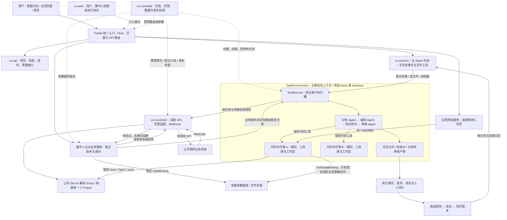

# Design｜CrewStation 数字人能力平台

> 状态：设计草案，待原型与评审验证  
> 版本：0.2.0 · 整理日期：2026-09-10  
> 修订日期：2026-09-11（任务级执行环境、代码托管与持续意图修改）  
> 配套文档：[Proposal](./proposal.md) · [Plan](./plan.md)

## 目录

- [0. 阅读约定](#0-阅读约定)
- [1. 架构不变量与领域模型](#1-架构不变量与领域模型)
- [2. 部署实体与流量路径](#2-部署实体与流量路径)
- [3. 技术基线与可替换接口](#3-技术基线与可替换接口)
- [4. 项目协议、数据对象与接口](#4-项目协议数据对象与接口)
- [5. 意图创建与修改 Agent、对话开发与实时预览](#5-意图创建与修改-agent对话开发与实时预览)
- [6. ZIP、构建、服务发布与路由](#6-zip构建服务发布与路由)
- [7. 数字人身份、环境权限与公司 API 代理](#7-数字人身份环境权限与公司-api-代理)
- [8. 权限化 OpenAPI、Swagger 与 Webhook](#8-权限化-openapiswagger-与-webhook)
- [9. 有状态数字人的数据资源供给](#9-有状态数字人的数据资源供给)
- [10. 异步任务、资源池与可靠性](#10-异步任务资源池与可靠性)
- [11. 空 Kubernetes 集群的一键安装](#11-空-kubernetes-集群的一键安装)
- [12. 升级、更新与回退](#12-升级更新与回退)
- [13. 安全边界与容量控制](#13-安全边界与容量控制)
- [14. 执行过程分析与知识飞轮](#14-执行过程分析与知识飞轮)
- [15. 仓库组织、决策记录与待决项](#15-仓库组织决策记录与待决项)
- [16. 设计完成的判断](#16-设计完成的判断)

## 0. 阅读约定

需求编号 R01–R37 以 Proposal 为准。本设计以公司多人使用的 Kubernetes 版本为目标，保留 Docker 本地验证路径。

所有 `cs-*` 名称、平台 API、Manifest、状态机、数据对象和安装命令都是拟议协议，尚不是已存在的产品接口。第三方组件采用本次讨论中的候选，不在这里声称其最新版本、具体 CRD 或全部兼容性已经确认。原稿与对话来源见 Proposal §0；本文的细化属于待验证的实现建议。

文档中区分：**要求**是不得违反的产品约束；**基线**是建议实现；**条件性选项**需要满足前置条件后才启用；**待决**事项必须在交付前关闭或明确限制。

### 0.1 v0.2.0 的替代范围

本版将上一版“环境生命周期对应一次 AgentRun”的模型替换为 TaskEnvironment → SubtaskRun → AgentRun／CommandRun，并将公司 GitLab 兼容托管、已有应用意图修改、任务数据访问和自动入库部署纳入主链路。来源及要求／建议区分见 Proposal §0.1–0.2 的 S5、S6。

既有 R／T／AT 编号保留，受影响语义已同步修订，不将旧的“一 Agent 一环境”继续作为验收条件。由于文档仍处于未实现草案阶段，新 API 是目标契约；不声称已存在旧部署，也不凭空要求兼容已上线客户端。具体数据和接口升级方案在真实实现基线形成后评审。

## 1. 架构不变量与领域模型

### 1.1 必须保持的不变量

1. **控制面不承载所有业务流量。** 页面、预览和业务 API 由独立网关转发，企业 API 由独立代理转发，Agent 流式会话由会话服务承接。
2. **服务隔离与任务执行分开。** 一个服务运行单元承载一个业务服务；一个长周期 TaskEnvironment 可顺序运行多个 Agent 和命令子任务，保留代码环境与产物。单个 Agent 进程结束不终结任务环境。
3. **多仓与单写约束。** TaskEnvironment 可关联多个 RepositoryEnvironment，主 Agent及子任务通过受控工具访问。首版默认一个前台执行槽，同一可写 Workspace 只有一个有效写入者；环境由平台关联，不要求容器内嵌套容器。
4. **公司事件先进入数字人业务服务。** Agent 不直接订阅公司原始 Webhook，也不承担公共系统数据同步；业务服务决定何时执行 Agent。
5. **意图创建与修改 Agent 与业务执行 Agent 分开。** 前者根据用户意图创建和修改数字人应用自身；后者由业务服务调用，执行数字人承接的具体业务任务。两者的工作对象、会话、身份和授权不能混用。
6. **服务账号和环境稳定，发布与运行实例可替换。** 预览和正式身份、数据与权限分离；底层副本扩容不凭空产生更大授权。
7. **权限由平台和公司授权决定，不由项目包决定。** Manifest、提示词、请求头、Agent 输出只可提出需求，不能自行授予权限。
8. **数据资源独立于服务发布版本。** 升级、暂停、取消子任务、关闭任务环境和删除旧发布，都不默认删除业务数据库或文件。
9. **发布使用不可变源码与镜像。** 开发工作区可以继续变化，已经开始构建的发布不得漂移。
10. **回退程序不恢复已撤销的权限，也不自动回退业务数据。**
11. **“已分配地址”不等于“服务已就绪”。** 安装、环境准备、真实业务和授权接入分别显示状态。
12. **执行事实与知识结论分离。** 经验先作为候选，验证后形成可召回知识，不把失败任务的自述自动发布为规则。
13. **一逻辑业务服务一个托管 Project。** 公司 Group 下自动建仓；运行副本、preview/prod 和历次发布复用绑定，不能每次改动新建仓库。
14. **新建和运行中应用共用意图工作台。** 修改时默认从目标环境实际发布 SHA 拉取，建立独立分支和 TaskEnvironment，不编辑线上容器。
15. **任务数据访问显式授权。** TaskDataBinding 支持开发库、获批真实库诊断及受控生产变更，不自动复制生产写权限，不把“允许连接”替代资源范围限制。
16. **代码保存与正式发布分开。** 提交／推送可以自动进行；满足当前授权与检查后自动部署最终提交。入库成功、审核完成、上线成功分别记录，不因文本“完成”绕过发布规则。

### 1.2 核心对象

| 对象 | 含义／关键关系 | 生命周期 |
|---|---|---|
| `Tenant` / `Team` | 用户、项目、授权和资源的组织范围 | 组织级 |
| `Project` | 开发与管理空间，首版承载一个主要业务服务 | 项目级 |
| `DigitalWorkerService` | 可独立发布的业务定义，包含页面、API 和事件逻辑 | 服务级 |
| `SourceRepositoryBinding` | 一个服务的托管连接、Group、远端 Project ID、仓库地址和分支规则 | 服务级、长期 |
| `ServiceEnvironment` | preview/prod 等稳定运行与授权绑定点 | 服务＋环境级 |
| `ServiceAccount` | 映射公司允许工作身份的数字人账号 | 稳定主体 |
| `DevSession` | `create/modify` 意图会话，关联目标环境、基础 Release/SHA、修改分支和 TaskEnvironment | 可恢复 |
| `TaskEnvironment` | 长周期任务上下文、串行执行槽、环境／工作区绑定、预算、检查点和关闭策略 | 任务级、可恢复 |
| `Workspace` | 可编辑的实际源码和未提交检查点；可包含多个仓库绑定 | 持久／可恢复 |
| `RepositoryEnvironment` | 某仓库及指定基线的工具链、工作区和运行条件 | 跨多个子任务复用 |
| `TaskWorkspaceBinding` | TaskEnvironment 与 Workspace／RepositoryEnvironment 的授权关联 | 任务级 |
| `SubtaskRun` | 一次 `agent` 或 `command` 子任务，含步骤输入输出、状态、依赖结果和尝试记录 | 子任务级 |
| `AgentRun` / `AgentSession` | AgentRun 记录子任务执行尝试；AgentSession 绑定主协调或子任务，分别记录用途、角色及 scope | 步骤执行／可恢复会话 |
| `CommandRun` | 平台显式发起的命令子任务，包含 argv、cwd、退出状态和输出 | 步骤执行 |
| `SandboxLease` | TaskEnvironment 或代码环境底层计算的租约／epoch／TTL，不拥有持久数据 | 可替换计算 |
| `TaskDataBinding` | 某任务／主体访问现有 DataResource 的模式、范围、有效期和授权引用 | 限时、可撤销 |
| `DataResource` / `DataBinding` | 业务数据库、Bucket、卷与服务环境的稳定数据绑定 | 项目环境级 |
| `SourceRevision` | 本次导入／修改的源码来源、托管 Project、远端确认 SHA 与快照摘要 | 不可变 |
| `Release` | 最终发布 SHA、镜像、配置、验证和数据迁移／绑定记录 | 不可变 |
| `ServiceDeployment` | 某 Release 的运行副本和路由目标 | 可替换 |
| `APIConnection` / `APIOperation` / `Grant` | 公司接入、精确接口操作与当前授权 | 管理／策略级 |
| `WebhookSubscription` | 环境事件订阅、有效消费者版本、投递规则 | 服务环境级 |
| `ExecutionEvent` / `Artifact` / `Checkpoint` | 任务与步骤事实、文件结果和可恢复工作区视图 | 按保留策略 |
| `KnowledgeCandidate` / `KnowledgeVersion` | 有来源、经过验证的经验与知识 | 版本化 |

**实例约定：** 数字人实例是独立逻辑业务服务；扩容 Pod 不新建仓库或扩大授权。TaskEnvironment 是逻辑资源集合，不等同于一个 Pod；可以由任务运行时和多个代码环境共同实现。

**来源约定：** 公司托管仓库是正式源码历史，平台检查点补充未提交现场。Git 不保存数据库、秘密或所有执行日志，源码快照也不能冒充远端已经入库。

**旧对象调整：** `RunWorkspaceBinding` 的环境归属提升为 `TaskWorkspaceBinding`；子任务按该绑定进一步限权。`AgentRun` 保留为执行记录，不再承担整个任务或计算生命周期。

### 1.3 Agent 角色与工作对象

全文使用“意图创建与修改 Agent”和“业务执行 Agent”两个角色名称，分别描述应用构建与业务执行，不以“是否写代码”划分。

| 角色 | 谁发起 | 工作对象 | 主要结果 | 权限边界 |
|---|---|---|---|---|
| **意图创建与修改 Agent** | 用户通过项目工作台或平台意图接口发起 | 当前数字人应用自身的源码、页面、业务逻辑及授权开发环境 | 创建或修改应用、调试、预览与检查；按规则提交发布请求 | 绑定用户与开发会话，不自动获得生产数据、迁移或公司接口权限 |
| **业务执行 Agent** | 数字人业务服务根据业务规则按需发起 | 某次业务任务授权的文档、问题单信息、产品代码仓等 | 分析、定位、检视或修改，并向业务服务返回约定产物 | 绑定服务与当前任务，仅取得相应授权；不直接接收公司 Webhook，不自动获得应用维护权限 |

例如：开发问题单处理系统、修改其列表页面和处理流程，属于意图创建与修改 Agent 的工作；在该系统中定位一个产品缺陷并生成产品代码修改，属于业务执行 Agent 的工作。

两类用途复用 AgentAdapter、TaskRunner、SandboxProvider 与执行资源池；身份和目标工作区仍分别绑定。`DevSession` 组织应用创建／修改，业务任务可由业务服务定义，两者都关联 TaskEnvironment。

| 维度 | 取值示例 | 说明 |
|---|---|---|
| 用途 `purpose` | `intent` / `business` | 创建修改应用，或执行其业务 |
| 任务角色 `role` | `coordinator` / `analysis` / `coding` / `review` | 主、分析、编码、审核，不是新的业务身份类别 |
| 子任务类型 `kind` | `agent` / `command` | 模型工作与显式命令都归入步骤记录 |

主 Agent 或业务程序选择后续步骤，TaskRunner 以普通程序实现排队与执行。主 Agent 的协调会话不占用它所等待的子任务槽，避免自锁；业务程序可直接组织确定性流程，不强制额外模型。默认每个 Agent 子任务新建会话并读取明确产物；环境文件复用不等于自动传递全部聊天上下文。

## 2. 部署实体与流量路径

### 2.1 常驻部署

| 实体 | 主要职责 | 关键边界 |
|---|---|---|
| `traefik` | 顶部统一入口；按 Host／路径转发页面、业务、预览、平台和会话请求 | 不执行平台业务逻辑，可独立扩容 |
| `cs-api` | 项目、服务、授权管理、目录、发布请求、控制台与 Swagger；提供意图能力 API | 不执行用户代码，不承担所有文件传输 |
| `cs-auth` | 企业登录适配、工作负载身份、短期凭证、入口检查 | 不向用户代码提供平台级长期凭据 |
| `cs-controller` | TaskEnvironment／子任务协调、建仓初始化、数据供给、构建、发布、路由、回收和知识任务 | 受限资源权限；副作用持久化并按租约协调 |
| `cs-session` | 两类用途的主／子 Agent 会话、事件流、任务文件工具、远程代码工具与恢复 | 不把 Agent 管理端口公开；不将一个会话视为整个任务环境 |
| `cs-connector` | 公司 API 代理、源码托管适配与受控凭据使用、Webhook 接收 | 建仓管理身份不下发 Agent；源码流量与业务 API 分别授权 |
| OpenSandbox 服务端／Controller | 沙箱生命周期与运行底座 | 具体部署角色、CRD、网络方式随验证版本确定 |
| PostgreSQL、对象存储、镜像仓库、CSI、备份设施 | 元数据、业务数据、产物和持久资源 | 独立升级与保留规则 |

五个 `cs-*` 是自研常驻服务，采用同仓库模块化实现。内部共享代码不意味着共享部署权限。知识分析、Swagger、MCP 等首版不各自拆成一组新微服务。
TaskRunner 是任务环境中的受管执行程序／模块，SourceControlProvider 是连接器适配模块，均不强制新增全局常驻服务。代码托管使用公司已提供的位置，正式部署不再自建一套 GitLab。

### 2.2 动态部署

| 实体 | 建议映射 | 谁创建／释放 |
|---|---|---|
| 数字人正式业务服务 | Deployment＋Service＋HTTPRoute；本地状态用相应受控策略 | cs-controller 按发布管理 |
| 托管 Project | 公司配置 Group 下的远端仓库资源，不是 K8s Pod | SourceControlProvider 创建；保留／归档独立操作 |
| TaskEnvironment 运行资源 | 任务运行时＋TaskRunner＋必要租约，承载顺序 Agent／命令子任务 | cs-controller 经 SandboxProvider；任务关闭才整体回收 |
| 项目／代码仓环境 | 固定仓库基线、工具链、持久工作区、可选预览端口 | 随任务准备，可跨步骤复用和恢复 |
| Agent／命令执行进程 | 一次前台 SubtaskRun；Agent 通过 Adapter 启动，命令显式指定 argv 与 cwd | TaskRunner 执行和清理，结束不删除任务现场 |
| 主 Agent 协调会话 | 与子任务队列逻辑分开，可按隔离需求独立托管 | cs-session 管理，不占所等待的子任务槽 |
| 强隔离步骤环境（按需） | 审核只读快照或独立计算实例，仍关联原 TaskEnvironment | 权限差异要求时创建，不强制每一步重建全部环境 |
| 构建／正式迁移／发布验证 | 固定输入的独立 Job 或受控执行任务 | cs-controller 管理，生产权限不放入一般任务环境 |
| 数据库、Bucket、PVC | DataResource／稳定 DataBinding；任务通过 TaskDataBinding 访问 | DataProvider 供给；任务关闭只撤销绑定不删资源 |

首版同一任务默认串行执行；应用预览和任务执行器是登记的辅助进程，不计作第二个前台子任务。Service、HTTPRoute、权限、仓库绑定和子任务记录也不是各自一个服务进程。

### 2.3 部署关系图

下面的 Mermaid 可在支持 Mermaid 的仓库页面渲染，表达实体和调用关系，不代替具体网络配置。顶部是业务流量入口，中心是业务服务和任务工作场所，下方是公司接入和数据资源。



意图任务关联应用自身仓库；业务任务可以关联其他获授权产品仓库。图中的主协调入口不等于 Runner 有不受限的公司账号：每次步骤和工具调用都检查任务、工作区与当前权限，生产发布与迁移由受控平台路径执行。

API 返回任务／步骤标识，长过程在后台运行。公司事件先到业务服务，不直接注入 TaskRunner 或 Agent；托管变更事件按控制面发布规则单独处理。

### 2.4 控制面与数据面

| 流量 | 路径 |
|---|---|
| 平台管理 | 浏览器 → 网关 → cs-api |
| 正式业务页面／API | 浏览器 → 网关 → 数字人业务服务 |
| 开发预览／热更新 | 浏览器 → 网关 → 代码环境开发端口；包含 WebSocket |
| Agent 对话 | 浏览器 → 网关 → cs-session → Agent 适配器 |
| 公司 API | 数字人服务／获授权 Agent → cs-connector → 公司管控入口 |
| 公司 Webhook | 公司系统 → cs-connector → 持久接收记录 → 投递任务 → 数字人服务 |
| ZIP／产物 | 控制面申请受限地址 → 浏览器或任务直接读写对象存储 |
| SQL | 业务服务 → 业务数据库／连接池，不经过平台 API 代理 |
| 修改任务 SQL／数据工具 | 获批任务主体 → 对应数据库／连接池，或限权数据工具；TaskDataBinding 不改变数据通路 |
| 对象文件 | 业务服务或受限直传 → 对象存储，不经过项目管理主服务 |
| 源码托管 | Controller → 托管适配器完成管理操作；代码环境通过受控 Git 路径 clone/fetch/push，不由项目 API 搬运所有仓库字节 |

路由配置变化时由 Controller 更新，网关执行转发；不为每个请求查询 cs-api 再代理。网关、认证、会话、公司接口代理均有容量上限，需分别测量和扩容。统一入口不等于只有一个网关 Pod。

## 3. 技术基线与可替换接口

### 3.1 建议选型，不锁未经验证的版本

| 部分 | 基线候选 | 核心验证 |
|---|---|---|
| 管理与 SDK | TypeScript、Node.js LTS、Fastify、TypeBox、OpenAPI | 契约生成、一致校验、流式行为 |
| UI | React、Vite、shadcn/ui | iframe、热更新、会话重连、授权展示 |
| 元数据／队列 | PostgreSQL、Drizzle、pg-boss | 事务边界、任务恢复、租约和迁移 |
| 入口与发布 | Traefik、Gateway API、Helm | 版本支持、鉴权、路由切换、CRD 顺序 |
| 执行 | OpenSandbox＋首个 OpenCode 适配器＋TaskRunner | 长任务与顺序步骤、跨仓文件、进程清理、租约和恢复 |
| 构建 | BuildKit＋固定模板；Buildpacks 后续可选 | 非特权构建、私有依赖、可重复产物 |
| 数据 | CloudNativePG、S3；内置候选 SeaweedFS | 隔离、迁移、备份、单项目恢复 |
| 代码托管 | 公司 GitLab 兼容位置＋SourceControlProvider | Group 建仓、初始化、Git 访问、保护分支、MR／事件能力逐项验证 |
| 观测与知识 | OpenTelemetry＋平台事件表；pgvector 按需要加入 | 来源、权限、留存和撤回 |

身份优先接公司已有体系。Keycloak 是开发或协议桥接候选，不是强制生产入口。Knative 用于适合的 HTTP 服务弹性托管；不要求所有数字人 FaaS 化。Istio 不作为首版依赖；使用它必须有独立的服务间治理需求与验证结果。OPA、Temporal、Kafka、Redis 不是首版强制清单。

### 3.2 适配边界

- `IdentityProvider`：用户登录、工作身份验证、企业账号映射。
- `ServiceHost`：服务部署、就绪检查、路由后端和版本退役。
- `SandboxProvider`：创建、访问、续期、停止、回收、资源枚举。
- `AgentAdapter`：启动会话、提交消息、工具接口、取消、事件和结果。
- `TaskExecutor` / `CommandAdapter`：串行子任务准入、受控进程启动／退出、命令输出与残留清理；实现落在 TaskRunner。
- `SourceControlProvider`：检查托管能力、在批准 Group 建仓、初始化、读写分支、提交推送、按规则合入、确认远端 SHA 和注册事件；不依赖完整 GitLab CI 才能发布。
- `ConnectorAdapter`：操作匹配、资源归属、上游签名、结果与错误转换。
- `DataProvider`：数据库、Bucket、卷的申请、绑定、备份恢复和回收。
- `ArtifactStore` / `ImageRegistry`：不可变源码与镜像产物。

接口先定义，但每种首版只实现必要后端。不能以“抽象扩展性”为理由提前实现多个未使用的 Provider。

## 4. 项目协议、数据对象与接口

### 4.1 Manifest

ZIP 导入、模板生成和工作区发布统一使用版本化 Manifest。以下示例是拟议协议；安装器和 Schema 必须实现其校验后才能使用。

```yaml
apiVersion: crewstation/v1
kind: DigitalWorker
metadata:
  name: issue-worker
spec:
  build:
    profile: node-web-v1
    install: [pnpm, install, --frozen-lockfile]
    command: [pnpm, build]
  development:
    command: [pnpm, dev]
    port: 3000
  service:
    command: [node, dist/server.js]
    port: 3000
    healthPath: /healthz
    # 此示例申请了单写持久卷，采用受控维护发布。
    releaseMode: maintenance
  requestedCapabilities:
    - operation: issues.v1.getIssue
      scopeRequest: {project: CT-A}
    - operation: scm.v1.createMergeRequest
      scopeRequest: {repositories: [backend-a, frontend-a]}
  subscriptions:
    - eventType: scm.pipeline.finished
      handlerPath: /events/pipeline
  taskExecution:
    environmentProfile: coding-task-v1
    scheduling: serial
    allowedAgentProfiles: [analysis-v1, coding-v1, review-v1]
    repositoryProfiles: [java-repo-v1, node-repo-v1]
  intent:
    baseRevisionPolicy: deployed-release
    dataAccessRequest: development
    # 托管连接与 Group 来自平台授权配置，不允许包内任意指定建仓位置。
  data:
    database:
      type: postgresql
      plan: shared-small
      retention: retain
    attachments:
      type: object-storage
      plan: standard
      retention: retain
    # 确实需要目录状态时才申请；不是所有项目默认挂盘。
    workfiles:
      type: persistent-volume
      plan: single-writer
      size: 10Gi
      mountPath: /data
      retention: retain
  release:
    publicationPolicyRequest: auto-after-checks
    migrationCommand: [pnpm, db:migrate]
```

约束：

- 不接收宿主机目录、Docker socket、任意 ServiceAccount、任意 K8s YAML、特权容器设置或原始公司凭据作为可直接生效配置。
- `requestedCapabilities` 只申请权限；实际 Grant 由审批与公司接入映射生成。
- `allowedAgentProfiles`、数据访问模式、自动发布都是申请／引用，必须受平台套餐与项目策略约束；角色配置不授予新权限。分析、编码、审核可使用同一个已接通的 Agent 引擎。
- `plan` 是管理员允许的套餐；超额度、缺 StorageClass 或不支持的访问模式应阻塞。
- 可写单卷与发布模式存在约束。上例使用 `single-writer` 并选择 `maintenance`；发布器不能让新旧服务并行写入。仅使用外部 PostgreSQL／S3、且应用与数据兼容的服务，才可以选择 `rolling-compatible`。
- 发布时解析模板／运行配置到固定版本，记录镜像摘要、数据绑定引用和配置版本。敏感数据用引用，不写入归档的明文 Manifest。

### 4.2 主要持久化关系

| 数据集合 | 唯一性／关键字段 | 要防止的问题 |
|---|---|---|
| projects / services / environments | tenant、project、service、environment | 跨租户误关联 |
| source_repository_bindings | service 唯一；connection、namespace_id、remote_project_id、repo_path、default_branch、policy_ref、provisioning_step | 每次重试重复建仓、同名接管、环境各建仓 |
| dev_sessions | mode、service、target_environment、base_release_id、base_sha、branch、task_environment_id、expected_target_head | 修改错版本、工作区覆盖、并发覆盖 |
| task_environments / task_workspace_bindings | owner、purpose、profile_lock、status、workspace_revision、writer_lease、foreground_slot、budget、retention | 子任务结束误回收、旧写入者干扰 |
| subtasks / attempts | task_id＋sequence／request_key；kind、role、attempt、status、business_outcome、input_checkpoint、output_checkpoint | 重试混入旧结果、审核发现误报执行失败 |
| agent_runs / agent_sessions / command_runs | task_id、session_scope、可选 subtask_id；agent_profile、session_id 或 argv/cwd/exit_code；profile_digest、authorization_ref | 混用上下文、泄露凭据、命令无退出记录 |
| sandbox_leases / repository_environments | task／workspace 绑定、provider_id、epoch、TTL、toolchain_digest | 陈旧租约、环境升级漂移、失联后双写 |
| task_data_bindings | task、resource_ref、principal、mode、scope、expires_at、grant_version、credential_ref | 预览继承生产写权、任务结束继续访问 |
| source_revisions / checkpoints | remote_project_id、commit_sha、remote_confirmed、snapshot_digest、workspace_revision、parent_checkpoint | 本地提交冒充远端入库、遗漏未提交代码 |
| releases / deployments | final_commit_sha、image_digest、config_version、schema_compatibility、data_binding_refs、expected_active_release | 构建漂移、旧任务覆盖新部署 |
| service_accounts / workload_bindings | 环境与运行主体、instance_id、到期时间 | 自报身份与失效实例复用 |
| data_resources / data_bindings | owner_environment、provider_id、retention、credential_ref | 跟随 Release 或任务删除业务数据 |
| api_operations / connections / grants | catalog_version、operation_key、scope、policy_version | 目录新增自动授权 |
| event_inbox / event_outbox / deliveries | origin＋event_id、subscription、release_request_id、attempt | 推送／CI／主动发布重复创建外部副作用 |
| session_events / execution_events | stream＋sequence、task_id、subtask_id、actor、timestamp | 断线重发指令、失去步骤来源 |
| knowledge_candidates / versions | task／step／checkpoint 来源、verification、visibility、version | 错误经验和数据越权 |
| install_runs / migrations / audit | step、version、fencing_token、result | 并发安装、误删仓库与数据 |

业务数据库表由用户项目维护，不写入平台管理库。源代码仓库是正式历史，任务检查点是未提交现场；模型会话和执行日志按平台保留策略保存。源码、文件和产物引用都受访问权限约束。

### 4.3 平台 API 概览

| API（拟议） | 作用 |
|---|---|
| `POST /v1/projects` | 创建业务服务、稳定地址和托管 Project 初始化操作 |
| `GET /v1/services/:id/source-repository` | 查看已授权仓库绑定及准备状态 |
| `POST /v1/projects/:id/source-uploads` / `POST /v1/projects/:id/imports` | 安全上传导入；在绑定仓库中形成源码变更 |
| `POST /v1/projects/:id/dev-sessions` | 新建／修改会话；指定目标服务环境、基线和数据访问申请 |
| `POST /v1/dev-sessions/:id/resume` | 恢复任务、源码检查点、预览和经重新验证的数据授权 |
| `POST /v1/dev-sessions/:id/messages` / `GET /v1/dev-sessions/:id/events` | 幂等消息、对话与子任务事件恢复 |
| `POST /v1/dev-sessions/:id/code-checkpoints` | 请求保存并按策略提交、推送到修改分支；不自动等同于发布 |
| `POST /v1/dev-sessions/:id/complete` | 请求完成检查和自动发布流程；服务端核验检查结果、基线与授权 |
| `POST /v1/task-environments` | 意图会话或业务服务创建任务级环境和资源绑定 |
| `POST /v1/task-environments/:id/subtasks` | 提交 `agent` 或 `command` 子任务，默认加入串行队列 |
| `GET /v1/task-environments/:id/subtasks/:subtaskId` | 查看某步骤及其尝试、契约结果与业务结论 |
| `POST /v1/task-environments/:id/subtasks/:subtaskId/cancel` | 取消当前／排队步骤，不销毁任务环境 |
| `GET /v1/task-environments/:id/files` / `GET /v1/task-environments/:id/diff` | 指定代码环境、路径、范围与可选检查点，读取实际文件或差异 |
| `GET /v1/task-environments/:id/events` | 任务和子任务日志／事件游标订阅 |
| `POST /v1/task-environments/:id/checkpoints` | 在明确写入版本下保存任务现场 |
| `POST /v1/task-environments/:id/pause` / `resume` / `close` | 分别暂停、恢复、终结任务，按规则保存与回收 |
| `POST /v1/task-environments/:id/data-bindings` | 请求与对应应用数据资源建立限时、限范围访问 |
| `POST /v1/projects/:id/releases` | 发布远端已确认且经验证的最终提交，带当前正式版本条件 |
| `POST /v1/projects/:id/rollbacks` | 回退程序但不恢复旧授权或业务数据 |
| `GET /v1/me/company-apis/openapi.json` | 按工作身份获取可调用公司接口 |
| `GET /v1/services/:id/environments/:env/company-apis/openapi.json` | 登录用户查看有权访问的目标服务文档 |
| `POST /v1/services/:id/api-debug-sessions` | 获批的短期在线接口调试 |
| `POST /v1/projects/:id/data-resources` / `restores` | 数据申请与受控恢复，不与任务关闭混用 |

异步操作返回 operation／task／subtask ID 和状态，不在 HTTP 线程内等待整个任务。创建、保存、发布、Git 副作用和资源申请使用幂等键；更新带预期版本；授权和验证结果由服务器读取核对，不能仅接受客户端“已通过”。

原拟议 `/v1/agent-runs` 的直接启动模式不再是首选入口。需要兼容适配时，它只能明确映射到某 TaskEnvironment 中的一次 Agent 子任务；取消该步骤不能隐含关闭整个环境。当前草案不假设已有客户端需要迁移。

### 4.4 子任务请求示例

下面展示同一任务内的两个步骤。路径、字段和 profile 均为待实现平台协议；`analysis`、`coding`、`review` 可以使用同一引擎的不同配置，不要求首版实现多厂商 CLI。

```json
{
  "requestKey": "T123-analysis-1",
  "kind": "agent",
  "role": "analysis",
  "agentProfile": "analysis-v1",
  "repositoryBindings": ["backend", "frontend"],
  "inputCheckpoint": "cp-0",
  "input": {"instruction": "分析问题并生成任务目录中的分析报告"},
  "outputContract": "analysis-report-v1"
}
```

```json
{
  "requestKey": "T123-test-1",
  "kind": "command",
  "role": "test",
  "repositoryBinding": "backend",
  "argv": ["pnpm", "test"],
  "workingDirectory": ".",
  "inputCheckpoint": "cp-after-code",
  "outputContract": "test-result-v1"
}
```

分析完成后由主 Agent 或业务程序读取结果并追加编码步骤，再执行测试、审核或修复。平台不把示例序列写死为所有业务唯一流程；对于提前排队的步骤，输入检查点必须在依赖完成后明确解析。

## 5. 意图创建与修改 Agent、对话开发与实时预览

### 5.1 公司源码托管与自动建仓

**要求：每创建一个逻辑业务服务，平台就在配置的公司 GitLab 兼容 Group／Subgroup 下自动创建一个 Project 托管该应用代码。** preview/prod、扩容副本、发布版本和修改会话都复用该仓库，不重复建仓。首版 Project 下一个主要服务，因此通常是一平台项目一托管项目；未来多服务时按服务身份绑定，不靠名称猜测关联。

平台管理员配置源码托管连接：公司服务地址、目标 Group ID、可使用的命名空间、管理凭据引用、可见性、分支策略及允许的事件。仓库管理和 Git 读写分别经适配器验证；“GitLab 兼容”不等于完整管理 API、MR、Webhook 或 CI 均可用。首版选择公司实际支持的路径；代码入库与平台构建不以部署整套 GitLab CI 为前提。

自动建仓流程：

1. 事务性创建服务、地址和 provisioning 操作；为服务生成稳定内部 ID 和经过校验的仓库路径。
2. 由 SourceControlProvider 使用平台受控身份，在明确的目标 Group 下创建 Project；不要默认落到个人命名空间。
3. 保存远端 Project ID、namespace ID、路径和归属证据，建立 SourceRepositoryBinding。超时后先核对远端结果，不能盲目再建一个。
4. 将固定模板或校验后的导入源码提交并推送到初始分支，确认远端 SHA；按批准能力配置分支规则、必要事件与平台标记。
5. 生成 SourceRevision，再从这个仓库／提交创建开发工作区。Demo、预览源码和托管项目必须属于同一应用。
6. 代码仓和环境分别显示 Ready／Failed／AwaitingAuthorization 等状态；建仓成功、环境失败时重试续接，不删除已有源码。

同名仓库只有经过归属核验并证明属于同一幂等创建操作才可复用；他人已有仓库需显式接入流程，不能自动接管。显示名可变，平台以远端 ID 和服务绑定识别；远端重命名／迁移需要重新校验。创建权限不足时明确阻塞，不能临时借用个人管理员账号。

建仓管理凭据留在连接器边界。Agent 对当前代码工作区读写；提交／推送／合入由平台工具在批准的项目与分支范围内执行。Git 数据可走受控直接传输或专用代理，不让 cs-api 搬运全部仓库字节。凭据不写入源码、远端 URL、镜像或日志。

### 5.2 意图创建链路

1. cs-api 校验用户、模板、配额和托管配置，记录 Project、ServiceEnvironment、地址与后台操作，立即返回准备状态。
2. 按 §5.1 自动建仓并提交模板。初始 Demo 是确定性模板，不依赖 Agent 第一轮生成成功。
3. 建立 `DevSession(mode=create)` 与 `TaskEnvironment(purpose=intent)`，绑定仓库基线和工作区。
4. 按模板分配 preview 数据库／Bucket；通过 TaskDataBinding 准备本次任务的数据访问，必要时先运行开发库迁移和种子数据。
5. 在代码环境中拉取初始化提交、准备工具链并启动 Demo／预览端口；预览只读取本工作区的真实源码。
6. 准备 TaskRunner 和 Agent 配置。根据交互方案建立主协调会话，或直接接受业务程序提交的子任务。Agent 就绪与环境就绪分开检查。
7. 用户已有业务意图时启动第一步分析／编码；只有名称时待命，不让模型无意义空转。一个任务可顺序调用多个角色 Agent 和命令。
8. 检查与当前项目规则满足后自动保存、入库和发布；需额外批准时在明确节点等待，批准后自动继续。不是每次普通修改都重新申请基础设施。

管理、预览和正式地址绑定项目／服务环境，不绑定容器 IP。同一项目多个修改会话可用会话子域／子路径获得不同预览入口，主工作台地址保持稳定，不能让不同用户的预览指向彼此工作区。正式地址需要创建即有内容时，可发布对应远端初始提交的预构建模板版本 r0；后续预览继续独立。

### 5.3 已运行应用随时意图修改

“意图修改”不是进入线上容器改文件，也不要求旧开发环境一直存在。流程为：

1. 读取指定服务和目标环境的 SourceRepositoryBinding、Active Release、最终 SHA、配置、数据绑定和当前权限。
2. 默认选择该环境实际部署 SHA，记录 `baseReleaseId`、`baseSha`、预期目标分支 HEAD 与目标正式版本。默认分支若领先线上，界面显示差异；用户可以显式选择其他基线，但不能静默混入未发布改动。
3. 创建独立修改分支，例如 `intent/change-042`。新建 TaskEnvironment；若恢复未完成会话，则先检查旧写入者和检查点，不重新 clone 覆盖现场。
4. 拉取应用代码与依赖，恢复获准配置，连接相应数据库／文件资源，启动预览。不存在实际数据权限时显示待授权，不用假数据冒充真实连接。
5. 启动意图创建与修改 Agent 或顺序子任务集合，主 Agent 通过任务工具读取代码、分析、日志及审核结果。所改源码就是预览源码。
6. 满足完成契约后自动提交、推送，按规则合入并发布最终固定版本。正式服务在切换前继续工作，目标环境有独占状态时按维护发布计划执行。
7. 关闭任务仅回收计算和临时访问，保留正式仓库、服务数据、必要检查点和审计。下次修改可再次从持久状态准备工作场所。

应用代码仓与业务任务涉及的产品代码仓是不同绑定。创建修改应用不得误把产品代码仓设为应用源码仓，也不因为有建应用权限就获得任意产品仓库写权。

### 5.4 数据访问进入环境准备契约

TaskDataBinding 是环境就绪条件的一部分，而不是让用户自己复制数据库密码。支持开发读写、批准的真实数据只读诊断、明确批准的生产变更三种模式，细节见 §9.8。

任务可了解服务对应的数据结构并在权限内调试，但不默认继承正式服务账号。预览进程与主／子 Agent 可以具有不同数据主体：前者连接开发库，后者使用限范围工具查看 Schema／样例；需要访问真实库时明确申请。数据库访问是数据通路，不把每条 SQL 都转成项目管理 API 请求。

启动预览前关闭生产定时任务、真实业务事件消费、外发通知等副作用；不同会话共享开发库时也要协调迁移和测试写入，或申请独立数据副本。普通代码发布不复制开发数据覆盖生产。

### 5.5 状态独立显示

| 对象 | 状态示例／应保存的信息 |
|---|---|
| 源码托管 | Pending、Creating、Initializing、Ready、AwaitingAuthorization、Conflict、Failed；远端 Project ID 与 SHA |
| 修改会话 | Preparing、Editing、Checking、Saving、AwaitingApproval、Publishing、Completed、Failed；基线与目标版本 |
| 任务环境 | 采用 §10.2 状态机；计算租约与任务结果分开 |
| 代码环境 | Preparing、Ready、Sleeping、Restoring、Failed；实际工作区和工具链版本 |
| 数据访问 | Requested、Ready、AwaitingApproval、Expired、Revoked、Failed；资源与模式 |
| 预览 | Starting、Ready、BuildError、ProcessExited；访问地址和进程状态 |
| 子任务 | 采用 §10.3 状态机；会话、尝试与业务结论分别保存 |
| 远端保存／发布 | RemoteSaved、Checking、ReadyToDeploy、Deploying、Active、Blocked、Failed；保存成功不等于上线 |

每个状态带原因、更新时间、可恢复动作和资源关联。一个 Pod 已运行不代表仓库、数据库、模型和预览均可用。

### 5.6 主 Agent 和子任务操作同一实际工作区

统一任务工具面，供主 Agent、意图接口和业务程序调用：

```text
task.create(spec)
task.attachRepository(taskId, repositoryBinding, baseSha)
task.runAgent(taskId, agentProfile, inputs, contract, requestKey)
task.exec(taskId, repositoryBinding, argv, cwd, contract, requestKey)
task.listFiles(taskId, repositoryBinding, path, cursor)
task.readFile(taskId, repositoryBinding, path, range, checkpointId?)
task.diff(taskId, repositoryBinding, fromCheckpoint, toCheckpoint)
task.logs(taskId, subtaskId, attemptId, cursor)
task.checkpoint(taskId, expectedWorkspaceRevision)
task.pause(taskId) / task.resume(taskId) / task.close(taskId)
```

`runAgent`、`exec` 返回步骤 ID，结果通过状态或事件获取。主 Agent 等待步骤不占子任务槽。远程工具必须校验调用主体、TaskEnvironment、TaskWorkspaceBinding 和子任务范围，不接受任意路径或任意环境 ID。读文件提供分页／范围，结果带来源及工作区版本；审核／发布使用明确快照，实时内容不伪装成稳定版本。

修改直接落到预览工作区，不在 Agent 私有目录修改后反复同步副本。文件写入使用预期版本；命令限定 cwd、资源、网络、超时和输出大小。主 Agent 可读不代表可读平台凭据；符号链接、路径穿越和其他环境的文件均需控制。

OpenCode 或其他 Agent Adapter 必须验证可以替换／禁止绕过平台的本地工具，并能绑定独立会话、角色配置和步骤结果。项目自带插件配置不能替换受保护的工具与授权。模型对话默认按子任务独立，复用或恢复必须显式指定。

### 5.7 前端与预览

- 左侧：意图对话、任务时间线、主／子 Agent 状态、命令、代码差异、检查结论、自动保存与发布进度；不是几条互不关联的 Agent 会话。
- 右侧：真实预览和错误信息；热更新经网关 WebSocket 直达开发进程，后端重启按模板管理。
- 项目信息：仓库入口、基线 SHA、修改分支、当前发布、数据连接模式和可用公司接口。
- 原始浏览器消息、日志和仓库内容均是输入材料，不能作为批准生产写入或发布的凭据。项目授权策略决定自动推进，意图文本不自行扩权。
- 预览与管理控制台不同来源，访问有真实鉴权；iframe、CSP、跨站 Cookie 和票据需实测，不给应用页面平台管理凭证。

### 5.8 恢复与写入控制

消息和步骤请求有幂等 ID，事件有序号。断线后补取，不重发同一开发指令。浏览器关闭不取消任务。

恢复顺序：确认原环境已停止或被隔离、取得新 epoch／写租约 → 从远端分支和对应检查点恢复未提交现场 → 重新取得当前允许的数据与接口授权 → 启动运行时和预览 → 恢复协调上下文／继续指定步骤。不能让失联的旧进程恢复后继续写同一工作区。

一个 Workspace 首版一个有效写入者；用户编辑器与 Agent 共享版本检查。不同修改会话使用独立分支／工作区，但目标正式环境的发布仍需协调。恢复文件不承诺恢复任意进程内存、数据库事务或运行到一半的命令。

### 5.9 意图接口与发布入口

控制台、CLI、MCP Server 和开发插件共用平台能力 API：可用能力发现、创建应用、修改已运行应用、准备环境与数据、读取现场、提交步骤、检查、保存代码、完成并发布、回退和权限申请。

自然语言由 Agent 理解，副作用落成结构化请求，由平台依据当前授权和持久检查记录执行。业务插件交付为托管源码＋Manifest＋固定镜像，不把上传代码动态加载进平台主进程。

## 6. ZIP、构建、服务发布与路由

### 6.1 所有源码入口先入库，再发布固定版本

```text
模板初始化 ───────────────┐
ZIP 源码导入 ──────────────┼→ 应用托管仓库／修改分支 → 远端确认提交
Agent／编辑器工作区检查点 ─┘           ↓
                            按项目策略检查／合入
                                      ↓
                              最终提交 SHA 固定
                                      ↓
                干净构建与验证 → 镜像摘要 → 迁移／发布 → 部署
```

Git 托管不再是后续可选入口。源码快照用于工作区恢复与构建缓存；正式发布必须关联绑定仓库中远端已确认的 SHA。无法推送或远端结果未知时，允许保留本地检查点，但阻止宣称“已入库／已上线”。无新代码变化时可以复用经核验的已有提交，仍记录配置与授权变化。

首版接受约定模板源码。缺 Manifest 时可以生成可解释的识别结果，不确定则阻塞；其他语言和静态产物模式不默认承诺。用户应用使用哪个框架不决定平台是否绕过源码、权限和发布规则。

### 6.2 ZIP 安全导入与仓库关系

控制面申请受限上传地址，后台校验原包、摘要、大小和内容，不信任浏览器“上传成功”。至少检查：文件数量、单文件和解压总大小、压缩比、绝对路径、`..`、符号／硬链接、重复条目、大小写冲突、嵌套包、入口与部署描述。

新服务按 §5.1 建仓并提交导入源码。已有服务将包作为独立修改分支的变更；差异和删除明确可见，不覆写运行目录、活跃编辑工作区、仓库归属或分支保护。包内凭据、特权 YAML、平台账号和工具配置不自动生效。

导入过程不执行包内脚本；依赖安装、构建和扫描只在受控环境执行。原 ZIP、导入结果、本地源码摘要和远端 SHA 分别关联保存。

### 6.3 自动代码保存与提交

`checkpoint` 保存任务文件现场；`code-checkpoint` 根据项目策略创建 Git 提交并推送修改分支，两者都不是“正式发布”。主／子 Agent 可发出请求，平台验证仓库、分支、当前 HEAD 和本次变更后执行。

入库内容为应用源码、必要测试、Manifest 和迁移文件；日志、数据库内容、密钥、模型凭据和临时产物不自动 `git add -A` 入库。保存流程检查意外敏感文件，保留发起人、Agent／步骤、任务和变更来源，提交身份使用公司批准方式，不冒用维护者。

推送超时先核对远端分支／提交，避免重复提交和重复 MR。禁止为消除冲突盲目 force push。代码已有远端提交但发布失败时，保留提交与失败状态，正式路由保持旧版。

### 6.4 自动发布策略与完成判断

支持项目策略 `auto-after-checks`：在已授权范围内完成规定的测试、审核、源码入库与迁移判断后自动发布；存在审批规则时，在对应节点等待，批准后自动续行。平台应让普通改动真正自动完成，不再要求用户逐条操作 Git 和部署工具。

测试、审核产物和批准必须匹配当前提交／检查点。审核 Agent 正常完成但报告问题，属于步骤执行成功、业务检查不通过；不能直接当成“审核通过”。收到 `complete` 请求后，服务器读取实际检查结果、批准和当前策略，不接受调用者自报完成。

保护分支、MR 和合入能力按公司实际支持方式适配。具备必要机制可自动创建 MR 并按规则合入；不具备时采用经批准的分支写入策略，不假设 CI 或自动合并接口可用。最终合入／变基后的 SHA 若变化，要对最终源码重新生成或确认有效验证证据。

### 6.5 构建与供应链

固定远端 Project ID、最终 SHA、源码摘要、构建 profile、依赖锁与镜像基础摘要。构建任务使用干净隔离环境，仅取得所需源码、私有依赖和镜像写入权限；不得复用开发容器中未经记录的额外修改或生产凭据。

记录产物镜像摘要、确切源码提交、构建环境、依赖检查、测试和日志。秘密不进入镜像层、普通构建参数、源码或日志。非特权构建方式、缓存隔离和工具权限必须以所选组件验证，禁用宿主 Docker socket 及任意宿主挂载。

发布关联图必须可查询：`DevSession / import → branch → remote-confirmed SHA → final SHA → Build → image digest → Release → ServiceDeployment`。配置、数据迁移、接口／授权引用记录但不保存原始秘密。

### 6.6 路由与运行

稳定地址由网关直接转发到业务服务／预览后端，Controller 只修改路由配置，不让 cs-api 查库搬运每个请求。用户不能配置指向平台内部或其他租户的后端。

一个业务服务通常对外一个 HTTP 入口，同时提供页面与 API。开发工具进程只服务该应用，不等于把多个独立业务混在一个服务单元。网关、Auth、Session 和 Connector 可以分别扩容，入口鉴权不复制大请求体，长连接支持排空和恢复。

### 6.7 并发、幂等与版本切换

1. 核对修改会话基础 SHA、目标分支 HEAD 和当前正式 Release；分支已前进时明确合并／变基／重做检查，不静默覆盖。
2. 多会话可在独立分支并行修改，合入与服务环境发布分别加协调条件；发布使用 `expectedActiveReleaseId` 等版本比较或受控发布租约。
3. 固定最终提交、配置、数据绑定和检查记录；构建验证后执行批准的迁移。
4. 启动候选服务，检查健康和必要业务功能，数据状态不兼容则阻塞或进入维护窗口。
5. 更新正式路由，记录切换前后版本；Webhook／定时消费者的有效版本单独切换，防止双版本副作用。
6. 旧版本完成在途工作后退役，保留回退产物和数据兼容信息。版本更早的迟到发布不得覆盖更新版本，除非显式回退授权。

平台主动发布、Git 推送事件和可用的 CI 回调关联同一发布请求／来源事件，数据库唯一性和步骤核对防止重复触发。用户普通推送是否自动部署由项目策略决定，不是所有分支事件都上线。外部提交结果未知时用 `UnknownOutcome` 核对，不能靠无限重试掩盖。

### 6.8 失败结果与数据边界

| 阶段 | 失败处理 |
|---|---|
| 建仓／初始化 | 保存远端结果，核对后重试；不删除已使用仓库 |
| 保存／推送 | 保留现场，显示 LocalSaved 或 RemoteUnknown；远端未确认不进入正式发布 |
| 合入／验证 | 留在修改分支并报告冲突／检查失败，不关闭真实检查 |
| 构建／候选启动 | 保留诊断信息与旧正式版本 |
| 数据迁移 | 按迁移方案处理，不因切回镜像假设数据已回退 |
| 路由／消费者切换 | 核对实际生效版本再恢复，避免重复投递或错误回退 |

代码、配置、权限、数据库恢复分别管理。普通任务关闭、应用暂停、发布失败不删除托管源码或业务数据。

## 7. 数字人身份、环境权限与公司 API 代理

### 7.1 身份链

```text
用户身份（创建／使用／批准）
    ↓ 经平台授权
数字人服务＋环境 → 稳定服务账号
    ↓ 部署控制器绑定
运行实例 → 有限期、指定 audience 的执行凭证
    ↓ API 代理验证
允许的接口操作、资源、环境和委托范围
```

公司允许的服务身份或应用身份映射到平台服务账号，不默认在员工目录中创建普通人账号。预览账号和正式账号分离。底层运行副本保留自己的实例 ID、部署版本和到期状态用于审计。

不信任业务代码自报的 `X-Service-Id`。Kubernetes 版可验证 Pod 绑定的工作身份，再交换为平台代理短期凭证；具体 TokenReview、离线校验和撤销组合需验证。生产身份不能写入 ZIP、镜像、Git、浏览器或日志。

### 7.2 有效权限

一次操作要求同时满足：服务当前授权、公司连接已批准范围、环境限制、适用的用户／任务委托范围。委托只能收窄，不自动合并成更大权限。

服务获得更多授权，不代表一条已经创建的限权执行会话自动扩大权限；服务被撤权，则旧执行会话也不能继续使用已撤销能力。短期 Token 只是身份手段，不替代当前策略检查。

Kubernetes RBAC 约束的是集群资源，不等同于公司业务 API 授权。服务 Pod 不需要广泛读取集群 Secret 或修改路由／网络策略的能力。

### 7.3 Connector Broker 请求流程

1. 验证身份、签发者、audience、到期、服务／环境和实例绑定状态。
2. 规范化方法与路径，映射到已登记的 APIOperation；未登记默认拒绝。
3. 检查当前 Grant、具体资源归属、查询／批量范围和额外条件。
4. 根据批准的 APIConnection 获取上游凭据或委托，不向调用方返回凭据。
5. 转换必要参数／签名，访问已登记公司入口。
6. 记录主体、操作、资源、策略版本、结果与耗时；限制敏感正文与认证头入日志。

目标不是 `/proxy?url=...` 通用转发器。上游地址来自批准配置，限制重定向、协议、目标网络、DNS 变化、可转发头部和请求体大小，防止访问未授权内部地址。

如果授权需要知道问题属于哪个项目，连接器必须通过可信关系核验，不能相信业务传入的 `projectId`。列表、搜索、批量接口分别验证边界；不能过滤一部分参数后仍返回全公司结果。

### 7.4 凭据与代理部署

公司凭据留在 cs-connector／专用凭据管理边界内，每个 APIConnection 有所属团队、适用环境和授权范围。能使用公司令牌交换则验证后采用；不支持则按实际批准方式适配，不假设公司系统天然支持。

标准 HTTP 代理可以评估 Fastify 代理组件；需正文授权、签名、资源映射时必须明确实现对应 Adapter，不能既完全流式透传又假设已经解析完整正文。代理横向扩容，与 cs-api 分开压测。

服务与 Agent 的出站访问由网络限制和代理授权共同约束。HTTP 细粒度规则在代理执行，网络层负责阻止直接访问被保护的公司目标。业务数据库和对象存储是独立数据通路，按 DataBinding 限制，不为了“统一代理”将 SQL 也转为控制面转发。

## 8. 权限化 OpenAPI、Swagger 与 Webhook

### 8.1 两种文档不要混淆

- **服务对外 API 文档**：这个数字人提供什么业务接口。
- **服务可调用的公司 API 文档**：这个数字人被允许调用哪些公司接口；这是本平台必须供给的能力。

公司原始 OpenAPI 导入平台后，先校验、登记操作与版本，补充资源范围规则、连接配置和调用语义。缺文档的接口由 Adapter 提供契约；未经登记的接口不能自动开放。

### 8.2 服务端文档裁剪

输入是已验证的服务身份、环境、授权版本和接口目录版本。人的查看入口还要校验其对目标服务的文档权限。

生成步骤：

1. 筛选当前获准且已配置对应连接的操作，按 HTTP 方法和路径精确保留。
2. 保留被授权操作依赖的参数、请求体、响应和 Schema；处理 `$ref`、共享依赖、标签、链接、示例，去除无关内部信息。
3. 将 servers、认证方式、操作级覆盖等统一改为平台可用调用入口，移除可绕过代理的上游信息。
4. 展示项目、仓库、环境等范围，以及必要审批条件。可见接口不代表任意参数都可调用。
5. 校验裁剪后文档引用完整性，按服务／环境／策略／目录版本缓存；浏览器不得取得其他服务或全量内部文档。

不通过 CSS 或前端过滤隐藏已经发送的接口。文档缓存和实际授权缓存分别失效，但共用同一套策略来源。

核心规则接口：

```text
listAllowedOperations(subject, environment) -> 操作及范围

authorizeRequest(subject, operation, resource, context) -> 允许 / 拒绝及原因
```

前者回答可发现能力，后者判断具体请求；两者不是把一个静态列表当成所有资源级授权。

### 8.3 在线调试

`api-docs.read` 与 `api-debug.invoke` 分离。开发者调试时创建限时会话，绑定本人、目标数字人、环境、允许操作和资源，经过调试代理使用相同运行授权规则。

浏览器不持有生产服务长期凭据；调试权限不超过服务范围并可以进一步缩小。不能仅因是 GET 就认定没有副作用。内部 Swagger 的外部校验器、资源加载和自动请求需要关闭或改为内网方式。

意图创建与修改 Agent 获取同一份权限化文档，但实际调用遵循开发会话授权；看到正式接口契约不等于拿到正式数据权限。

### 8.4 Webhook 接收与投递

```text
公司系统 → cs-connector 验签／防重放 → EventInbox
         → 事务性投递记录／后台任务 → 数字人业务处理入口
         → 业务规则判断 → 创建／恢复业务 TaskEnvironment → 按需提交 Agent／命令子任务
```

事件标识、来源、类型、订阅环境、payload 摘要、接收时间和验证状态持久化。采用 CloudEvents 风格描述作为候选规范，但可靠性来自平台的持久化、去重、重试和业务幂等。

至少支持投递重试、最大尝试后的死信、管理员核对／重放、订阅版本和消费者去重。验签密钥、重放窗口、最大正文和速率按连接配置限制。已经通过接收校验的事件在重放时保留来源和重放者审计；不能把它伪装成新事件绕过业务去重。

Webhook 不直接送到 Agent 环境；平台也不要求 Agent 接收原始任务或做系统数据同步。

## 9. 有状态数字人的数据资源供给

### 9.1 三层独立生命周期

```text
Project / ServiceEnvironment
├─ DataResource：数据库、Bucket、持久卷
├─ DataBinding：以什么身份、什么权限连接哪个数据资源
└─ Release / ServiceDeployment：可替换的程序版本
```

DataResource 不由某个 Release 或 Pod 级联拥有。绑定变更有审计与校验，发布默认引用当前稳定绑定。preview 与 prod 分别分配数据，不通过把 preview 库直接复制覆盖 prod 来完成代码发布。

业务应用状态可以持久，而服务计算实例仍可替换。Serverless 的目标是管理计算资源，不是让数据库、文件或业务身份随实例消失。

### 9.2 PostgreSQL 供给

- 平台管理数据库与业务 PostgreSQL 集群分开。开发安装可以简化物理拓扑，但明确限制，不能让用户账号访问平台表。
- 默认每项目环境独立数据库和账号，复用业务数据库池；需要更强隔离或性能保障时申请独享集群。
- 资源管理身份可创建数据库与授权，不注入业务环境；迁移身份限定目标数据库的结构操作；运行身份只有必要业务读写权限。
- 显式限制默认连接、Schema、对象和默认权限，不能只创建两个用户名就宣称完成隔离。
- 向服务注入绑定引用或受控连接信息，浏览器和用户源码不保存凭据。运行账号不拥有平台数据库集群管理能力。
- 数据通路直接到数据库／连接池。连接配额、查询超时、负载监控和池化按套餐实施。
- 共享数据库池的独立库是逻辑隔离，不是 CPU、磁盘或故障域独占。每库容量若只是告警必须明确，不能虚称硬配额。

CloudNativePG 作为候选供给与维护组件，是否使用其数据库声明对象、角色管理与连接池功能按冻结版本实现。应用表迁移由项目交付，不能交给 Operator 自动猜测。

### 9.3 对象文件存储

附件、报告、上传文件和产物默认用 S3 接口存储。每个环境独立 Bucket 或经过验证的受限对象空间，并配置实际存储侧访问策略；不能只依赖 SDK 给键名加前缀。

支持业务服务直接访问，以及由应用／平台在批准范围内签发限时直传地址。上传完成后校验对象、大小、摘要和权限；短期地址不能提升用户或服务的权能。

内置 SeaweedFS 是本次讨论的候选，企业模式优先适配已有对象存储。以下能力必须实测：租户授权、跨桶拒绝、预签名上传、删除策略、版本保留、数据与元数据备份、离线安装。能力缺失时必须限制套餐或更换 Provider，不以“S3 兼容”替代验证。

### 9.4 文件卷与部署类型

| 状态形式 | 运行基线 | 发布条件 |
|---|---|---|
| 外部 PostgreSQL／S3，服务副本可替换 | Deployment，可按条件弹性 | 数据兼容时滚动／蓝绿 |
| SQLite 或本地单写目录 | 单副本＋独占写入策略／适当有序工作负载 | 停写、退出、重挂，允许维护窗口 |
| 多副本共享目录 | 支持相应访问模式的卷＋应用并发机制 | 存储可并挂不等于应用不会写冲突 |
| 需要稳定实例身份与有序管理 | 按实际需要采用 StatefulSet | 应用有明确恢复和升级策略 |

Kubernetes 卷访问模式与真正的写入隔离不能混淆。单节点挂载不等于只有一个 Pod；选择单 Pod 模式还需 CSI 支持。每个存储套餐记录支持的访问模式和迁移限制，不支持时拒绝发布。

不是所有“使用数据库”的业务都需要 StatefulSet；数据库已经外置时，其服务计算仍可使用 Deployment。

### 9.5 资源申请与绑定事务

资源供给是异步且可恢复的 Saga，不是假定数据库、对象存储和 Kubernetes 存在共同事务：

1. 验证用户权限、环境、套餐和额度，记录申请及幂等键。
2. 逐项申请外部资源，保存 Provider 侧 ID 和步骤结果。
3. 创建最小权限运行与迁移凭据，以 Secret 引用或数据连接方式形成 Binding。
4. 实际连接与读写校验通过后绑定到候选服务。
5. 失败重试复用已成功资源；只补偿明确新建且尚未使用、允许删除的临时资源。
6. 数据已经写入或保留策略为 retain 时，失败不能自动销毁；标记为待处理并给出清理计划。

### 9.6 数据库迁移与发布

迁移脚本来源于用户项目，因此也是需要隔离与权限限制的代码。使用独立 Job 与迁移身份，并对目标环境加迁移锁和版本条件。API 服务副本不在启动时各自抢迁移。

发布计划至少声明：当前与目标迁移版本、支持的新旧应用兼容范围、是否破坏性、是否有备份、预计回退方式。默认采用扩展、回填、切换、后续收缩的分阶段方式。破坏性操作需单独批准，意图创建与修改 Agent 不直接获得生产迁移身份。

迁移与代码发布分别持久记录。自动判断不足时必须要求维护者确认，而不是默认可回退。

### 9.7 删除、保留与恢复

| 操作 | 计算处理 | 数据处理 |
|---|---|---|
| 暂停项目 | 停止／回收可停计算 | 保留数据库、文件与检查点 |
| 删除旧 Release | 删除对应不再使用的运行资源 | 不删除项目 DataResource |
| 结束／取消一个子任务 | 停止该 Agent／命令并清理残留 | 保留任务环境、代码仓和全部已保存现场 |
| 暂停任务环境 | 检查点后回收可停计算、撤销短期访问 | 仓库、工作区检查点和业务数据保留 |
| 关闭任务环境 | 终结任务，归档并回收任务计算 | 不删除托管仓库与业务数据；临时文件按保留规则清理 |
| 删除项目 | 停服务并进入删除流程 | 默认 retain 或受控保留期，单独销毁 |
| 卸载平台控制服务 | 删除平台进程 | 业务数据和备份不作为普通 Release 附件删除 |
| 销毁数据 | 已停用，核对绑定 | 明确授权、审计、保留策略和最终删除确认 |

保留机制不能抵御拥有集群管理员权限的人删除整个命名空间、存储池或底层磁盘。生产需要权限边界与独立备份共同保障。

备份覆盖业务数据库、对象内容与元数据、工作区检查点、平台元数据、必要密钥和资源映射。数据库归档与对象备份不能只放在会同时失效的同一组节点上。发行版必须声明 RPO／RTO 的验证结果；本设计不虚填数值。

共享业务 PostgreSQL 下，单项目时间点恢复采用：恢复到临时数据库集群 → 提取目标项目 → 导入新数据库 → 验证 → 切换该项目 DataBinding。不能为恢复项目 A 而回退 B、C。恢复文件也先到新空间，检查数据库引用与文件时间点的一致性。应用镜像回退不自动执行该过程。

### 9.8 任务级数据访问 TaskDataBinding

**要求：新建和已有应用的意图任务环境能够连接对应业务数据库，并按需访问相关文件。** 不是只生成连接字符串模板，也不是默认把线上全部凭据注入沙箱。资源归属来自应用已有 DataBinding；任务发起人、任务主体、用途、环境和具体操作共同决定允许范围。

| 模式 | 目标与用途 | 基线规则 |
|---|---|---|
| `development` | 应用开发库、明确准备的数据副本及开发文件空间；调试、写入验证、迁移测试 | 默认模式，项目隔离；不能通过改连接参数切到生产 |
| `diagnostic-readonly` | 已批准的真实业务库／只读副本和附件；结构或问题诊断 | 限库／表／视图／数据范围、查询预算和期限；真实只读由数据库／工具执行，不只靠提示词 |
| `production-change` | 指定正式数据修正或迁移 | 单独批准、专用身份、明确操作和审计，优先受控迁移／变更任务，不给一般编码步骤管理员账号 |

`TaskDataBinding` 记录 task、dataResource、调用主体、mode、scope、expiresAt、grantVersion、凭据引用和连接状态。任务启动时实际验证所需数据连接；缺授权／资源／网络则标为未就绪或受限，不伪造成功。不会因为“有权改应用源码”自动获得真实业务数据权限。

预览服务和 Agent 数据工具可用不同权限。Agent 查看 Schema、样例和查询结果时限制范围、大小并脱敏；不把真实数据库导出、查询正文或秘密直接提交到代码仓、公开日志或全局知识。SQL 数据通路可直连数据库／连接池；受控查询工具只承接其批准的动作，不要求所有业务 SQL 绕过平台主服务。

任务暂停／关闭、授权撤销与凭据到期都要处理已有访问，不仅阻止发新凭据。首版需实测既有数据库连接／会话终止与网络隔离策略；未验证撤权时效不得宣称即时生效。恢复环境时重新取当前授权，不恢复过期生产权限。

开发应用默认不订阅生产事件、不执行生产定时任务、不发送真实通知。多修改会话共享开发库时迁移与测试写入要协调；可选择独立数据副本，但不假定任意数据库有即时克隆能力。正式迁移脚本在开发数据验证后由独立流程执行，发布不会覆盖生产数据库或复制全部开发文件。

## 10. 异步任务、资源池与可靠性

### 10.1 TaskEnvironment 与 TaskRunner

TaskEnvironment 是一项工作从准备到结束的逻辑环境，承载任务目录、一个或多个代码仓环境、数据访问、顺序步骤和产物。TaskRunner 是普通执行程序，负责受控启动 Agent／命令、收集结果和状态；它不是一个负责所有决策的大模型，也不是必须新增的全局微服务。

两类用途共用任务执行底座。主 Agent 或业务程序决定步骤次序、条件和修复次数；平台验证请求、协调资源并执行，不固定唯一工作流。典型序列：分析 Agent → 编码 Agent → 编译测试命令 → 审核 Agent → 修复 Agent → 再验证。

主协调会话不占用所等待的前台子任务槽。任务运行时可以顺序复用不同角色／会话的同一 Agent 引擎，也可以在验证支持后选不同引擎；不得把“一种首发适配器”误写成“一个任务只能一次 Agent”。

### 10.2 环境状态与资源租约

```text
Requested → Admitted → Provisioning → Ready
Ready → Active → Ready / AwaitingInput / AwaitingApproval
Ready / AwaitingInput / AwaitingApproval → Pausing → Suspended
Suspended → Restoring → Ready
Ready / Active / AwaitingInput / AwaitingApproval / Suspended → Closing → Closed
Provisioning / Restoring / Active → Failed（记录是否可恢复及现场保留）
```

Active 表示有活动工作，不等于任务最后成功。业务任务结果、环境状态和计算租约分别保存；子任务 Succeeded 不自动将环境 Closed。Closing 需要停止／处理在途步骤、归档现场、撤销临时授权后释放资源。

一个 TaskEnvironment 可以先后有多个 SandboxLease。暂停和恢复允许更换计算实例，task ID、仓库绑定、工作区与步骤历史不因此改变。空闲续期与回收由预算、保留策略和用户操作管理；租约 TTL 不是业务数据的删除期限。

### 10.3 子任务状态、尝试与结果契约

```text
Queued → Admitted → Starting → Running → Verifying → Succeeded
Running → AwaitingInput / AwaitingApproval → Running
Queued / Starting / Running / Verifying → Cancelled / Failed / TimedOut
有外部副作用且结果不明 → UnknownOutcome → 核对后确定结果
```

每次重试生成新的 attempt，保留原输入／输出、日志和失败现场；执行记录不覆盖。审核成功发现问题可记为 `status=Succeeded, businessOutcome=findings`，不代表业务验收通过；只有有效的输出契约、检查结果和授权才能推动发布。

Agent 子任务有 profile、模型／工具设置、会话 ID、输入上下文和产物契约。命令子任务有 argv、cwd、退出码、stdout/stderr、超时和报告。Agent 内部普通工具调用可作为步骤下的工具事件，不强制每条 shell 命令成为顶层步骤。

默认各角色新建模型会话，通过明确文件／报告交接。编码重试需要恢复自己的会话时显式指定；审核不默认继承编码 Agent 的全部对话。所有读取和输出都标注具体任务、仓库、步骤和检查点。

### 10.4 串行槽、写入与进程管理

首版 TaskEnvironment 默认只有一个前台 SubtaskRun；同一可写 Workspace 一个写租约。后台预览、日志收集和 TaskRunner 属登记的辅助进程，可在允许范围持续运行。多仓并行或多分支 fan-out 不作为首版强制能力；需要扩展时先隔离工作区和合并结果。

步骤启动显式提供 cwd、环境参数、角色配置和受控凭据，不假定前一个 shell 的 `cd`／环境变量会自动继承。结束时核对退出、关闭步骤专用连接、清理未获批准的进程树及凭据，确认不再写入后才能释放槽。

若残留进程或旧写入者无法确认停止，环境进入隔离／失败状态，先处理或从检查点恢复到新计算实例，不能让审核在仍被修改的目录里假装稳定运行。更高隔离角色使用只读快照、远程工具或独立步骤实例，仍属于同一个逻辑任务。

### 10.5 文件、检查点与主 Agent 可见性

任务目录保存分析、方案、审核意见和命令报告；仓库环境保存真实代码。主 Agent通过 §5.6 工具读取目录、范围文件、diff 和日志，而不是只听子 Agent 自述。

检查点记录所有需要继续工作的源码、未跟踪文件和受管理任务产物的引用／摘要；不自动包含凭据、业务数据库和所有依赖缓存。多仓检查点标注各仓 SHA／工作区版本及一致性边界；首版在无前台写入的安全点采集，不承诺天然多仓事务。

共享现场不等于可信现场：仓库、日志和报告可能包含提示注入或错误结论，仍按数据处理。关键审核和发布引用固定检查点／最终 SHA，不引用正在变化的 latest 工作区。

### 10.6 取消、暂停、重试与恢复

| 操作 | 环境和执行行为 | 必须保留／核对 |
|---|---|---|
| 取消排队步骤 | 移出执行队列，其他步骤是否继续由任务规则决定 | 请求和状态记录 |
| 取消运行步骤 | 停止该进程和不准保留的子进程，保留任务环境 | 现有文件、日志和不确定副作用 |
| 暂停任务 | 停止接新步骤，在安全点保存现场后回收可停计算 | 未提交检查点、分支、数据资源；撤销短期访问 |
| 恢复任务 | 原实例仍健康可复用，否则隔离旧实例后重新准备 | 当前授权、源码与检查点，不复活旧凭据 |
| 重试步骤 | 显式选择从当前现场继续或恢复指定检查点 | 新 attempt，不覆盖失败证据；核对外部副作用 |
| 关闭任务 | 终结队列和会话，归档后回收任务计算 | 托管仓库、必要任务现场与业务数据按独立策略保留 |

不把恢复会话等同于恢复整个进程内存或一条执行中的命令。暂停不能回滚已发生的数据库写入或远端提交。若步骤部分修改文件就退出，界面必须显示现场状态，不能悄悄 reset，也不能盲目重跑。

### 10.7 队列、控制器与副作用

pg-boss 驱动短协调步骤；不占用一个工作函数等待整段长任务。持久期望状态、资源 ID、写入 epoch 和尝试记录支持控制器重启后续接。只有当前租约持有者可以更新对应资源，失联旧持有者不可重新取得写权。

Git 建仓／推送／MR、服务发布和数据库迁移不存在共同事务。每项副作用带稳定请求标识，结果不明确时记录 UnknownOutcome 并查询或人工核对，不能因队列重投重复创建仓库、提交 MR 或部署。发往任务内的命令也必须关联 attempt，避免重连重复执行。

### 10.8 执行池、预算与版本

资源池管理准入、并发、排队和计算租约；task profile 定义受支持工具、运行条件与允许的角色配置。任务准备时固定环境和工具链版本，各步骤记录所用 Agent／命令配置。无需重建环境即可顺序切换兼容角色，不代表可以随意安装系统工具或提升权限。

预算同时覆盖任务累计时长、模型使用、尝试次数和环境空闲时间，也有步骤超时。用完预算停止新步骤或等待明确批准，不无限修复。模型费用不能精确取得时单独标注。

预热池减少准备开销但必须清理跨任务数据；复用容器前验证进程、文件与凭据清理。禁止 Agent 访问宿主 Docker socket 或管理未授权的嵌套环境。TaskEnvironment 的持久身份不要求某个进程永久常驻。

## 11. 空 Kubernetes 集群的一键安装

### 11.1 安装边界与模式

“空集群”指集群节点、网络、DNS 与容器运行条件可用，但未安装 CrewStation。管理员还需提供合法权限和可取得的资源，包括公司源码托管地址、目标 Group 与建仓／代码操作资格。安装器不能凭空创造公司 API 或 Git 授权、可路由 IP、磁盘或模型资格。

| 模式 | 用途 | 限制 |
|---|---|---|
| Docker Compose | 开发者本地验证 | 不等同于多租户生产隔离 |
| Kubernetes 快速体验 | Demo 和安装验证，允许显式本地存储／演示身份 | 明确非 HA、数据与安全限制 |
| Kubernetes 正式部署 | 接公司身份、网络、持久存储、备份和受控接口 | 通过生产就绪门槛后使用 |

已有 CSI、数据库、对象存储、镜像仓库优先接入；没有时提供验证过的内置选项。裸机入口可选择 MetalLB 等候选，但必须指定合法地址池与网络条件。存储无现成 CSI 时可评估 Longhorn；本地卷只作明确选择的体验模式，不静默降级。

### 11.2 发行包内容

```text
crewstation-release/
├─ release.lock.yaml       # 版本、镜像摘要、依赖兼容与最低条件
├─ charts/                 # 平台与所选依赖 Charts
├─ images/                 # 离线镜像或受控导入清单
├─ schemas/                # 安装配置与 Manifest Schema
├─ templates/              # Demo 及首个数字人源码模板
├─ profiles/               # Agent、代码环境和数据套餐
├─ migrations/             # 平台表结构与资源迁移说明
├─ checks/                 # 预检、安装验收、升级与恢复测试
└─ licenses-and-sbom/      # 依赖与许可信息
```

安装器、发行包和运行组件使用兼容矩阵。锁文件不使用漂移 `latest`。离线模式先将引导镜像预载节点或使用可访问的引导仓库，再启动内置 registry，不能依赖尚未运行的仓库拉取自身。

### 11.3 安装入口与配置示例

以下是待实现的产品接口，不能当成目前可直接执行的命令：

```bash
crewstation install --config ./install.yaml --bundle ./crewstation-release
crewstation status --config ./install.yaml
crewstation verify --suite smoke --config ./install.yaml
```

```yaml
# CrewStation 拟议安装配置，不是任何第三方 Chart 的原生 values。
profile: production
namespace: cs-system
network:
  ingressMode: LoadBalancer
  consoleHost: studio.example.com
  appsDomain: apps.example.net
  previewDomain: preview.example.net
  tlsSecretRef: platform-ingress-tls
storage:
  mode: existing
  blockStorageClass: company-block
  sharedFileStorageClass: company-files
postgres:
  mode: bundled
  separatePlatformAndApplications: true
objectStorage:
  mode: bundled
  provider: seaweedfs
registry:
  mode: external
  endpoint: registry.example.com
  credentialsSecretRef: registry-credentials
identity:
  mode: enterprise
  configurationSecretRef: company-identity
sourceControl:
  mode: external
  provider: gitlab-compatible
  baseUrl: https://git.example.com
  groupId: "1234"                 # 示例，必须由管理员提供真实获准 Group
  credentialsSecretRef: company-git-access
  defaultBranch: main
  repositoryVisibility: private
runtime:
  sandboxProfile: approved-sandbox
  modelCredentialsSecretRef: model-access
backup:
  configurationSecretRef: off-cluster-backup
```

体验模式可使用 demo 身份和模拟连接，但界面与验收报告必须标明。正式模式缺备份、身份接入或生产隔离时不能给出“全部生产就绪”。
公司代码托管未配置时可以显示“平台已安装、自动建仓待接入”；真实意图创建／入库闭环不能标为已通过。体验用兼容测试服务或 Mock 时单独标记，不能把本地裸 Git 等同于公司 Group 管理 API 已验证。

### 11.4 安装阶段

1. **预检与计划**：检查权限、节点能力、资源余量、镜像来源、入口、DNS、证书、CSI、Secret 引用、模型及公司接入；源码托管另验 namespace、建仓、初始化、读写分支和所用管理 API。写入测试仅在明确授权测试范围执行，显示已有资源复用计划。
2. **基础组件**：先安装所需 CRD，等待其建立；再启动 Controller／Webhook，实际可用后继续。公司源码托管为外部依赖，不作为自动创建一整套 GitLab 的步骤。
3. **数据底座**：创建平台与业务 PostgreSQL、对象存储、必要 registry；验证账号隔离与实际读写。
4. **平台应用**：安装网关、五个自研服务和沙箱底座；数据库迁移通过独立带锁任务运行。
5. **初始化**：模板、任务／Agent／代码环境 profile、数据套餐、管理员、源码托管连接与 Group、分支和发布策略、接口目录与权限规则。
6. **真实验收**：经批准的测试 Group 自动建仓、代码初始化、数据读写、真实预览、串行 Agent／命令、主 Agent 读文件、自动入库部署、回收后再次意图修改。测试资源只按事先授权的测试范围清理，不删未知仓库。
7. **结果报告**：区分成功、受限、待配置、失败；输出版本与检查证据，不只列 Pod 状态。

安装步骤持久记录，支持重试与恢复；仅创建缺失资源，不能重跑就重新生成全部密码。公共数据已有写入后，安装失败不得通过“自动清场”删除数据。兼容 CRD 升级独立处理，不依赖 Helm 自动包办。

## 12. 升级、更新与回退

### 12.1 管理责任

| 更新对象 | 管理者 | 是否影响业务数据 |
|---|---|---|
| CrewStation 常驻服务 | 安装器／Helm／平台发布流程 | 仅受控元数据迁移，不重建业务库 |
| 网关、沙箱、数据库 Operator、CRD | 独立依赖发布流程 | 需验证兼容和在途资源 |
| 数字人业务服务 | cs-controller | 使用稳定 DataBinding，迁移单独记录 |
| 应用代码与托管 Project | SourceControlProvider＋项目维护规则 | 平台升级不替换仓库绑定或覆盖用户代码；模板升级只影响新建或显式合入 |
| Agent／代码环境镜像 | 运行环境版本与资源池发布 | 新任务选新版本，旧任务不默认替换 |
| 权限、目录、连接 | 授权与接入管理流程 | 独立生效，不随代码回退 |
| PostgreSQL 引擎、CSI、对象存储 | 数据／基础设施维护流程 | 明确备份与恢复计划 |

Helm 管平台，CrewStation 管用户工作负载。用户部署不能塞进一个平台 Helm Release，也不成为 cs-api Pod 的级联资源。

### 12.2 平台升级

升级入口的拟议形式：

```bash
crewstation upgrade --bundle ./new-release --config ./install.yaml
```

升级前检查当前版本支持的路径、CRD 与依赖兼容、额外副本容量、备份及恢复能力。先做旧新版本都能读取的扩展迁移，再滚动平台服务，通过端到端验证后标记成功；删除旧字段等破坏性清理放在后续版本。

API 与数据面分别就绪、排空。Controller 停领任务并通过租约交接；Session 断线后补事件，不能重新执行用户指令。认证签名密钥轮换保留必要重叠期，不能升级时随机生成新密钥使所有已批准会话无故失效。

框架提供的回退只覆盖其管理的部分资源，不撤销数据库迁移和外部副作用。失败时按迁移兼容范围选择应用回退或前向修复；不能承诺任意版本跳跃。

### 12.3 业务服务升级

不改变稳定地址和服务环境身份。候选版本先验证，路由切换后新请求进入新版；已有长任务明确固定处理版本。Webhook、定时任务、后台消费者的活跃版本及租约独立切换，不能双版本重复消费。

满足兼容条件的无状态计算可以并行切换；独占文件或不兼容数据库采用维护窗口。回退前检查当前数据与旧程序兼容范围。发布失败保留旧版，不直接在旧版目录覆盖文件。

### 12.4 Agent 与资源池升级

固定新 task profile、Agent 配置和工具链镜像，验证后用于新建任务；已有 TaskEnvironment 默认继续使用锁定版本。一个子任务结束只是下一个步骤的边界，不应悄悄升级其共享工具链。确需采用新配置时形成可审计的任务配置修订。

新旧预热池并行，旧池停止新分配，存量任务在保留规则内排空。长任务空闲时可以保存检查点、隔离旧写入者、建立新租约／环境、恢复工作区并验证，再继续剩余步骤；环境迁移不承诺恢复任意进程内存。

公司源码仓库和分支保持不变；未提交内容不能只依赖仓库恢复。数据绑定重新验证当前权限，已撤销授权不被环境恢复复活。安全紧急升级可强制终止并标记受影响步骤，不假称无中断。

### 12.5 配置与策略更新

授权更新同步代理当前规则、文档缓存和 Agent 能力目录；必须定义撤权最大延迟及故障时策略。回退应用只回退程序，不重新激活历史 Grant。

可热更新的配置由应用明确支持。环境变量式配置改变通常需要重建对应运行进程；不能把所有 ConfigMap／Secret 变化泛称为热更新。配置版本和密钥引用可追溯，真实秘密不进入发布日志。

### 12.6 备份恢复与卸载

备份、恢复、卸载分别提供计划与确认。恢复先到新资源，验证后切 DataBinding；需要跨文件与数据库恢复时核对一致性。普通卸载不删除业务数据；数据销毁必须独立授权，并说明 namespace、Operator、卷策略和底层存储的删除风险。

## 13. 安全边界与容量控制

### 13.1 首版即需落实的隔离

| 风险源 | 必须控制 |
|---|---|
| 上传源码、安装脚本、Agent 生成代码 | 不可信代码在独立环境运行；限制 CPU、内存、进程、执行时间、文件大小与网络 |
| 数字人业务服务 | 不读取平台数据库与其他项目 Secret，不修改网关或集群管理资源 |
| 意图创建与修改 Agent 与仓库内容 | 外部内容不提升权限，不覆盖受保护的工具与身份配置 |
| 同任务顺序 Agent／命令 | 明确步骤权限、进程清理和凭据边界；同 UID／可写文件系统不等于强隔离，强制只读用受控工具或快照验证 |
| 源码托管 | 只在批准 Group 建仓、只访问绑定 Project／分支；建仓管理员身份不进入用户任务；不自动接管同名项目 |
| 任务数据访问 | 限资源、模式和期限；关闭生产预览副作用，已有连接撤权实测，日志／Git／知识不泄露真实数据 |
| 公司接口 | 身份与具体资源授权；出站限制阻止绕过代理；目标白名单与重定向控制 |
| 业务数据 | 存储侧真实授权、最小账号权限、开发生产隔离、受控迁移与保留 |
| 浏览器预览 | 独立来源、受控 iframe、限权访问，不把公司凭据注入用户页面 |
| 缓存、日志、备份、知识 | 租户与环境范围、脱敏、来源、保留与删除要求 |

namespace 只是隔离组织方式的一部分，不是充分安全边界。Kubernetes 网络策略要由实际网络插件执行，且不能替代 HTTP 资源授权。运行时安全配置和 gVisor/Kata 等候选需要以公司实际工具链测试；生产不只凭“容器化”就验收隔离。

必要 egress 包括指定模型、受控 API 代理、批准的镜像／依赖源、绑定的数据存储和平台工具接口；不能为了开发方便开放整个公司网段。无法在某环境实施这条边界时，应限制为受信体验环境，不宣称具备多租户生产能力。

### 13.2 授权撤销与缓存

代理使用当前有效策略。缓存键至少包含租户、服务、环境、授权版本和目录版本；不混用不同服务结果。策略变化有通知和最大有效期，失联且无法确认授权有效时拒绝相应请求。Token 有效期与撤权时限分别设计并测试。

服务被暂停／停用、公司连接撤销、调试会话到期、子任务取消和任务环境关闭，应分别处理所影响的凭据范围；取消子任务不等于撤销其他合法任务的授权。不能依赖删除 Swagger 中的方法完成真正撤权。

### 13.3 容量与费用

按团队、服务和环境统计：正式服务资源、开发环境活跃时间、Agent 并发与时间、构建消耗、数据库连接、对象容量、文件带宽和可取得的模型用量。模型计费不可取得时标为估算或缺失，不伪装精确成本。

准入规则和队列防止单团队耗尽全部执行池；网关、Session、Connector、数据库和对象存储分别压测。HTTP RPS、长连接数、上传带宽、批量项目创建和路由传播是不同维度。没有实测前不承诺万人并发或固定冷启动秒数。

## 14. 执行过程分析与知识飞轮

### 14.1 关联链

```text
团队 / 数字人 / 发布版本
→ 应用托管 Project / 基础 SHA / 修改分支 / DevSession 或业务任务
→ TaskEnvironment / 工作区与数据绑定 / 环境版本
→ SubtaskRun / attempt / AgentRun 或 CommandRun / 会话与授权
→ 工具调用 / 代码仓环境 / 检查点 / 模型调用
→ 产物 / 测试 / 人工检视 / 最终结果
→ 候选经验 / 验证 / 知识版本 / 后续召回
```

平台业务记录独立持久化；OpenTelemetry 用于调用链、指标和诊断，不能让采样造成关键业务状态缺失。默认不要求保留模型内部推理内容；保存可观测的操作、输入输出摘要、来源和评审依据，并按敏感性控制访问。

### 14.2 飞轮机制

1. **采集事实**：失败类型、操作、测试结果、修复差异、人审结论、澄清问答与设计决定。
2. **提取候选**：后台任务形成候选经验，标注适用项目、代码版本、来源、风险和不确定性。
3. **验证发布**：规则测试或人工确认后，发布为版本化知识／Skill 改进建议。不能通过自评直接升级全组织能力。
4. **权限召回**：下次执行按任务相关性、业务范围、知识有效期与使用权限注入，并记录使用了哪一版。
5. **评估撤回**：错误经验可停用，已使用任务保留引用便于追查；知识更新不绕过接口或数据权限。

首版使用 PostgreSQL 保存记录，按必要性加入 pgvector；独立向量服务和完整自学习系统不是必需前置项。

### 14.3 运维与用户可见状态

用户能看到：数字人地址、代码仓与当前部署 SHA、修改分支、账号和可用 API、任务数据访问模式、TaskEnvironment 及子任务时间线、文件与检查点、主／子 Agent 状态、远端入库和上线的独立结果、失败／待批准项及知识来源。

管理员能看到：准入与排队、网关和会话连接、代理拒绝与撤权版本、构建部署失败、孤儿资源、数据备份恢复、安装升级步骤与版本。展示的是业务服务与 Agent，底层沙箱细节折叠到诊断视图，不让基础设施术语淹没主对象。

## 15. 仓库组织、决策记录与待决项

### 15.1 建议目录

```text
crewstation/
├─ docs/rfcs/platform-foundation/
│  ├─ proposal.md
│  ├─ design.md
│  └─ plan.md
├─ apps/
│  ├─ console/
│  ├─ api/
│  ├─ auth/
│  ├─ controller/
│  ├─ session/
│  └─ connector/
├─ packages/
│  ├─ contracts/
│  ├─ sdk/
│  ├─ cli/
│  ├─ mcp-server/
│  ├─ policy/
│  ├─ adapters/
│  ├─ source-control/          # 托管管理、Git 操作及策略适配
│  ├─ task-runtime/            # TaskRunner、步骤执行和任务工具
│  └─ data-providers/
├─ runtimes/
│  ├─ task/                    # 可顺序执行多个子任务的运行环境
│  ├─ agent/
│  └─ repository/
├─ templates/issue-worker/
├─ deploy/
│  ├─ compose/
│  ├─ helm/
│  ├─ installer/
│  └─ profiles/
└─ tests/
   ├─ contracts/
   ├─ security/
   ├─ e2e/
   ├─ upgrade/
   └─ recovery/
```

使用 pnpm workspace 统一契约、SDK、CLI 与服务版本。控制台可作为独立构建产物交给网关／静态托管，首版不因此增加新的业务后端。不是目录中每个包都必须有常驻进程。

### 15.2 设计决策记录

| 编号 | 建议决策 | 状态／主要取舍 |
|---|---|---|
| D01 | 公司版以 Kubernetes 为目标，Docker 保留开发路径 | 基线；K8s 环境与权限待确认 |
| D02 | Traefik 独立入口，不使用 cs-api 全流量代理 | 基线；网关、Auth、长连接独立验收 |
| D03 | 五个自研常驻服务，内部模块化 | 基线；安全与流量边界优先于一容器简化 |
| D04 | 首版不强制 Istio／Kafka／全套 Knative | 范围决定；按真实需求再加入 |
| D05 | 两类用途通过 TaskEnvironment 关联多仓，子任务与环境生命周期分离 | S5 修订旧执行边界；角色和工具隔离需验证 |
| D06 | ZIP／意图修改先入应用托管仓库，再由最终固定 SHA 发布 | S6 与自动入库需求；兼容 API 和分支策略待验证 |
| D07 | 每服务环境稳定身份，实例有短期证明 | 基线；公司身份映射待接入 |
| D08 | OpenAPI 与运行授权共用规则来源 | 用户明确要求；资源归属需连接器实现 |
| D09 | Webhook 先到业务服务，不直达 Agent | 用户明确要求 |
| D10 | 业务数据与 Release 分离、默认保留 | 用户要求及数据安全基线 |
| D11 | PostgreSQL＋S3＋受限 PVC 为首版数据类型 | 建议；Provider 细节待验证 |
| D12 | 应用回退、撤权、数据库恢复分开 | 基线；不承诺全场景无损回退 |
| D13 | 安装器管理阶段，Helm 管组件，Controller 管用户资源 | 建议；依赖版本与 CRD 迁移待验证 |
| D14 | 任务／知识有来源与版本，知识发布需验证 | 用户要求的飞轮实现基线 |
| D15 | 平台升级与业务／环境升级分开 | 基线；具体兼容矩阵需发布验证 |
| D16 | 任务环境内默认前台串行执行 Agent／命令，主协调不占子任务槽 | S5 的首版实现建议，不建设强制通用 DAG |
| D17 | 每逻辑业务服务自动创建独立托管 Project | S6 明确要求；公司提供托管，平台不另建代码平台 |
| D18 | 已运行应用默认从实际发布 SHA 建立独立修改环境 | S6 的基线建议；其他代码基线须显式选择 |
| D19 | TaskDataBinding 将业务数据接入修改任务 | S6 要求，三种访问模式与最小权限为建议规则 |
| D20 | 自动保存、合入／验证、部署分别记录并按策略推进 | S6 自动化要求；最终 SHA、并发和失败检查是实现基线 |
| D21 | 子任务取消、任务暂停、任务关闭分开；仓库与数据不级联清理 | S5／S6 生命周期要求与保留基线 |
| D22 | 用途与主／分析／编码／审核角色正交，共用运行底座 | 两轮讨论综合，不新增第三类业务身份 |

### 15.3 待决项与退出条件

| 编号 | 待确认事项 | 关闭方式／默认限制 |
|---|---|---|
| Q01 | 公司 SSO、数字人身份、上游接口授权模式 | 获得实际接入材料并跑通；否则仅模拟接入 |
| Q02 | Kubernetes、网关、OpenSandbox、Agent 的版本组合 | M0 原型与锁文件；不宣称兼容未测版本 |
| Q03 | Agent 远程多仓工具、权限禁止、事件恢复能力 | 两仓真实读写测试；不支持则更换 Adapter，不能取消隔离边界 |
| Q04 | 运行时隔离和构建隔离的公司允许方式 | 安全验证与节点条件；未通过不开放不可信多租户 |
| Q05 | PostgreSQL 角色、S3 权限和持久卷访问模式 | 跨租户拒绝、迁移、并发与恢复实测 |
| Q06 | 域名／证书／网络／存储／离线镜像条件 | 安装配置与预检；缺失清晰失败 |
| Q07 | 灰度、暂停、数据删除和正式调试审批规则 | 产品与组织规则评审，默认最小权限与 retain |
| Q08 | 性能、撤权窗口、RPO／RTO、留存周期 | 场景压测与恢复演练后写入发行 SLA，不填虚构数字 |
| Q09 | 业务数据库／文件跨资源恢复一致性 | 选定应用恢复协议与演练，不能默认原子恢复 |
| Q10 | 首版社区许可证、依赖分发与离线镜像许可 | 依赖核验与仓库决策；本稿不替用户选定许可证 |
| Q11 | 公司 GitLab 兼容范围、Group 配置、建仓／分支／事件权限 | 真实获批测试 Project 验证；不支持机制显式适配，不假定 CI 可用 |
| Q12 | 开发库、真实库诊断和生产变更的批准、脱敏与连接撤销规则 | 每种模式实际连接和拒绝测试；未获批准的模式不可用但设计能力保留 |
| Q13 | 同任务多 Agent／命令顺序复用、子进程清理、只读审核与旧写者隔离 | 原型和故障测试；无法强制时独立计算实例，不仅换提示词 |
| Q14 | 自动入库／发布默认策略、分支保护、合并冲突和最终验证 | 项目策略评审、并发和失败测试；auto-after-checks 与审批节点明确 |
| Q15 | 任务预算、源码检查点保留、仓库归档／删除及恢复方式 | 保留与权限规则确认、环境回收再修改演练；不无限占计算或静默删数据 |

## 16. 设计完成的判断

不是所有方框能启动，而是：创建服务就在获准公司 Group 下生成代码仓，有真实页面、源码和数据；同一 TaskEnvironment 可以先分析、再编码、跑命令和审核，主 Agent 读到实际现场；取消一个步骤不会清空整个任务。

修改完成自动入库并按规则部署最终提交；即使回收全部开发计算，仍可以对已经运行的应用再次发起意图修改，重新拉取准确源码、连接获授权业务数据、恢复预览并继续发布。代码入库失败、部署失败、数据权限不足分别可见，旧正式版本和既有数据不被误删。

同时保留既有目标：按服务裁剪 Swagger 并运行时授权、Webhook 先到业务服务、控制面不搬运全量业务流量、数据与程序版本分离、一键安装与分层升级、独立恢复和可追溯知识积累。所有具体验证见 [Plan](./plan.md)。
