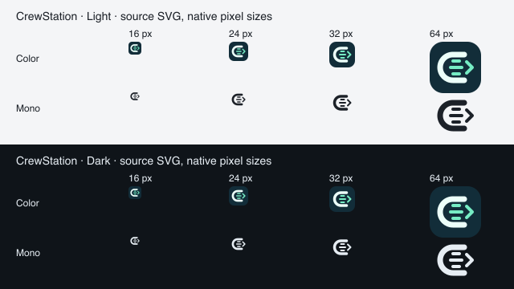

# RFC-003｜CrewStation 品牌标识

> In Progress · 2026-09-13。协作舱已接入真实顶栏、favicon 与演示登录页，代码与验收记录见 implementation.md。

## 协作舱

C 形工作站对应 CrewStation，容纳三个独立并行轨道；右侧终端箭头表示执行和共同交付。三条轨道是协作意象，不规定 Agent 数量。图形保留单一轮廓，避免把终端、机器人、齿轮等符号堆在一起。

主标使用深蓝绿底、浅白 C 形和薄荷绿轨道；双色标的固定品牌色不参与运行状态编码，产品按钮和状态继续沿主题 tokens。单色版本继承 currentColor，适合文档、紧凑导航和深浅主题。

| 资产 | 用途 |
|---|---|
| [crewstation-mark.svg](./crewstation-mark.svg) | 应用图标、登录页、产品顶栏；64×64 viewBox，透明圆角外部 |
| [crewstation-mark-mono.svg](./crewstation-mark-mono.svg) | 单色字标组合、印刷与主题背景 |

顶栏使用 28px 图标配 CrewStation 字标，点击返回工作台。彩色／单色生产原稿在 console 的 public/brand 目录；favicon／登录页／顶栏使用同一原稿。登录页在尚未鉴权时也要显示图标，因此内嵌原稿，并以逐字节测试验证部署副本一致。图标与名称相邻时视为装饰，独立图标有 CrewStation 可访问名称。16／24／32／64／128px 和单色预览仍可在交互附件里查看。

验收关注小尺寸轮廓、单色识别、深浅背景和顶栏密度；不以视觉稿冒充已完成生产品牌替换。

## 2026-09-15 原稿尺寸复核

本图使用生产 `apps/console/public/brand` 中的两份 SVG 原稿，由 rsvg-convert 以原生像素尺寸渲染；背景与文字颜色取当前主题 tokens，未重新绘制标识。彩色 SHA256=`d197d8a17bd794e2ca1d28bdef055553dbccacc3cd34c7273484023f1b8fac4b`，单色 SHA256=`8ad9e4b95541c703a53305535e391f29cead3655a6a1beeb93ab4fe0e60abedf`，与本次 console build 产物一致。16／24／32／64px 下轮廓、并行轨道与箭头可区分，单色在两背景均可见。

这是当前资产的渲染检查；Mac 再次锁定后没有重新完成浏览器顶栏、favicon 或登录页面旅程，UX-AT-51 暂不据此整项关闭。
