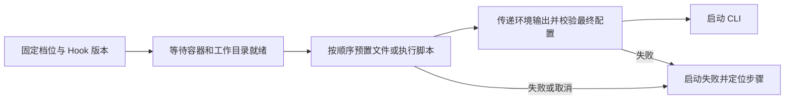

# RFC-004｜设计

> In Progress · 2026-09-14 与 [proposal.md](proposal.md)、[plan.md](plan.md)、[ADR-0004](../../../docs/adr/0004-agent-runtime-module.md) 一并批准为实施依据；2026-09-16 已按本设计实现（新增 L3 模块 `modules/agent-runtime`，contracts／Runner／agent-drivers／project／dev-session／business-task／task-runtime／session／platform／console 相应扩展）。§1 的“现状与断点”保留为实施前的证据；实现与设计的对应关系见 plan.md 实施说明。

## 1. 现状与断点

| 环节 | 当前源码证据 | 缺口 |
|---|---|---|
| 档位 | [plans.ts:16](../../../modules/project/domain/plans.ts#L16)、[manageQuotaAndPlans.ts:39](../../../modules/project/application/manageQuotaAndPlans.ts#L39) | 只有 driver／model；租户投影只有名称／说明，无运行配置就绪状态 |
| 开发启动 | [nativeTerminals.ts:27](../../../modules/dev-session/application/nativeTerminals.ts#L27)、[agents.ts:42](../../../modules/dev-session/application/agents.ts#L42) | 解析档位后发送驱动／模型，env 为空，没有配置版本 |
| 业务启动 | [subtaskLaunch.ts:44](../../../modules/business-task/application/subtaskLaunch.ts#L44) | 同样只有档位解析；需与原生路径一起改 |
| 下发 | [containerEnv.ts:38](../../../modules/task-runtime/application/containerEnv.ts#L38)、[taskCluster.ts:57](../../../modules/task-runtime/adapters/k8s/taskCluster.ts#L57) | 固定 Secret 名在任务命名空间挂载，可选挂载不构成管理流程 |
| 加载 | [runner.ts:84](../../../runtimes/task/src/runner.ts#L84) | 容器创建时一次性读取，所有 Agent 使用同一份旧 agentEnv |
| OpenCode 合成 | [nativeEnv.ts:6](../../../packages/agent-drivers/drivers/opencode/nativeEnv.ts#L6) | 平台当前固定选中供应方／模型，但没有管理员连接设置的输入 |
| Claude 观测设置 | [nativeActivitySetup.ts:16](../../../packages/agent-drivers/drivers/claudeCode/nativeActivitySetup.ts#L16) | 已写 activity-settings.json 并传 --settings；新文件输入必须与此合成，不能互相覆盖 |
| 原生准备边界 | [nativeTerminal.ts:18](../../../packages/agent-drivers/drivers/nativeTerminal.ts#L18) | 可在 CLI 进程创建前统一准备；当前没有管理员文件／脚本步骤 |
| 脚本解释器 | [Dockerfile:6](../../../runtimes/task/Dockerfile#L6)、[Dockerfile:15](../../../runtimes/task/Dockerfile#L15) | 镜像明确安装 bash、携带 Bun；未声明 Python／Node，不能直接声称都可运行 |
| 传输 | [commandDispatch.ts:10](../../../modules/session/application/commandDispatch.ts#L10) | 现有受控 Runner 命令通道可承载定向启动材料，不能把敏感材料转入浏览器事件 |

## 2. 落位与依赖

依据结构规则新增 L3 `modules/agent-runtime`，职责为管理员启动前 Hook 配置、不可变版本、验证记录、凭据存储和启动材料解析；详见 ADR-0004。采用 domain／application／ports／adapters／http／api／tests 模板，持久化只访问 `agent_runtime` schema，复用 `packages/secretbox`。

`project` 继续拥有现有算力档位，新增可选 `runtimeConfigId` 与档位 revision。不会把新对象塞进已有 39 个生产文件的 project 或 40 个文件的 dev-session。档位写入通过窄端口验证运行配置引用与驱动；组合根回填端口，沿用 ADR-0003 允许的装配方式，application 不 import 其他模块内部。运行配置被引用时不能物理删除；本期以停用代替删除。

`dev-session`、`business-task` 的 compute 端口统一返回解析后的不可变启动快照；`platform` 装配 project 的档位查询与 agent-runtime 的配置解析。`task-runtime` 承担目标任务容器与运行检查任务的生命周期；`session` 仅传输／协商，不拥有配置。`packages/agent-drivers` 合成两种 CLI 的最终配置；`runtimes/task` 在实际创建 Agent 进程前执行通用文件／脚本步骤，负责进程组、超时、取消、文件占用及结果传递。通用 Hook 执行不放进 Claude 专用 hooks 或 OpenCode 插件。

前端位于 `features/admin` 的运行配置与档位页签，路由由 app 组合；租户只消费 shared 契约投影。全部输入、行内确认、错误、列表和草稿保护复用 shared；i18n 同时覆盖中英文。此方案不放宽文件／函数／目录尺寸限制。

## 3. 对象与状态

`RuntimeConfig`：id、name、description、driver、draftRevision、activeRevision、enabled、updatedBy、updatedAt。名称 3–40 位 slug，说明上限 500 字。driver 建档后固定，换驱动须新建配置，避免既有版本含义变化。

`RuntimeConfigRevision`：configId、revision、`beforeStart.steps`、普通变量／凭据引用、CLI 配置文件绑定、默认模型／可绑定模型名、contentHash、createdBy、createdAt。版本只追加。供应方、协议、baseUrl、认证方式与详细模型定义由原生文件或脚本产物表达，不再维护一套重复的 provider 表单。模板默认模型与档位覆盖值的来源须明确，不能让两个相同含义的字段各自生效。

`BeforeStartStep` 为有序、带稳定 stepId／名称的二选一结构：

- `file`：pathTemplate、contentTemplate、format（text／json／jsonc）、mode（默认 0600）、existing（默认 require-same，可显式 replace）。非空内容与合法路径在保存时校验；运行时完成变量展开后再次校验格式和实际落点。
- `script`：language（shell／python／javascript／custom）、source、interpreter、argv、cwdTemplate、timeoutMs。预设解释器为 bash、python3、bun；custom 用管理员定义的可执行文件与参数数组，启动前确认存在和可执行，不将整条命令拼成 shell 字符串。脚本默认超时 60 秒，单步可设 1 秒至 10 分钟，整条最多 30 分钟；表单初始即显示范围。

运行环境最多 20 个步骤，文件／脚本文本每项最多 256 KiB，完整配置最多 1 MiB；受理前拒绝超限并定位字段。新增、删除和排序均改变 revision 与 contentHash。步骤顺序允许 file→script、script→file 或单一类型，只有全部成功才进入最终 CLI 配置合成。

`RuntimeCredentialVersion`：版本引用、加密值、键名、修改人／时间；复用平台安装密钥与 SecretBox，不创建新的密钥体系。写请求区分 keep／replace／clear，GET 不返回原值或可重用密文。

`RuntimeValidation`：checkId、configId／revision、taskId、任务镜像 digest、实际 CLI／解释器版本、检查上下文、检查阶段与终态、checkedAt、脱敏错误。阶段为输入校验、每个 Hook 步骤、最终 CLI 配置校验、真实模型响应；网络和认证失败显示实际调用结果，不能凭脚本退出 0 标记模型通过。结果绑定精确配置输入与镜像，编辑或更换不兼容镜像使原检查不能用于启用。

`ResolvedAgentRuntime`：档位名／revision、运行配置 id／revision、driver、model、非敏感摘要、瞬时启动材料。每个已接受的 agentId／native clientRequestId／业务 attempt 固定一次快照；重试和重连使用同一版本，不能重新解析“当前最新”后混用旧幂等请求。

`BeforeStartExecution`：executionId、agentId、processAttemptId、runtimeRevision、步骤状态、开始／结束时间、退出码或结构化错误、非敏感产物摘要。配置版本冻结的是输入定义，动态认证脚本本次取得的令牌和外部结果可能不同，记录结果引用与状态，不能声称跨次执行产物逐字一致。

## 4. API 草案

| 接口 | 语义 |
|---|---|
| `GET /v1/admin/agent-runtime-configs` | 有界分页列表，默认 20、最多 50；按名称／driver／状态筛选 |
| `POST /v1/admin/agent-runtime-configs` | 建草稿，不自动启用 |
| `GET /v1/admin/agent-runtime-configs/:id` | 元信息、步骤、文件／脚本、变量引用、认证已设置状态、引用档位；无密钥原值 |
| `PUT /v1/admin/agent-runtime-configs/:id/draft` | expectedRevision 比较后创建新版本；409 保留原草稿 |
| `POST /v1/admin/agent-runtime-configs/:id/checks` | 固定 revision＋clientRequestId＋目标运行环境，202 返回 checkId |
| `GET /v1/admin/agent-runtime-configs/:id/checks/:checkId` | 查询真实进度与失败阶段，断线后按 ID 恢复 |
| `POST /v1/admin/agent-runtime-configs/:id/activate` | expectedActiveRevision＋目标 revision＋checkId，验证通过后启用；旧确认拒绝 |
| `POST /v1/admin/agent-runtime-configs/:id/disable` | 固定当前版本，阻止后续新受理；不停止已受理进程 |

这些接口只对管理员开放，服务端逐个裁定。现有 `/v1/catalog/compute-profiles` 保留：管理投影增添运行配置绑定、revision 和就绪信息；租户投影只增添可用状态及可理解原因。写操作采用 expectedRevision，旧客户端写已托管档位时返回明确冲突／升级提示，不能无意清掉 runtimeConfigId。新 managed 启动记录可展示自身 runtimeRevision 和加载状态，不展示 provider／网关／认证内容。

执行状态查询复用现有 Agent 启动记录并增加 beforeStart 摘要；管理员检查接口提供逐步详情。租户事件只包含步骤名、进度、失败类型与 executionId，脚本源码、文件正文和脚本 stdout／stderr 不通过租户事件广播。管理员日志有界保留并替换已知凭据值；脚本输出不作为环境变量协议解析。

## 5. 下发与实际生效

1. 开发／业务应用在受理启动时解析算力档位及已启用运行版本，保存无密钥快照引用。并发启用与受理必须形成可证明的先后关系；受理结束后不可再换版本。
2. 按固定引用读取加密认证并在服务端准备最小启动材料，通过既有认证 Runner 命令通道只发送给目标任务。持久记录、通道诊断、异常和浏览器广播只允许无密钥引用。
3. Runner 通过新增协议能力 `agentRuntimeConfig: 1` 与 Hook 解释器清单协商。旧 Runner 或缺少所需解释器时在执行前明确拒绝；不冒充成功，不自动重建会话。任务镜像补装 Python 3，JavaScript 预设使用镜像已有 Bun；Node 专用脚本必须选实际安装的 Node，不能冒称 Bun 完全等价。
4. Runner 建立 agentId／processAttemptId 对应的私有目录和环境，进入 preparing；按顺序执行文件与脚本步骤，执行者与 Agent 相同，使用现有 worker 身份和实际项目出口。任务的代码初始化先完成，Hook 才可访问工作目录。普通终端、预览与构建不会因为 Runner 合并了 Agent 环境而继承它。
5. 全部步骤成功后，读取绑定的 CLI 配置，合成平台 MCP／状态观测等必需项，检查所选模型与实际加载入口，创建 CLI 子进程。步骤失败或取消则不执行后续步骤、不创建 CLI，保存失败阶段和配置版本。文件已写入不等于 CLI 已载入；模型就绪仍以真实响应证明。
6. 进程结束清理其独立瞬时目录与文件占用记录；自定义共享路径不盲目删除。继续历史会话仍使用原配置快照，若确实创建新的 CLI 进程，生成新的 processAttemptId 并执行相应启动前步骤。单纯输入／重连不重跑。显式改用新配置时创建新运行记录。

同一容器能同时存在旧版本 Agent 与新版本 Agent，因此不能再靠容器启动时全局读一份 env 文件完成此功能。已托管 Agent 从所选配置解析认证；未迁移档位继续走现有 agentEnvFile 路径，二者不混合。

### 5.1 路径、变量与脚本结果

路径支持容器绝对路径，以及 `{{agent.home}}`、`{{agent.runDir}}`、`{{workspace}}` 等固定上下文变量。普通值通过 `{{vars.NAME}}` 引用，凭据通过 `{{secrets.NAME}}` 引用。平台只展开已声明的有限变量，不执行模板表达式；JSON／JSONC 按字符串值展开并正确转义，不直接替换文本破坏引号。文本模板按字面值展开，未定义变量、非法 JSON 和无权限路径均定位到具体步骤。`~` 明确相对于 agent.home；预设新建进程私有 HOME，原项目 cwd 保持不变，不能继续把认证缓存写进 `/work`。

CLI 预设使用 `{{agent.home}}/.claude/settings.json` 或 `{{agent.home}}/.opencode/opencode.json`，显示展开后的容器路径。管理员可修改路径，也可把该文件改为由脚本生成；配置绑定单独说明哪个文件供 CLI 加载。自定义固定共享路径显示“同容器共享”，与已有活跃 Agent 占用路径的内容不一致时返回 `file_path_in_use`。所有实际落点按规范化路径记录；文件步骤先写临时文件、校验完成后原子替换，写入失败不得留下半个原文件。

脚本通过环境获得只读上下文 `CS_AGENT_ID`、`CS_AGENT_HOME`、`CS_AGENT_RUN_DIR`、`CS_WORKDIR`，以及声明的输入变量。每个脚本步骤获得独立的 **`CS_HOOK_ENV_OUT`** 路径；脚本可在该路径写 JSON 字符串映射，例如 `{"ANTHROPIC_BASE_URL":"https://gateway.example"}`。退出 0 且输出格式有效后 Runner 才把这些变量合并到后续步骤与最终 CLI 的环境；Python／JS 使用同一约定。未写输出文件代表没有额外环境变量。文件最多 64 KiB，变量必须合法且值为字符串；格式错误明确失败，不能部分应用。

脚本源码不做凭据文本替换，使用输入环境读取凭据；环境输出文件不回传到管理页面。后续 file 步骤通过 `{{env.NAME}}` 访问已明确输出的变量。输出不能覆盖 Runner 身份、工作目录、平台 MCP 身份与观测通道等保留变量，冲突显示变量名；CLI 加载目录由配置绑定生成。普通认证与供应方变量允许输出，最终模型仍来自已解析档位。

文件写入和脚本步骤均在同一容器的初始化队列中顺序执行，排队时间与执行超时分开显示；既有 Agent 不因此暂停。脚本可以操作管理员指定的共享目录，因此版本固定只保证启动输入与过程可追溯，不代表任意脚本的共享副作用可自动回滚。可写范围与执行身份在检查页显示；平台不伪造脚本已回滚的结果。

### 5.2 失败、取消与重复请求

状态为 queued → running(stepId) → succeeded／failed／cancelled／unknown；每个步骤的退出码与超时分别记录。超时或取消终止当前脚本进程组并等待回收，再释放队列，不只杀掉 shell 留下子进程。可观测到的未知解释器、文件冲突、非零退出、输出格式错误和 CLI 配置无效均有独立错误类型。

同一 clientRequestId／processAttemptId 的双击、WS 重发和迟到回执只恢复原执行结果，不重复脚本。Runner 中途丢失且无法确认脚本是否完成时记为 `hook_result_unknown`，不得用“幂等”名义自动重跑有副作用的脚本。管理员修正配置后启用新版本，或用户显式重试产生新的 attempt；已成功写入的文件和脚本外部副作用不会被擅自撤销。

## 6. 两种 CLI 的配置合成

Claude Code：管理员模板或脚本生成 settings.json；文件路径通过配置绑定明确传入 CLI，默认目录由 `CLAUDE_CONFIG_DIR` 指向私有 `.claude`。API／网关认证可以放在文件的 env 中；settings.json 不等于完整网页登录状态。需要 --settings 时，将管理员内容与现有 activity-settings.json 统一合成后只传一个最终文件，保留原项目规则和事件 hooks，不追加两个含糊的同名参数。

OpenCode：管理员可把文件放在 `.opencode/opencode.json` 或其他选定路径，由 `OPENCODE_CONFIG` 显式指定文件，`OPENCODE_CONFIG_DIR` 指定技能／插件等目录。当前 `nativeEnv.ts:13` 直接构造 provider 对象，实施时必须保留模板中该 provider 的 options／baseURL／模型定义，再精确合成受控模型范围；不能用仅含 whitelist 的对象覆盖整个模板。原生与 headless 使用同一合成规则，最终结果遵从 CLI 的配置优先级并实测。

文件模板是主要输入，脚本是显式执行步骤，二者不混成可执行模板表达式。最终 JSON 按固定 CLI 版本支持的 schema 校验；不认识的字段显示路径和 CLI 的真实反馈。平台生成的任务身份、MCP 认证、轮次观测、受控模型、工作目录和启动模式为保留项；可兼容的对象与列表按原规则合并，无法同时成立时显示冲突来源。项目业务说明与已有工具授权保持。

官方依据（2026-09-14 查询，实施仍以镜像实际版本回归为准）：[Claude Code 环境变量](https://code.claude.com/docs/en/env-vars)、[Claude Code 设置及优先级](https://code.claude.com/docs/en/settings)、[OpenCode 配置顺序与自定义路径](https://opencode.ai/docs/config/)、[OpenCode provider 连接配置](https://opencode.ai/docs/providers)。Claude 区分用户／项目 settings、--settings 与登录会话文件；OpenCode 区分默认全局文件、项目文件、自定义文件和目录。上述 `beforeStart`、模板变量、环境输出协议与版本管理均是 CrewStation 自身设计，不是 CLI 已有的同名能力。

## 7. 兼容、失败与检查执行

迁移仅增加本模块表及 project 自有表的绑定／revision 列，旧档位 runtimeConfigId 为 null。管理页明确展示旧模式，管理员创建、检查并启用配置后显式绑定档位。绑定时校验驱动／模型和引用，原运行记录不重写。`stub` 仍按既有样例用途存在；不得计入真实 CLI 验收。

检查使用平台专属、可识别的短期任务，在指定 Runner 镜像、样例工作目录与实际目标出口条件下执行完整 Hook 和固定模型测试。L3 agent-runtime 通过验证执行端口调用，由 platform 注入 task-runtime 实现，不反向 import L4。检查具有期限与幂等 ID，遵守同一 unknown／不自动重跑规则；任务完成后清理临时资源，仍保留无敏感值结果。目录、脚本退出与真实模型调用分别标记，避免把平台命名空间可达误当所有项目可达。一次检查失败不修改 activeRevision；并发编辑后旧检查不能启用新内容。

需要覆盖 401／403、DNS／连接失败、模型不存在、驱动 JSON 不兼容、文件路径／内容冲突、写入中断、解释器缺失、脚本非零退出／超时／取消、环境输出非法、配置被停用、引用冲突、旧 Runner、未知执行结果、重复请求、迟到结果和凭据替换／清除。首次启动指向管理员可处理原因，不转嫁给租户手工配置。精确案例见 plan。
