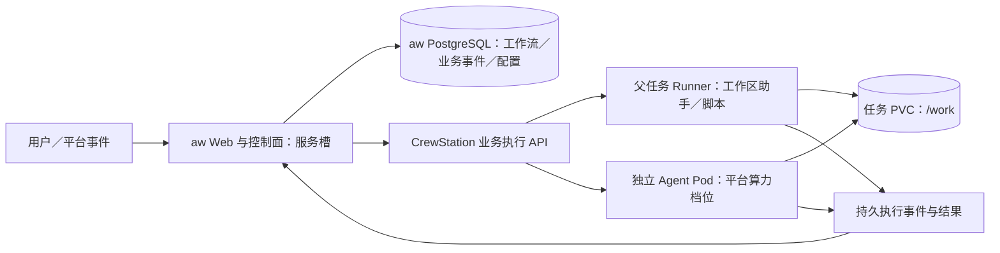

# RFC-027 · 业务执行契约与发布交接｜Design

> 状态：Done · 2026-09-27。作者已批准实施、提交远端及本地部署；文中目标契约的实际完成证据见 plan。
> 配套：[提案及现状证据](./proposal.md) · [计划与验收](./plan.md)

## 1. 拓扑与模块落位

aw 的控制状态归 aw 的库；平台执行状态归平台。任务 Pod 不通过直写 aw 调度表完成回执，aw 经 API／事件更新自己的状态。平台不要求任务容器有 aw 生产库凭据；现有生产数据注入行为不由本 RFC 顺带修改。

| 所有者 | 层／位置 | 本 RFC 职责 |
|---|---|---|
| contracts | `packages/contracts/api/business/` 新主题目录、Manifest／Runner 契约 | v3 DTO、事件、能力、错误、执行控制声明；保留 v2 导出 |
| business-task | L5；`domain/`、`application/`、`ports/`、`adapters/persistence/`、`http/`、`workers/` | 幂等、任务契约快照、配置材料、会话租约、执行权、归属校验、业务投影 |
| task-runtime | L4；现有生命周期、准入与原生执行用例 | 固定 ID 受理、任务卷、Pod 清理、配额预留与释放；经 resources 声明资源 |
| session | L5；事件存储、Runner 命令与重连 | 可靠输出／终态持久化、游标读取、Runner 世代；不判断 aw 业务结果 |
| agent-runtime | L3；档位修订与测试 | 能力声明、配置合成规则、保留变量与恢复兼容性测试 |
| release | L4；发布与切流用例、端口、持久操作 | 固定 release 解析、fenced 切流流程、执行停写证明、独立探针声明 |
| identity | L1；可信 Pod 身份投影 | 提供源 Pod UID／服务／物理槽／release 的可信绑定；不从用户头信任 release |
| gateway | 既有 Pod 身份索引 | 从控制器观测固定源 Pod UID／release／物理槽和 readiness；身份模块签名并在 v3 使用前现查实例 |
| resources／cluster-control | L1／L2 | 沿 RFC-025 资源台账和调和器观测真实创建／删除，不另起直接操作 K8s 的旁路 |
| platform | L7；组合根 | 接线同层模块端口、release 的 ExecutionHandoff 反向端口 |
| task runtime／agent-drivers | `runtimes/task/src/{exec,agents,files}`、`packages/agent-drivers` | 执行去重日志、输出重放、路径校验、动态材料及能力适配 |
| 工作台／模板 | 既有功能目录与共享 UI | 显示交接阶段、阻断原因与执行清理状态；模板示例和环境注释 |

不新增模块、不改 layer、不新增跨 schema JOIN／事务。business-task 与 session 同层，仅通过各自 ports 由 platform 接线；release 经自己声明的 ExecutionHandoff 端口调用 business-task。数据库查询仅在所有者适配器内。新源文件按主题拆分，遵守 600 行／目录 20 文件上限，目录将超限时在既有层内拆主题子目录，不申请规则豁免。

## 2. 版本、身份与能力发现

### 2.1 v3 与请求来源

新增 `/v3/business-tasks`；v2 保留。v3 所有请求对象严格校验，未知字段 400 `unknown_field`。平台生成 UUIDv7 资源 ID；requestKey 是调用方提供的业务不透明字符串（1～128 字符），不是资源 ID。

服务域沿用平台源身份认证。调用者 project／service／slot／release 从可信 Pod 身份投影获取；客户端传相同字段只能作期望值校验，不能扩大权限。源 Pod 被替换、归属未知或 release 尚未登记时拒绝新执行。所有任务、文件、事件、会话查询先核对服务归属。

traceId 取合法 body 值或 `x-cs-trace-id`，两者都有且不相同则 400；都没有由平台生成。重复 requestKey 返回首次 trace，不创建第二条调用链。日志只记录键与摘要，不记录明文 env、提示词或凭据。

### 2.2 能力响应

`GET /v3/business-execution/capabilities` 返回 protocolVersion、平台限制，以及调用方 release 已登记 Agent 档案的可用能力：`events`、`usage: none/final/incremental`、`resume`、`systemPrompt`、`skills`、`mcp`、`platformDelegation`、配置大小限制。租户投影不暴露模型供应商与凭据。

能力来源是经真实档位测试的不可变修订；提交时重新解析并固定该修订，不能仅信客户端发现时的结果。请求了不支持的能力返回 412 `capability_unsupported`，并指出字段。可选能力不等于可以忽略其请求。

Runner 通过新增能力位 `businessExecutionV3` 协商可靠执行、材料和事件形状；协议基础版本保持兼容，新增帧只发给宣告该能力的 Runner。父 Runner 或子档位镜像缺能力时受理前 412，不让旧 Runner 猜测新语义。

## 3. API、幂等与准入

以下路由均属目标 v3；稳定句柄创建后返回 201，重复创建返回 200；异步生命周期请求返回 202 及 operationId。

| 路由 | 请求要点／结果 |
|---|---|
| POST `/business-tasks` | requestKey、volumeMode?、taskProfileId?、traceId?、labels、应用自定义 taskContractVersion；返回 taskId、releaseId、契约摘要及状态 |
| GET `/business-tasks/:id` | 父状态、持久卷身份、generation、额度与清理状态；不因读取触发新执行 |
| POST `/:id/subtasks` | requestKey、kind、name、cwd；command 加 argv/env/timeoutSeconds；agent 加 agentProfileId、prompt、mode、outputContractId?、materialId?、resumeSessionId? |
| GET `/:id/subtasks/:subtaskId` | attempt、状态、process 状态、结果摘要、会话和固定档位引用 |
| POST `/:id/subtasks/:subtaskId/retry` | 新 requestKey、expectedAttempt、resumePolicy=fresh/resume；生成新 subtaskId 并保留 previousId；不覆盖原记录 |
| POST `/:id/subtasks/:subtaskId/messages` | requestKey、content、expectedAttempt；仅 interactive 的活动实例接受 |
| POST `/:id/subtasks/:subtaskId/cancel` | requestKey、expectedAttempt；返回取消意图和确认进度 |
| POST `/:id/pause`、`/:id/resume`、`/:id/close` | requestKey、expectedGeneration；保留生命周期操作记录 |
| GET `/:id/events?after=&limit=` | 稳定游标分页；可按 subtaskId 过滤但游标不能混用 |
| GET `/:id/events/stream?after=` | SSE，与分页同一事件序列；Last-Event-ID 可恢复 |
| GET `/:id/files?path=`、GET `/:id/file?path=&offset=&limit=&version=` | 目录／有版本的有界文件读取，见 §6 |
| GET `/:id/subtasks/:subtaskId/output` | 兼容阅读用的输出摘要，含 truncated 与 resultRef；程序优先使用结果 DTO／文件 |

表中 `/:id` 均相对于 `/v3/business-tasks`。配置材料使用 §7 路由，执行权使用 §9 路由。

资源观测暂时不可用时，`resourceState: unknown`，`quotaHeld: null`，不把未知占用伪报为 false。该三态在尚未发布的 v3 契约内落定；现有 v2 形状不变。

### 3.1 幂等记录

- 唯一键为 `(serviceId, operationKind, parentId, requestKey)`；创建父任务的 parentId 固定为空哨兵。规范化请求摘要包含所有影响执行的参数、release 契约／材料摘要；不包含 trace 和执行权租约等传输元数据。
- 同键同摘要返回同资源／操作；同键不同摘要 409 `idempotency_conflict`。跨槽交接后仍可查询原回执，不能因新 release 重新解析 defaults 导致重复执行。校验重复键必须先读取原快照，再解析新请求。
- business-task 在自身事务中记录意图、稳定 taskId／subtaskId／executionId 和 outbox；task-runtime 以该固定 ID 幂等准入；接受的资源引用与配额预留一致，重试不能先换 ID 再找旧资源。
- 平台不排队等容量：新请求在准入返回 429 时记录可重试拒绝，同键同摘要下次可重新准入；已创建任何执行资源后只能查询／继续原操作，不能再变成“未受理 429”。结果未知时返回 202 `admitting`，调和原 ID，不要求调用方换键。
- 调用方断线不取消操作。平台崩溃时 outbox／调和恢复；业务记录和 task-runtime 准入不做跨模块事务。未使用的预留按操作状态补偿，已运行的资源只能在确认终止后退额。
- 父任务创建时显式值优先，否则取固定 release 的 defaultVolumeMode／taskProfileId。默认值进入摘要与快照，重试不重读 latest。
- 幂等回执覆盖资源整个生命周期；删除重型历史后保留键、摘要、终态与资源墓碑。不能通过过期清理使旧键重新执行。平台卸载／明确数据销毁不在此保证内。

### 3.2 背压与错误

| HTTP／code | 客户端语义 |
|---|---|
| 400 unknown_field / invalid_configuration | 修改请求，不能原样重试 |
| 403 forbidden | 服务／项目／会话归属不符 |
| 409 idempotency_conflict / stale_generation / session_busy | 根据事实解决冲突；不能换随机键盲目重发 |
| 412 capability_unsupported / incompatible_task / runner_upgrade_required | 明确产品降级或升级依赖 |
| 429 quota_exceeded / rate_limited | 带 Retry-After；aw 有界退避加抖动，用同键重试，停止时取消本地待提交意图 |
| 503 temporarily_unavailable | 同键查询／重试；不等同于业务执行失败 |
| 410 cursor_expired / resource_gone | 明确历史缺口或资源墓碑，不伪造完整历史 |

平台父工作区和每个 Agent Pod 各占一个额度。命令在父 Pod 内执行，不另算 Agent 单位，受父容器 CPU／内存和命令数量限制。aw 控制 Agent 和 script 的业务并发；平台不复制 aw 的“各四槽”。

## 4. 异步执行、失联和取消

### 4.1 状态机

v3 子任务：`admitting → pending → running ↔ awaiting-input → verifying → succeeded/failed`；任意非终态可进入 `cancelling → cancelled`。基础进程观测独立为 `not-started/live/unknown/exited`。连接断开时保持业务状态并标 unknown，不因 30 秒 RPC 超时转 failed。

命令执行采用异步受理：Runner 回执只证明登记，不等待命令结束。超时从实际进程启动计时，继续使用 timeoutSeconds 的 1～86400 秒范围。退出、输出完整性和契约校验决定业务终态；RPC 回执不承担这个职责。禁止依赖单进程 awaiting Set 判断谁能收尾。

v3 命令受理和派发意图存于同一子任务记录：同父任务 requestKey 唯一，重复请求比较原始参数摘要，argv/env 使用平台 SecretBox 密钥加密。受理前验证来源执行权和 Runner 能力；事务内再次验证 epoch。派发前持久化 Runner incarnation，重试只查询／发送同一个 executionId、attempt 和摘要。旧 incarnation 丢失记录时保留 unknown，不换新 ID。

父准入 outbox 与子任务派发分别有界推进；GET、输出和事件查询只读持久投影。冻结屏障同时统计在途／unknown 子任务，过期派发票据不能写入新回执。终态事件已投影后，迟到派发回执不能覆盖它。

### 4.2 Runner 去重与可靠回执

派发带 executionId、attempt、Runner incarnation、payloadDigest。Runner 在受保护的持久目录登记启动意图，启动前核对重复 ID；同 ID 相同摘要回放 receipt，摘要不同拒绝。运行和已结束记录都不能重复 spawn。

Runner 本地实现使用 Bun 内置 SQLite 的私有日志文件（WAL、FULL 同步），这是容器执行记录而非平台业务数据库。准入、连续事件水位、完成结果与确认回收各自用短事务；确认回收不删除执行 ID／摘要／结果墓碑。只保存参数摘要，不把 argv 或 env 值落入准入记录。协议补读还限制单批总量，避免最大分页数量叠加成超大帧。

日志身份同时持久化于数据库和独立私有身份文件。目录存在但库丢失、清空、被其他库替换或身份失配时拒绝启动，不允许在原目录创建空执行历史。仅从未准入过执行的初始化中断可以补齐身份；返回可执行服务之前同步数据库、身份文件及父目录。

日志目录由平台提供受保护的持久挂载，不能直接放在 worker 可重命名的工作目录下；目录权限检查不能替代卷布局隔离。未配置可靠存储时新命令明确拒绝。Runner 全部 v3 能力落地前不宣告 `businessExecutionV3`，session 在写 socket 前拒绝向旧 Runner 派发可靠业务命令。

文件日志与 OS spawn 不能做原子事务：若 Runner 在“登记后／spawn 前后”崩溃且无法证明是否执行，返回 `execution_unknown`，禁止自动重跑该 attempt。通过进程隔离单元、Pod UID 和终止观测收敛；需要重试时由业务显式创建新 attempt。不得承诺任意外部副作用 exactly-once。

命令 stdout/stderr 分块带 executionId、stream、seq。Runner 将业务执行事件落有界 spool，session 持久化后确认 offset，再回收已确认块。spool 属于 Runner 管理目录，不经公共文件 API 暴露。磁盘不可写或输出达到公布上限时停止该执行并给出明确 `output_limit`／`event_persistence_failed`，不能静默丢输出后宣布完整成功。

业务命令新增持久输出事件种类，避免把交互终端的所有 execOutput 无差别存库。终态与结果摘要持久化后才能触发业务完成通知；重复／乱序事件用 executionId＋producer sequence 去重。退出先到、尾部输出后到时，完成游标只在输出水位闭合后发布。

### 4.3 取消与额度

取消先持久化 cancelRequestedAt 与幂等操作。尚无 incarnation 检查点的未派发记录在同一服务事务撤销并失效旧派发票据；进入派发阶段后向 Runner 发送带原身份的取消。取消先于延迟 start 到达时，Runner 保存相同 executionId／摘要的取消墓碑，后到 start 只能回放结果。Runner 杀进程树并确认；若 Runner 失联，保持 cancelling/unknown，task-runtime 可请求终止对应 Pod。只有观察到进程停止或原 Pod UID 已消失才终结，不能用“命令已发出”证明停止。

取消与正常退出竞态按持久观测收敛：已成功完成的不改成 cancelled；尚未终结且收到终止确认才 cancelled，保留原 exit reason。额度退还沿资源台账真实释放状态，只退一次；清理失败仍占资源并显示原因。

Runner incarnation 改变后不复用旧 PID 判断存活；旧 incarnation 的迟到输出可归档，不能更新新 attempt 状态。API／session 重启后按事件和资源观测恢复，不靠触发 GET 才推进完成。

## 5. 事件、结果与 token 预算

业务事件投影归 business-task，原始执行事件归 session。session 持久化后通过可重放端口／outbox 向业务投影供数；business-task 以 sourceEventId 去重，事务内追加每父任务单调 sequence 和状态投影。模块间不读取对方表。

统一信封：`{taskId, subtaskId?, attempt?, cursor, type, occurredAt, sourceEventId, data}`。type 包括 task-state、execution-state、text、tool-start、tool-end、session、usage、output、result、gap。result 包含 exitCode、reason、stdout/stderr 摘要、truncated、文件引用及 finalCursor。

游标绑定 taskId／过滤条件／日志世代，分页 limit 默认 200、最大 1000。SSE 只作同一日志的推送视图，断线按游标补读；无丢失通知的承诺依赖持久日志，不依赖 LISTEN/NOTIFY。慢消费者断开后继续补读。事件历史建议默认保留终态后 7 天，活动任务不能按时间截断未确认关键事件；归档前 aw 应导入其业务历史。过期返回 410、earliestCursor 和状态快照地址，不能把缺口伪装成空数组。

命令事件投影从 session 的持久端口取页，连续 producer sequence、摘要、输出摘要、任务 sequence 和状态在一个事务更新。分页同时受条数及 1 MiB 总字节限制；SSE 支持 Last-Event-ID，连接寿命有界，背压等待只持有当前页，不形成无限队列。最终 result 的 finalCursor 与同次事务追加的结果事件一致。

usage 使用规范字段 inputTokens/outputTokens/cacheReadTokens/cacheWriteTokens、计量 scope、累计值／增量类型、measurementId、complete；不支持的字段为 null。适配器负责避免累计值重复相加。公开事件不包含 raw 原始驱动事件、模型凭据或平台内部启动材料。

aw 基于增量事件做软预算，达到阈值调用 cancel；计量迟报和停止在途输出可能超额。usage=final 的档位只支持完成后统计，不能宣称实时预算；请求增量预算能力时应在受理前拒绝不支持档位。严格费用上限和供应商账单对账不在本 RFC。

初始容量参数作为可配置设计值：每次执行输出日志 64 MiB、单事件 256 KiB、结果文本摘要两流合计最多 256 KiB（同时受单事件 JSON 编码上限约束，为信封预留 4 KiB）；能力接口公开实际值。容量验收后可调整，不能引用这些数值声称已压测。

## 6. 工作区、文件与暂停

一个 aw 任务对应一个 persistent 父任务。业务任务不自动检出 aw 仓库；aw 的工作区助手作为版本固定的业务材料部署到 `/work/.aw-tools/<digest>/`，由命令子任务执行 clone、iso、snapshot、merge。助手的投递／安装通过幂等命令和校验摘要完成；平台不实现其 git 语义。凭据使用项目配置／Secret 引用，不能写进 argv、幂等摘要明文或事件。GitLab／外部 SCM 凭据的具体适配由 aw RFC 明确。

公共文件 API 只允许 `/work` 内相对路径；拒绝 `..`、绝对路径、越界符号链接、设备／管道及平台管理目录。打开文件时验证真实路径和文件类型，防止检查后换链接；复用并加强现有 WorkdirPaths，不只是字符串前缀检查。单次读最大 1 MiB，以 bytes offset／base64 返回，可选 utf8 展示；version 是内容摘要，分块间版本变更返回 409。目录分页，不能一次枚举无限目录。

实现采用 Linux `openat2` 的 `O_PATH`、`RESOLVE_BENEATH` 与 `RESOLVE_NO_MAGICLINKS` 固定对象，验证普通文件／目录类型后才经私有描述符读取；原始路径不再用于打开数据。内部绝对符号链接先解析为工作区内目标，再进行上述原子打开；打开后的真实位置再次排除 `.crewstation`。内核不支持该机制时明确返回 `unsupported_capability`，不退回存在检查／打开竞态的读取。流式计算完整内容摘要，仅保存请求的字节片段；读取前后比较 inode／大小／纳秒修改时间。目录扫描只保存当前页候选项，游标绑定路径摘要和目录版本。

持久卷按 `crewstation-business-v1/<父 taskId>/work` 与 `runners/<runner taskId>` 分开；主容器仅挂载 work 和本 Runner 私有日志的 subPath，不挂卷根。root init 只初始化新父任务的空卷，并校验既有布局、所有者及原父日志目录；恢复和 Agent 子任务不能把丢失布局当空工作区重建。私有日志目录不通过 `/work` 或公共文件 API 暴露。

父任务 paused 时文件 API 返回 409 `task_paused`，不为了读文件偷偷启动 Pod 或占额度；历史输出摘要仍可读。aw 页面需要长期展示的产物在暂停前导入自身持久存储。平台不在本 RFC 新增大文件仓库。

pause 先核对无 pending/running/awaiting-input/verifying/cancelling 子任务；有活动执行返回 409 `active_subtasks`。需要取消时显式逐项取消并等确认，不能把 awaiting_human 与 CLI 的 awaiting-input 混为一谈。父 Pod 删除确认后才 paused；PVC 保留。资源调和器清理该暂停业务工作区当前及旧启动的 Runner Secret，删除复核认领和 UID，不释放父记录、不删 PVC；台账在实际子对象消失后恢复可用额度。resume 以同一 taskId／卷 UID／固定 release 契约重新准入，额度不足 429，卷丢失报错，不悄悄建空卷。

生命周期操作在服务事务中固定 requestKey、generation 和执行权；pause／close 均要求活动或未知子任务先显式取消并确认，避免销毁仍有结果待核实的父工作区。关闭过程持续可观测，确认原 Pod 清理后才完成；重复 receipt 查询不增加 generation。恢复 429 保留操作 ID，由同键显式重试重新申请额度。

会话目录按 taskId＋session key 分区并保存于同一 PVC，工作区助手不可把平台日志当业务文件改写。RWO 同节点约束和节点不可用作为调度条件暴露；无 RWX 故障跨节点无损迁移承诺。并行 Agent 使用业务提供的 iso cwd，合并由 aw 串行安排。

## 7. 动态 Agent 材料与配置归属

`POST /v3/business-tasks/:id/materials` 接收 requestKey、systemPrompt?、skills 文件集合、MCP 引用、env 和子代理描述；返回 materialId＋digest。材料不可变、属于该父任务，建议总大小上限 1 MiB／最多 128 个文件，超限 413。不接受任意 tar 解压、绝对路径或通过 URL 让平台盲取任意材料。

Manifest 的 Agent 档案新增 `businessConfig`：`allowSystemPromptAppend`、`allowSkills`、`allowedEnvNames`、`mcpConnections[]`（稳定 ID、名称、URL、Secret 引用与允许的参数键）。缺省不开放本次动态覆盖，v3 请求越过声明边界时报错。档位能力／保留项优先于业务声明；业务声明不能开启驱动没有的能力。配置注册与父契约快照同版本固定；发布时校验引用属于本项目和合法连接协议，不允许请求体直接替换已登记 MCP URL。

| 配置 | 来源与合成规则 |
|---|---|
| 协议、模型、provider、镜像、二进制、启动参数、资源 | 平台固定档位修订；业务字段不得覆盖 |
| 系统级启动文件／环境 | 平台 beforeStart；管理员声明不可覆盖字段与路径 |
| 业务 system prompt | release 的 systemPromptFile 基线与本次追加段，按明确顺序合成；本次段不得替换平台段 |
| skills | 业务材料按摘要物化到本次目录，与平台材料分目录；同名冲突报错，不覆盖平台文件 |
| MCP | 引用发布契约登记的连接及受控参数；平台内置连接保留，重名拒绝；业务凭据使用本项目 Secret 引用，临时值派发时解析 |
| env | 业务普通变量和项目 Secret 引用；禁止覆盖 CS_*、HOME、XDG_*、PATH、LD_*、驱动 provider／model 凭据变量，以及档位显式保留项；驱动适配器维护完整保留表 |
| 子代理 | aw 的独立节点以 agentProfileId 引用平台子任务；描述转为业务计划，不直接注入可绕过调度的原生 spawn 配置 |

release 构建时把 systemPromptFile 等发布材料打包并计算摘要，业务登记只接收发布产物；不要在未检出业务仓库的父容器里假装能读取仓库相对路径。Secret 不进入材料明文或公开 DTO；保存引用和版本，运行时由所有者能力解密注入，值变更形成新有效配置摘要。

每次执行持久化非敏感有效配置摘要、材料引用、固定档位修订及能力版本。Runner 在 spawn 前核对摘要、支持能力和目标路径，生成 CLI 专用文件；驱动不支持的形状必须拒绝。已有 generic terminal 档位不因此自动成为业务 Agent 驱动。

Secret 引用在 attempt 受理时固定版本，传输请求摘要只含引用与版本，绝不含可离线猜测的明文值摘要。同 attempt 的重投必须取相同版本；已销毁／撤销的版本明确失败，不拿新值替代。按 I34 作者裁定，fresh 重试同样继承原快照；显式新建子任务才解析新版本。交互消息也带 requestKey，Runner 持久化消息 receipt；已发给 CLI 但回执不确定时查询原消息结果，不盲目重复 sendMessage。

原生 CLI 内部委派可能无法完整观测，能力响应必须区分 `platformDelegation` 与 `opaqueInternalDelegation`。aw 接入测试检查其已登记子代理都产生独立平台句柄／Pod／额度；不能只看提示词里写了“不使用内部委派”。平台对 arbitrary shell 的防绕过不在本 RFC 安全保证内。

## 8. release 固定、重试与会话续跑

父任务创建时由可信源 Pod 固定 releaseId、taskContractVersion、Agent／output 契约快照和 digest；不存在登记则 412，绝不 fallback latest。子任务读取父快照。待命槽发布、管理员修改默认档位不能改变已受理 attempt。

首次接受 Agent attempt 时解析授权档位并固定修订；同 requestKey 重放固定原修订。显式 fresh 重试生成新 attempt，requestKey 作用域独立于原 submit；同一原 attempt 只允许一个后继，事务中再次检查原终态和 attempt，原结果不变。命令重试仅允许 fresh，非终态或 unknown 未收敛前拒绝重试。按 I34 作者裁定（2026-09-27），Agent fresh 保留原档位、镜像、初始化及材料快照，只新建执行和原生目录；resume 使用同一快照与原会话目录。需要新环境时显式新建子任务。修订撤销／凭据失效时明确失败，不自动换供应商或模型。

session 记录 `{sessionId, taskId, volumeUid, protocol, profileRevision, materialDigest, cwd, lastExecutionId, state}`。跨任务、跨卷、协议／配置不兼容均拒绝。会话租约在平台数据库互斥，恢复先取得租约再准入；进程和资源终止确认前不释放。租约失效但旧进程存活时先隔离／终止，不让第二个进程同时写会话。

Runner 的 HOME／XDG_DATA_HOME／CLAUDE_CONFIG_DIR 指向受管理的任务持久目录；新 Pod 恢复时验证原生会话真实存在。断线、API 重启或 pause/resume 不等于 fresh。驱动不支持 resume 报 412，aw 可创建显式 fresh attempt 并在业务事件记录降级原因。

控制代码版本与任务执行契约分开。Manifest 新增 `tasks.acceptedTaskContractVersions`，切流前检查目标是否能接管所有未结束任务；不能接管则阻断并列出任务，先由用户完成／终止或另行迁移。平台只验证声明和握手；aw 自身 schema、业务状态版本的兼容性仍由 aw 验证。

## 9. 在线执行权与发布交接

### 9.1 启用与执行权

Manifest 新增 `tasks.executionControl: legacy/fenced`，缺省 legacy；aw 声明 fenced。CS_SLOT 保持 blue/green。新增只读 `GET /v3/business-execution/control`：`{activeReleaseId, physicalSlot, epoch, phase, leaseOwner?, leaseExpiresAt?}`，通知可经 SSE，但变更受理必须查平台权威记录。

fenced 服务通过 `/control/claim`、`/control/renew`、`/control/release` 管理实例租约，instanceId 为进程启动生成的 UUID。claim 校验可信源 Pod 的 release／slot 和 ready 状态；服务有多个副本时只允许一个 holder。建议 lease=30 秒、每 10 秒续租，使用平台数据库时间；过期不允许继续派发。holder 变化单调增加 epoch，即使 release 不变。

claim 先返回 `preparing` 的租约预留，不立即授予派发权；申请者完成应用数据库屏障与原句柄对账后，用 `/control/activate` 提交 leaseId、epoch 和准备回执，平台校验后才改为 active。首次启用、同 release 实例故障接管和跨槽交接都走该屏障。renew／release／activate 携带 expectedEpoch 和 leaseId 并在同一执行权行锁内比较更新；过期旧实例不能通过迟到 renew 复活。完整切流另用 `/control/handoffs/:operationId/ready` 记录目标准备回执，release 依据该回执推进阶段。

所有执行变更携带 `{epoch, leaseId, instanceId}`，在 business-task 接受意图的同一事务中校验；陈旧请求返回 409 `stale_generation`，错误槽返回 403。重复 requestKey 的只读 receipt 查询仍可用；不得借重复键发起新副作用。迟到 Runner 事件以 executionId 收录，不因调度权交接丢弃既有执行结果。

执行权记录、幂等意图、派发 outbox 都归 business-task，worker 派发前核对世代。切流前已真正开始的 execution 可以继续；尚未派发的旧世代意图挂起，由新 holder 按同 ID 接管／取消。处于派发临界区但回执未知的操作必须完成查询与去重对账，不能在新世代换 ID 重发。

旧 v1/v2 不携带 fence，启用控制后拒绝其写接口。首次启用必须与旧请求及后台派发共用服务级事务屏障：旧请求登记持久票据，各外部副作用独立登记，HTTP 已返回的后台 exec 仍有自己的票据。首次 claim 与新旧受理互斥；超时／进程消失只保留 unknown，不按 TTL 清票据。未开始的旧子任务保持 pending，已有执行的只读契约检查及经终态证明的资源回收继续。未知票据必须由发布诊断／对账取得完成或停止证明后收敛，不以“现在查不到进程”作为未执行证明。

### 9.2 切流为可恢复操作

release 保存 handoff operation 与阶段，通过 ExecutionHandoff 端口驱动 business-task；各模块各自事务＋幂等操作，不用跨模块锁模拟原子提交。

1. **预检**：目标健康、业务 schema 兼容、所有活动 taskContractVersion 被支持；记录 expectedActiveRelease／expectedTargetRelease；同服务串行切流。
2. **冻结**：business-task 持久化冻结生产新变更并递增 epoch，等待正在受理／派发的临界操作收敛；旧 holder 续租失败。已开始的 Agent 可继续，禁止新节点启动。release 只有读到冻结确认才继续。
3. **应用屏障**：目标 aw 实例读取新 epoch，在 aw 自己数据库推进 fencing 行；全部调度、恢复、孤儿回收、停机写必须在同事务校验 aw 的 holder／epoch。旧进程之后的事务被拒。平台记录目标的幂等准备回执和兼容结果；平台不能直接替 aw 数据库执行此屏障。
4. **切路由**：release 提交目标 active 和 handoff phase，gateway／资源调和到目标；保留执行冻结。路由生效存在延迟，误到旧槽的写请求由应用屏障拒绝。目标尚未取得运行租约时只接受业务持久 inbox，暂不派发。
5. **激活**：目标确认 aw 屏障与接管对账已完成，且路由观测达到期望后，business-task 授予新 holder；新 holder 用原句柄接管活动任务、恢复持久 inbox 派发。交接完成才向操作者报成功。

每步持久化 operationId、期望版本、epoch 和回执。任一步失败保持可诊断冻结并允许幂等继续；不在超时后自动解冻旧槽。恢复旧槽也必须新 epoch＋相同握手，epoch 永不回退。切路由成功而激活失败时，用户请求可明确报暂不可执行，不能退回无屏障运行。

release 不直接 import 高层 business-task；反向端口由 platform 注入。应用准备／激活用服务端认证的 v3 控制回执 API，回执必须来自目标可信 Pod 与 operationId，不能由浏览器代填。

### 9.3 应用责任与外部副作用

aw 实例本地拿锁并不足够；它必须把 epoch 检查放进每次业务写事务。禁止旧实例 shutdown 把所有任务一概 interrupted，禁止按本机 PID 回收远程任务。aw 的运行权到期就停止新决策；恢复时先查远程句柄。

数据库 fencing 不能撤销已经发出的 git push 或外部 API 调用。本方案将工作区写操作放命令子任务，以 attempt／操作日志对账；工作区助手为 merge／push 设计可重试检查，出现未知副作用需查询上游或人工处理。外部调用的 exactly-once 不是租约自动提供的属性。

### 9.4 迁移、回退与预览

优先 expand／backfill／switch／contract。`rollback: blocked` 只拦后续回退，不证明迁移时无人写。

非兼容迁移前，除现有用户／服务／事件入口维护外，fenced 服务必须冻结控制面并完成 aw 写屏障，活动命令／Agent 和其他持有库写权限的进程全部完成或被确认停止。无法证明写者已停就阻止 migration Job；单纯“三个入口关了”不是证明。迁移锁、schema 条件与回退资格一起检查。

冻结之后，原正式发布可用 `{stopAuthority:{operationId,epoch}}` 调用取消、pause、close 来排空写者；它不是执行租约，不能用于 resume、新建、消息或 fresh。每次受理在服务事务内复核迁移操作、epoch 和可信正式 Pod，原 fence 不再有效。pause/close 仍要求子任务已经确认终态。迁移失败不自动解冻：修复发布必须较新，旧发布已 failed，资源台账有集群观测产生的 Finished 终止记录，且旧迁移 Pod 已清理，才允许平台以原 operationId 做 CAS 接替，推进新 epoch 并保持应用停写证明。单纯超时、Created=false 或查无记录不能放行。

回退同样检查旧版本能读当前 schema、支持全部活动任务契约，并走新 epoch 交接。只切 HTTP 路由不算回退完成。aw 待命槽对生产任务只读；完整可写试用用独立项目、库和任务卷。此范围变化见 proposal 能力影响表。

## 10. aw 接入责任与部署契约

这些是交给 aw 自身 RFC 的合同，不是本仓代码变更：

| aw 工作项 | 接入条件 |
|---|---|
| 网关身份 | 使用固定可信 JWKS，验证签名、issuer、audience、时效与服务绑定；用户属性取签名声明；gateway 模式下不因恶意 Bearer 覆盖可信身份；用户域登录过期整页导航，机器接口走服务域独立认证 |
| PG 冷启动 | CS_DATABASE_URL 支持空库；独立 migration 命令无数据目录也可执行；schema 兼容检查与任务契约版本明确 |
| 控制状态 | config、密钥来源、skills 元数据及持久业务事件脱离服务槽本地盘；大内容有显式大小和存储边界，不把一切无上限塞入 PG |
| 业务事件与 WS | 数据库持久事件＋游标，NOTIFY 仅通知；多副本客户端可以断线补读 |
| 执行端口 | 本地适配器保持现有行为；远程适配器使用平台句柄与工作区助手，不把本地 PID／文件 API 偷留在远程路径 |
| 平台事件 | 先持久 inbox 去重并及时确认，再异步处理；生产发布世代变化不能重复触发；机器入口按服务域 API 登记 |
| 容器入口 | 根 Dockerfile、显式监听 0.0.0.0／PORT；service.command 中包含必要 init 进程；迁移和服务命令分开 |
| 健康检查 | liveness 只判进程可继续，readiness 判依赖／兼容准备完成；没有执行租约的待命 Web 可以 ready，但调度禁止 |
| API 消费 | 429 分类处理，同键退避；UI 聚合请求并实测限流，确需覆盖时使用已有项目限流配置 |

平台 service 新增可选 `probes`：startup/readiness/liveness 各自路径与有界超时／周期／失败阈值；旧 healthPath 映射维持不变。aw 模板显式配 startupProbe，启动阶段不因恢复耗时被 liveness 杀死，也不把“进程已开端口”冒充业务 ready。范围只到通用 service 探针渲染和验收，不改所有服务的默认参数。

平台配置／Secret 可注入进程环境，aw publicBaseUrl 必须来自平台提供的路由契约或显式项目配置，不在适配器散落拼接域名规则。先记录实际平台域名／项目 slug 的解析结果并验证回调与 WS 路径。

## 11. 持久化、升级与观测

business-task 新增任务契约快照、幂等操作、执行材料、会话记录、执行控制／handoff 收据和事件投影；为 SubtaskRun 增加 v3 版本化执行存储（execution_subtasks），旧表保持 v1/v2 回收器隔离，公共查询与监控仍归 business-task；不修改已终结结果。session 新增业务输出存储、水位与去重约束；release 新增 handoff 操作及目标兼容声明。均由各模块迁移管理，追加 migration lock。

升级顺序：平台兼容迁移 → session／控制面支持 v3 → 新任务底座及档位能力测试 → 测试业务客户 → aw 适配器 → 显式启用 fenced。旧 v2 活动任务继续旧路径，不能自动改成 v3 并声称有幂等历史；aw 新接入不继承来源不明的旧任务。

平台回退前必须确认是否已有 v3 活动任务／fenced 服务；旧控制面不懂这些记录时禁止回退，先清退或使用支持新 schema 的修复版本。业务 release 回退与平台控制面升级回退分别验证。

审计字段：serviceId、taskId、subtaskId、attempt、executionId、requestKey 摘要、releaseId、profileRevision、materialDigest、epoch、Pod UID、traceId。指标：受理延迟、unknown 执行数、事件积压／缺口、取消等待、冻结时长、资源清理与额度回收延迟。工作台复用现有资源／调用链页面，展示阶段与下一步，不新增一套任务监控产品。

## 12. 测试策略与留下的边界

unit 覆盖契约严格校验、摘要、配置合成、状态机、usage 归一、路径边界；module 用真实 PostgreSQL 覆盖并发唯一性、事务屏障、恢复与迟到事件；Runner 用真实子进程验证超时／取消／崩溃窗口／输出重放；跨模块与 upgrade 验证 outbox 重试及 v2/v3 共存；真实集群验证 Pod／PVC／额度与切流，不用 mock ready 代替。

完整清单和阶段退出条件见 plan。每条拒绝分支都有用例。UI 复用 shared primitives，中文／英文、键盘和 320px 验证；实机在独立测试项目进行，保留任务卷／配置恢复证据，不对共享工作任务做故障注入。

本 RFC 收敛本地 awaiting Set、latest 契约读取和静默丢参数，不引入通用 facade／跨模块表访问。留下的明确边界是：不透明 CLI 内部委派计量、严格 token 上限、RWX／跨节点迁移、大文件服务、aw 自身实现与验证。这些边界不能被包装成平台原生完整接入已经完成。

### 实施补充：未知执行与失败迁移的停止证明

取消失联的独占 Agent 可以请求释放其运行环境；共享命令工作区不会因单条取消而被杀掉。只有 runtime released 后才以 cancelled + gap + truncated 终结缺失日志的执行，保留已持久化输出。session 单独保存停止墓碑以阻止迟到登记，七天保留期内可读部分原日志；这不把 complete 改成 true。未受理固定 ID 的取消与项目准入共锁，持久封锁后才可按未启动收敛，普通查无记录不构成停止证据。

旧 v1/v2 票据保留请求父子关系与原处理 Pod UID。管理员在工作台业务执行恢复页查看阻塞，显式停止关联环境（影响其中全部命令），或对账已有停止证明。处理进程身份缺失、未知远程副作用和仍存在的 Pod 都保持阻断；恢复墓碑拒绝迟到新任务注册。

失败迁移除 Finished 之外可以使用资源中心 Stopped 证明：同名 Job 保持 suspend=true 且移除 TTL，Kubernetes 回报 Suspended 后确认其 Pod 全部消失。这个名称墓碑阻止迟到 ensureJob 创建另一名写者。修复发布在接替前再次检查墓碑和 Pod，不依据过去的 Stopped 单独切换。失败发生在 Job 声明之前时，release 原子声明该名字的失败停止意图，资源中心只建立暂停墓碑；不启动迁移。历史 owner 模式只有被资源台账接管且获得相同停止证明后才能恢复。清理墓碑须在该服务/项目整体退役时进行，不能按普通成功 Job 的 TTL 删除。
