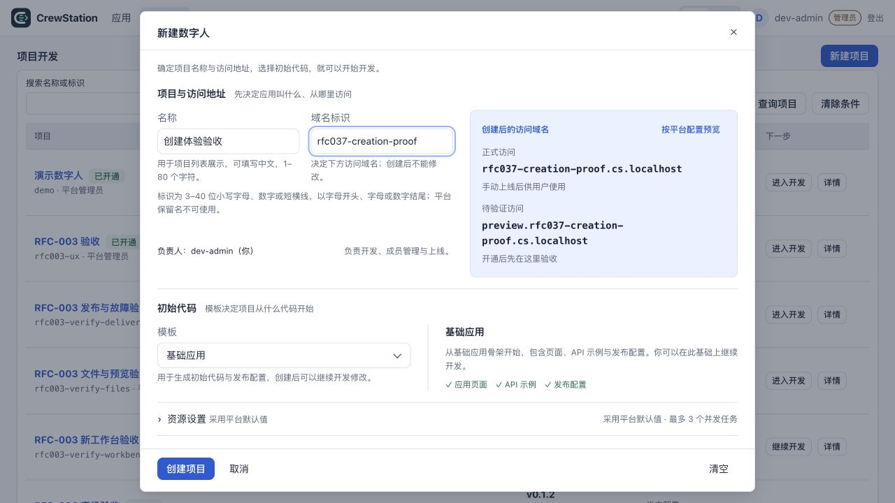
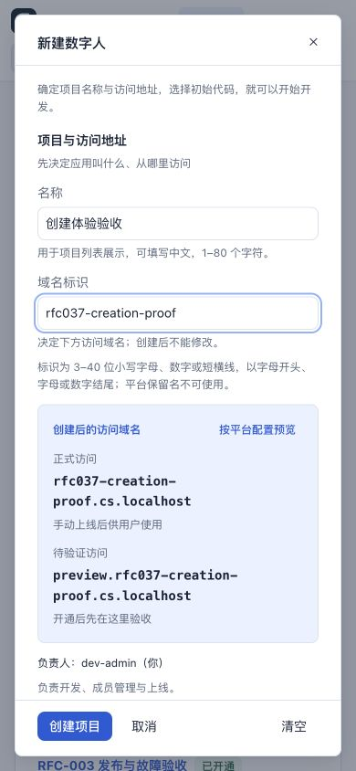
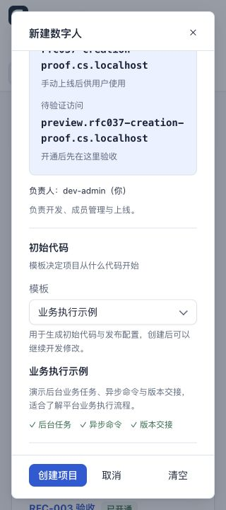
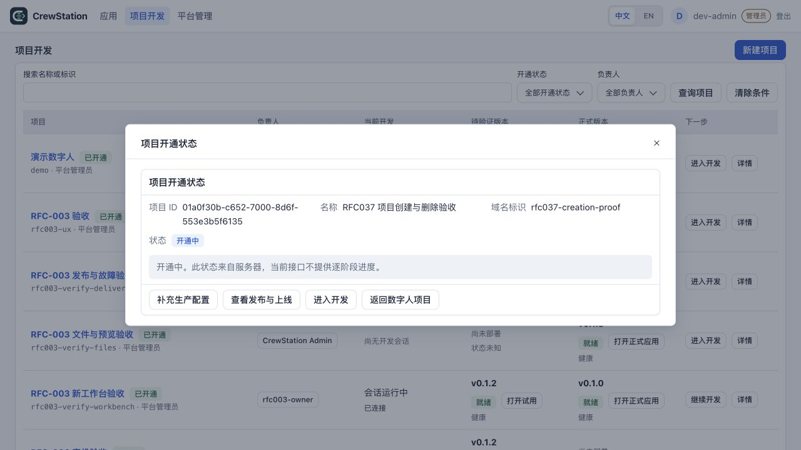
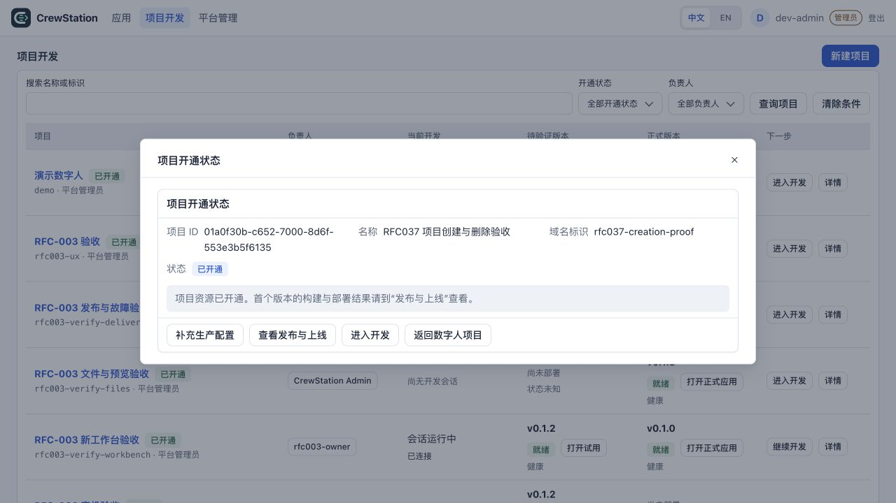
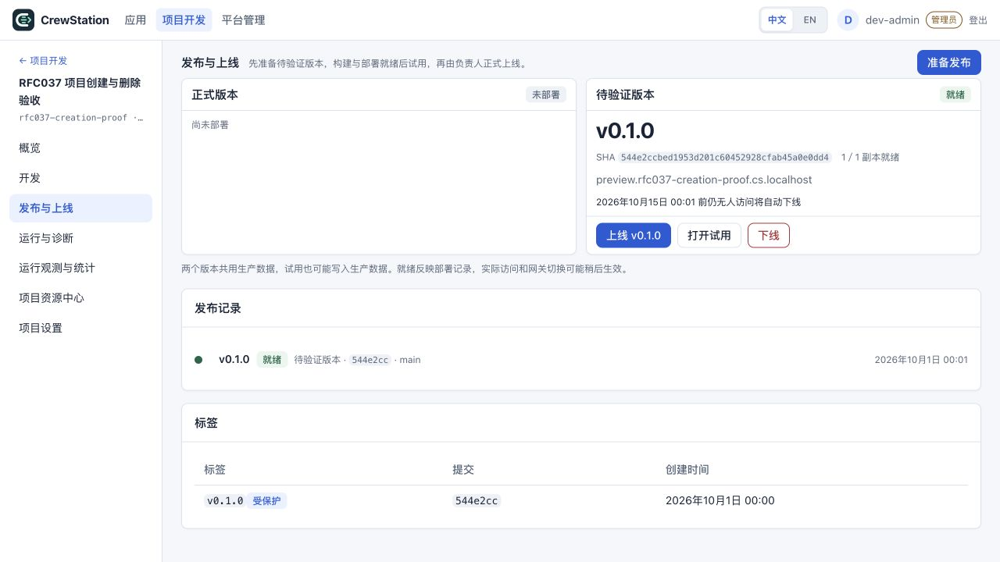

# 已部署的创建弹窗验收

2026-09-30／10-01，使用本机 `docker-desktop` 的正式控制面及工作台。管理员通过既有登录入口登录；页面请求实际服务器，没有 fetch 替身。开发者身份、另一套安装域名、输入错误与迟到结果由对应模块／console 用例证明；本轮未切换现有账号。

## 发布和部署

- 实现提交：`cc56ee8818bdb87d76932a5fe3affd947d7e39ef`，精确 189 个路径，包括共享文件中完整保留的资源中心接线和迁移锁。提交后的 main／origin 同步，暂存区为空。
- 稳定候选完整本地检查：4561 pass／143 skip／0 fail，4704 tests、911 文件、29318 断言；跳过项不计真实资源验收。工作台生产构建通过。
- [精确 SHA CI 36735324944](https://github.com/wangbinquan/CrewStation/actions/runs/36735324944) 已结束，static、unit、module、console、gate、e2e 六项全部 success。
- 从该提交的 Git archive 构建部署产物，不收入后续 API 目录清理候选或并行未提交内容。实际工作台镜像为 `docker.io/library/cs-console@sha256:2cbbe189d9b07fc5a3838ee8abf1a16c1145046799540c003ab8a96cc0127a21`，控制面为 `docker.io/library/cs-control-plane@sha256:6a5cc25f75479b01070c3042e78ae0070e3e263bdad1f14cc06e32e956c1475d`；两者构建标签的 revision 均为上述完整提交。
- 真实平台 PostgreSQL 在 `crewstation-system` 的 `statefulset/postgres`；先保存 0600 custom dump，再运行唯一迁移 Job `rfc037-migrate-cc56ee8818bd`，结果 Complete。测试容器 `cs-dev-pg` 没有被当作平台库升级。
- 2026-09-30T15:36:59.087Z，cs-session、cs-api、cs-auth、cs-controller、cs-events、两个 MCP 与 console 共八个 Deployment 的 observedGeneration 等于 generation，Ready=1。
- 兼容检查 storage-contract=1；默认 Runner 的原摘要保持。部署前后的原项目 Pod、PVC、PV 和 Namespace UID 没有缺失，没有替换原业务会话或容器。

部署的私有原始回执为 `/private/tmp/cs-rfc037-cc56ee8818bd-deployment-receipt.json`；备份和部署日志使用同一前缀。备份不进入仓库。

## 实际浏览器

| 检查 | 结果 |
|---|---|
| 创建入口 | `/projects` 的「新建项目」为按钮，点击后在原列表打开共享 FormDialog |
| 用途 | 「域名标识」说明决定访问域名且创建后不可修改；模板说明初始代码与发布配置，并列出所选模板的具体内容 |
| 域名 | 输入 `rfc037-creation-proof` 后，服务器预览正式 `rfc037-creation-proof.cs.localhost` 与待验证 `preview.rfc037-creation-proof.cs.localhost` |
| 模板 | 切换到「业务执行示例」后，说明变为后台任务、异步命令和版本交接；两种实际目录模板均有说明 |
| 桌面 1280×720 | dialog 位于 x=200、y=16，880×688，无横向溢出 |
| 手机 390×844 | dialog 位于 x=16、y=16，358×812；正文可内部滚动，底部操作可见，无横向溢出 |
| 手机 320×720 | dialog 288×688，底部按钮在视口内，无横向溢出；临时 viewport 已恢复 |
| 列表上下文 | 筛选 `rfc035` 后仅一行；开关弹窗不改变 `?q=rfc035` 和筛选值 |
| 草稿与焦点 | 取消／Esc 后再打开保留名称、标识与模板；关闭后 focus 回到「新建项目」 |
| 旧书签 | 访问原 `/projects/new` 自动落在 `/projects?q=&create=true`，列表上打开创建弹窗 |
| 实际提交 | 弹窗提交后在同列表打开状态 Dialog；先显示服务器「开通中」，随后变为「已开通」 |
| 实际发布 | 首个 v0.1.0 的待验证版本 1／1 就绪，访问地址与创建预览一致；真实浏览器打开「CrewStation 最小样例」，项目字段为原标识 |

本轮浏览器未提供网络采集能力，因此不声称记录了取消操作的网络零写轨迹；取消零创建及重复／在途提交由 console 回归断言。页面日志中未发现 warn／error。

## 专用验收项目

名称「RFC037 项目创建与删除验收」，项目 ID `01a0f30b-c652-7000-8d6f-553e3b5f6135`；Namespace `cs-rfc037-creation-proof` 的原 UID 为 `73fa6bd2-3c64-4d61-8ab3-fa4ff0cc372a`。首个版本提交为 `544e2ccbed1953d201c60452928cfab45a0e0dd4`，运行镜像为 `registry.crewstation-system.svc.cluster.local:5000/rfc037-creation-proof@sha256:2ec25634c3a423fb4f094dc71ac6f0e73383cdde42110767421664a601399cde`。

原部署 UID `145a9143-5b00-4806-8fe5-d164ef115c8c`，原应用 Pod UID `b2b1a4db-76a5-4d12-9851-284172694666`，原构建 Job UID `18a82b93-9ee7-48de-b87a-a62fe8f8fa28`。原身份回执在 `/private/tmp/cs-rfc037-creation-live-resource-identities.json`。这是已创建且仍保留的专用验收项目，尚未受理永久删除；它不是 PD-22 资源回收成功证据。

## 截图

### 2026-10-02 已部署弹窗复测

本次通过既有公司身份入口登录原验收 `dev-admin` 管理员，未切换到其他角色。当前 `console` Deployment Ready=1，镜像为 `docker.io/library/cs-console@sha256:64bdb18f6afe8b3aeefe5cd85d91ae4e9909b9a2fa7304bf2eaffe06e93bf637`，与8f699d69部署回执对应。

筛选 `rfc037` 后只见原验收项目。在原列表点击「新建项目」打开真实 `dialog[open]`，URL保留 `/projects?q=rfc037`；界面清楚显示名称／域名标识用途、规则与正式／待验证地址。只填写本轮复核草稿 `rfc037-ui-recheck`，实际服务器预览为 `rfc037-ui-recheck.cs.localhost` 和 `preview.rfc037-ui-recheck.cs.localhost`。切换「业务执行示例」立即显示后台任务、异步命令、版本交接的具体说明。

桌面1280×720的弹窗880×688、位置200/16；390×844的弹窗358×812、位置16/16；320×720的弹窗288×688、位置16/16。三者页面及弹窗均无横向溢出，底部创建／取消／清空在视口内。320px正文有570px可视高度、1190px实际内容高度，实际内部滚动后模板及下一步说明可见。

Esc关闭后只有原项目一行、筛选仍为`rfc037`，焦点回到「新建项目」。重开保留名称、标识及所选模板；清空只清本次自建草稿且不关闭弹窗，恢复初始空值／基础应用，再Esc关闭。临时视口已reset。本轮未点击创建／删除，没有新增验收资源；未采集网络轨迹，不声称HTTP零写证明。永久删除入口尚未开放，本次不是PD-22回收验收。

私有截图`/private/tmp/cs-rfc037-creation-recheck-20261002-wide.jpg`与`...-geometry.json`保存布局和实际操作回执。最初全表面浏览器发现超时，按已知工作台URL选择现有IAB成功；超时不计通过。

创建批次已发布并部署。永久删除的剩余 owner、物理资源／数字排空、二次确认 UI、正式组合和专用项目回收仍未完成，产品删除入口保持关闭；RFC 与全流程验证目标继续。

### f78c27ad 部署后的真实浏览器复核

2026-10-02 八组件精确部署后刷新同一已登录管理员页面，原项目筛选与原项目保持。新建仍为原页面上方统一弹窗；桌面1280×720中弹窗880×688、位置200/16、无横向溢出。仅本次界面草稿“周报助手”／weekly-report 显示 `weekly-report.cs.localhost` 与 `preview.weekly-report.cs.localhost`，标识决定域名、不可修改及模板初始代码/发布配置的说明在界面可见。截图保存在私有 `cs-rfc037-f78c27ad377d-creation-wide.jpg`，几何回执同前缀 `-creation-browser-receipt.json`。随后清空自己的草稿并Esc关闭，焦点回新建按钮，原rfc037筛选保留；未点击创建，未新增项目。前一次390/320窄屏复核保留，不把本次桌面复核扩大为新的窄屏或网络轨迹证据。
